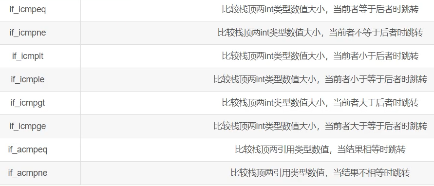
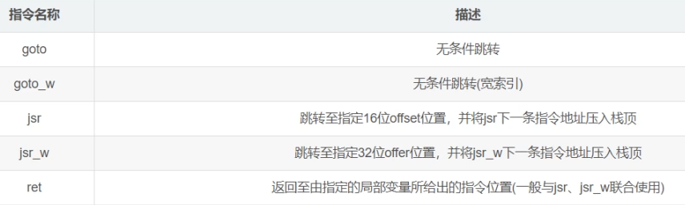
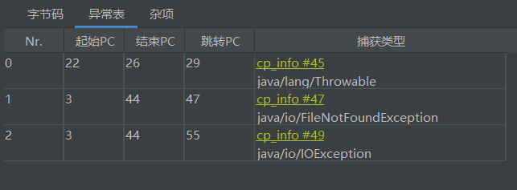

## 字节码指令集

大部分指令先**以i(int),l(long),f(float),d(double),a(引用)开头**

**其中byte,char,short.boolean在hotspot中都是转成int去执行(使用int类型的字节码指令)**

字节码指令大致分为: 

1. **加载与存储指令**
2. **算术指令**
3. **类型转换指令**
4. **对象创建与访问指令**
5. **方法调用与返回指令**
6. **操作数栈管理指令**
7. **控制转义指令**
8. **异常处理指令**
9. **同步控制指令**

在hotspot中每个方法对应的一组**字节码指令实际上就是在该方法所对应的栈帧中的局部变量表和操作数栈上进行操作**

**字节码指令包含字节码操作指令 和 操作数** (操作数可能是在局部变量表上也可能在常量池中还可能就是常数)


### 加载与存储指令

> 加载

**加载指令就是把操作数加载到操作数栈中**(可以从局部变量表,常量池中加载到操作数栈)

- 局部变量表加载指令 
	- `i/l/f/d/aload` 后面跟的操作数就是要去局部变量表的哪个槽取值
	- `iload_0`: 去局部变量表0号槽取出int类型值

- 常量加载指令

	- 可以根据常量范围分为三种 `const < push < ldc`

		


> 存储

**存储指令就是将操作数栈顶元素出栈后,存储到局部变量表的某个槽中**

- 存储指令
	- `i/l/f/d/astore` 后面跟的操作数就是要存到局部变量表的哪个槽
	- `istore_1`:出栈栈顶int类型的元素保存到局部变量表的1号槽

**注意: 编译时就知道了局部变量表应该有多少槽的位置 和 操作数栈的最大深度(为节省空间,局部变量槽还会复用)**


### 算术指令

**算术指令将操作数栈中的俩个栈顶元素出栈作运算再将运算结果入栈**

使用的是后缀表达式(逆波兰表达式),比如 3 4 + => 3 + 4

> 注意

1. 当除数是0时会抛出ArithmeticException异常
2. 浮点数转整数向0取整
3. 浮点数计算精度丢失
4. Infinity 计算结果无穷大
5. Nan 计算结果不确定计算值

```java
	public void test1() {
        double d1 = 10 / 0.0;
        //Infinity
        System.out.println(d1);

        double d2 = 0.0 / 0.0;
        //NaN
        System.out.println(d2);

        //向0取整模式:浮点数转整数
        //5
        System.out.println((int) 5.9);
        //-5
        System.out.println((int) -5.9);


        //向最接近数舍入模式:浮点数运算
        //0.060000000000000005
        System.out.println(0.05+0.01);

        //抛出ArithmeticException: / by zero异常
        System.out.println(1/0);
    }
```


比较指令说明

栈顶元素v2先出栈 , 栈顶元素v1再出栈

如果v1=v2 会将0入栈,如果v1 < v2 将-1入栈,如果v1>v2将1入栈

`cmpg`和`cmpl`区别在于结果为Nan时,`cmpg`将1入栈,`cmpl`将-1入栈

因为Nan只发生在浮点数运算中,所以long类型只有一个`cmp`指令


### 类型转换指令

类型转换指令可以分为**宽化类型转换**和**窄化类型转换**(对应基本类型的非强制转换和强制转换)

> 宽化类型转换

**小范围向大范围转换**

- ==int -> long -> float -> double==
	- `i2l`,`i2f`,`i2d`
	- `l2f`,`l2d`
	- `f2d`

byte,short,char 使用int类型的指令

**注意: long转换为float或double时可能发生精度丢失**

```java
	public void test2(){
        long l1 =  123412345L;
        long l2 =  1234567891234567899L;

        float f1 = l1;
        //结果: 1.23412344E8 => 123412344
        //                l1 =  123412345L
        System.out.println(f1);

        double d1 = l2;
        //结果: 1.23456789123456794E18 => 1234567891234567940
        //                          l2 =  1234567891234567899L
        System.out.println(d1);
    }
```


> 窄化类型转换

**大范围向小范围转换**

- int->byte,char,short: `i2b`,`i2c`,`i2s`
- long->int: `l2i`
- float->long,int: `f2l`,`f2i`
- double->float,long,int: `d2f`,`d2l`,`d2i`

如果long,float,double要转换为byte,char,short可以先转为int再转为相对应类型

**窄化类型转换会发生精度丢失**

NaN和Infinity的特殊情况:

```java
	public void test3(){
        double d1 = Double.NaN;
        double d2 = Double.POSITIVE_INFINITY;

        int i1 = (int) d1;
        int i2 = (int) d2;
        //0
        System.out.println(i1);
        //true
        System.out.println(i2==Integer.MAX_VALUE);

        long l1 = (long) d1;
        long l2 = (long) d2;
        //0
        System.out.println(l1);
        //true
        System.out.println(l2==Long.MAX_VALUE);

        float f1 = (float) d1;
        float f2 = (float) d2;
        //NaN
        System.out.println(f1);
        //Infinity
        System.out.println(f2);


    }
```

**NaN转为整型会变成0**

**正无穷或负无穷转为整型会变成那个类型的最大值或最小值**


### 对象创建与访问指令

对象创建与访问指令: **创建指令,字段访问指令,数组操作指令,类型检查指令**

#### 创建指令

`new`: 创建实例

`newarray`: 创建一维基本类型数组

`anewarray`: 创建一维引用类型数组

`multianewarray`: 创建多维数组

**注意: 这里的创建可以理解为分配内存,当多维数组只分配了一维数组时使用的是`anewarray`**


#### 字段访问指令

`getstatic`: 对静态字段进行读操作 

`putstatic`: 对静态字段进行写操作 

`getfield`: 对实例字段进行读操作

`putfield`: 对实例字段进行写操作

**读操作: 把要进行读操作的字段入栈**

**写操作: 把要写操作的值出栈再写到对应的字段**


#### 数组操作指令

- `b/c/s/i/l/f/d/a aload` : **表示将数组中某索引元素入栈** (读)
	- 需要的参数从栈顶依次向下: **索引位置,数组引用**

- `b/c/s/i/l/f/d/a astore`: **表示将某值出栈并写入数组某索引元素** (写)
	- 需要的参数从栈顶依次向下: **要写入的值,索引位置,数组引用**


注意: b开头的指令对byte和boolean通用

- `arraylength`: **先将数组引用出栈再将获得的数组长度入栈**


#### 类型检查指令

**`instanceof`: 判断某对象是否为某类的实例**

**`checkcast`: 检查引用类型是否可以强制转换**


### 方法调用与返回指令

#### 方法调用指令

 **非虚方法: 静态方法,私有方法,父类中的方法,被final修饰的方法,实例构造器**

与之对应不是非虚方法的就是虚方法了

- 普通调用指令

	- **`invokestatic`:调用静态方法**
	- **`invokespecial`:调用私有方法,父类中的方法,实例构造器<init>方法,final方法**
	- **`invokeinterface`:调用接口方法**
	- **`invokevirtual`: 调用虚方法**

	**使用`invokestatic`和`invokespecial`指令的一定是非虚方法**

	使用`invokeinterface`指令一定是虚方法(因为接口方法需要具体的实现类去实现)

	使用`invokevirtual`指令可能是虚方法

- 动态调用指令

	- **`invokedynamic`: 动态解析出需要调用的方法再执行**

	jdk 7 出现`invokedynamic`,支持动态语言


> 测试虚方法代码

- 父类

```java
public class Father {
    public static void staticMethod(){
        System.out.println("father static method");
    }

    public final void finalMethod(){
        System.out.println("father final method");
    }

    public Father() {
        System.out.println("father init method");
    }

    public void overrideMethod(){
        System.out.println("father override method");
    }
}
```

- 接口

```java
public interface TestInterfaceMethod {
    void testInterfaceMethod();
}
```

- 子类

```java
public class Son extends Father{

    public Son() {
        //invokespecial 调用父类init 非虚方法
        super();
        //invokestatic 调用父类静态方法 非虚方法
        staticMethod();
        //invokespecial 调用子类私有方法 特殊的非虚方法
        privateMethod();
        //invokevirtual 调用子类的重写方法 虚方法
        overrideMethod();
        //invokespecial 调用父类方法 非虚方法
        super.overrideMethod();
        //invokespecial 调用父类final方法 非虚方法
        super.finalMethod();
        //invokedynamic 动态生成接口的实现类 动态调用
        TestInterfaceMethod test = ()->{
            System.out.println("testInterfaceMethod");
        };
        //invokeinterface 调用接口方法 虚方法
        test.testInterfaceMethod();
    }

    @Override
    public void overrideMethod(){
        System.out.println("son override method");
    }

    private void privateMethod(){
        System.out.println("son private method");
    }

    public static void main(String[] args) {
        new Son();
    }
}
```


#### 方法返回指令

**方法返回指令: 方法结束前,将栈顶元素(最后一个元素)出栈 ,返回给调用者**

根据方法的返回类型划分多种指令


### 操作数栈管理指令

**通用型指令,不区分类型**

- 出栈
	- `pop/pop2`出栈1个/2个栈顶元素

- 入栈

	- `dup/dup2` 复制栈顶1个/2个slot并重新入栈

	- `dup_x1` 复制栈顶1个slot并插入到栈顶开始的第2个slot下

	- `dup_x2 `复制栈顶1个slot并插入到栈顶开始的第3个slot下

	- `dup2_x1`复制栈顶2个slot并插入到栈顶开始的第3个slot下

	- `dup2_x2`复制栈顶2个slot并插入到栈顶开始的第4个slot下

		- 插入到具体的slot计算:  dup的系数 +  `_x`的系数

			

### 控制转义指令

#### 条件跳转指令

**通常先进行比较指令,再进行条件跳转指令**

比较指令比较结果-1,0,1再进行判断是否要跳转

**条件跳转指令: 出栈栈顶元素,判断它是否满足条件,若满足条件则跳转到指定位置**


注意: 这种跳转指令一般都"取反",比如代码中第一个条件语句是d>100,它第一个条件跳转指令就是`ifle`小于等于0,满足则跳转,不满足则按照顺序往下走


#### 比较条件跳转指令

**比较条件跳转指令 类似 比较指令和条件跳转指令 的结合体**




#### 多条件分支跳转指令

**多条件分支跳转指令是为了switch-case提出的**

**`tableswitch`用于case值连续的switch多条件分支跳转指令,效率好**

**`lookupswitch`用于case值不连续的switch多条件分支跳转指令(虽然case值不连续,但最后会对case值进行排序)**

> tableswitch


> lookupswitch


对于String类型是先找到对应的哈希值再equals比较确定走哪个case的


#### 无条件跳转指令

**无条件跳转指令就是跳转到某个字节码指令处**

`goto`经常使用  

`jsr,jsr_w,ret`不怎么使用了




### 异常处理指令

throw抛出异常对应`athrow`: **清除该操作数栈上所有内容,将异常实例压入调用者操作数栈上**

使用try-catch/try-final/throws时会产生异常表

**异常表保存了异常处理信息** (起始,结束位置,字节码指令偏移地址,异常类在常量池中的索引等信息)

> athrow


> 异常表



异常还会被压入栈或者保存到局部变量表中


### 同步控制指令

synchronized作用于方法时,方法的访问标识会有**ACC_SYNCHRONIZED表示该方法需要加锁**

synchronized作用于某个对象时,对应着**`monitorentry`加锁字节码指令和 `monitorexit`解锁字节码指令**

**Java中的synchronized默认是可重入锁**

- 当线程要访问需要加锁的对象时 (执行monitorentry)

1. 先查看对象头中加锁次数,如果为0说明未加锁,获取后,加锁次数自增
2. 如果不为0,再查看获取锁的线程是不是自己,如果是自己就可以访问,加锁次数自增
3. 如果不为0且获取锁线程不是自己,就阻塞

当线程释放锁时 (执行monitorexit)会让加锁次数自减


为什么会有2个monitorexit ?

程序正常执行应该是一个monitorentry对应一个monitorexit的

如果程序在加锁的代码中抛出了异常,没有释放锁,那不就会造成其他阻塞的线程永远也拿不到锁了吗

所以在程序抛出异常时(跳转PC偏移量为15的指令)继续往下执行,**抛出异常前要释放锁**

