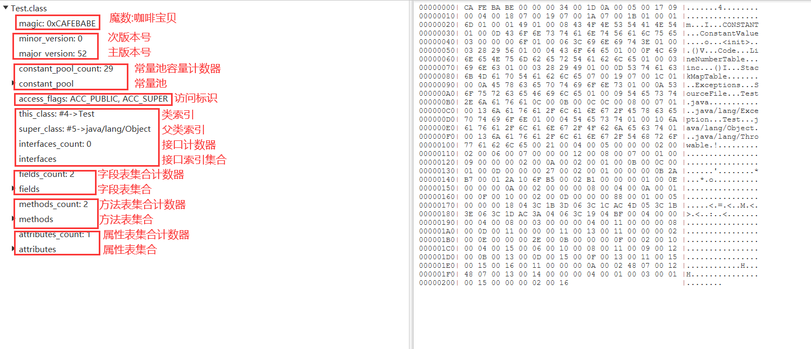
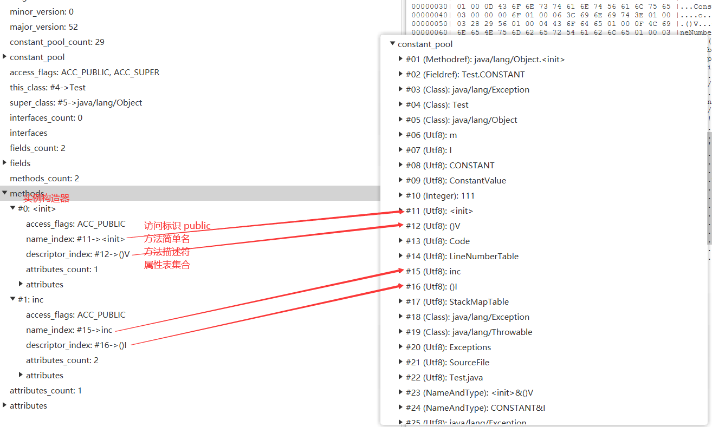
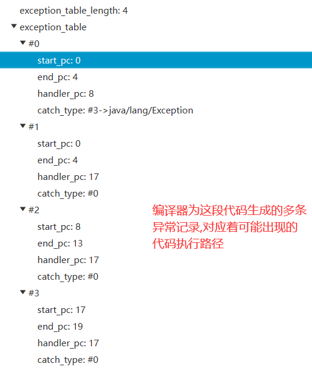
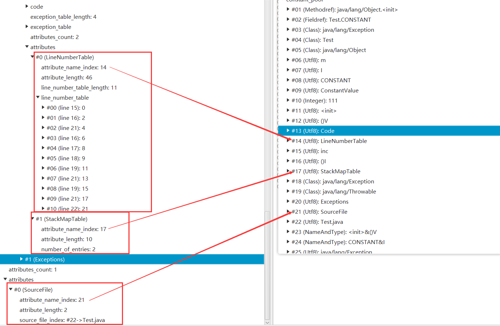

[toc]


## 类文件结构

### 无关性的基石

曾经: 源代码->经过编译->本地机器码

Java: 源代码->经过编译->字节码 -> 解释器 -> 本地机器码


**字节码: 与操作系统和机器指令集无关的,平台中立的程序编译后的存储格式**


> 字节码是无关性的基石

平台无关性的基石: 

1. **所有平台都统一支持字节码**
2. **不同的Java虚拟机都可以执行平台无关的字节码**

因此实现了 **一次编译,到处运行**


语言无关性的基石:

1. **Java虚拟机**
2. **字节码**

Java虚拟机不是只可以执行Java源代码编译而成的字节码,只要符合要求(安全...)的字节码,它都可以执行

因此Kotlin...等语言可以运行在Java虚拟机上


### Class类文件结构

> 文件格式存取数据的类型

1. 无符号数 : u1,u2,u4,u8代表1,2,4,8个字节的无符号数(可以表示数字,UTF-8的字符串,索引引用....)
2. 表: 由n个无符号数或n个表组成(命名以`_info`结尾)


#### 初识Class文件格式

> 编写Java源代码

```java
public class Test {
    private int m;
    private final int CONSTANT=111;

    public int inc() throws Exception {
        int x;
        try {
            x = 1;
            return x;
        }catch (Exception e){
            x = 2;
            return  x;
        }finally{
            x = 3;
        }
    }
}
```


> 使用可视化工具classpy查看反编译的结果




> Class文件格式的描述

|   数据类型   | 名称     | 数量                    | 对应图中名字 | 作用 |
| ---- | ---- | ---- | ---- | ---- |
| u4 | magic | 1 | 魔数 | 确定这个文件是否是一个能被虚拟机接受的Class文件 |
| u2 | minor_version | 1 | 次版本号 | 虚拟机必须拒绝执行超过其版本号的Class文件 |
| u2 | major_version | 1 | 主版本号 | 虚拟机必须拒绝执行超过其版本号的Class文件 |
| u2 | constant_pool_count | 1 | 常量池容量计数器 | 统计常量数量 |
| cp_info | constant_pool | constant_pool_count - 1 | 常量池 | 存放常量 |
| u2 | access_flags | 1 | 访问标志 | 识别类(类,接口)的访问信息 |
| u2 | this_class | 1 | 类索引 | 确定类的全限定名 |
| u2 | super_class | 1 | 父类索引 | 确定父类的全限定名 |
| u2 | interfaces_count | 1 | 接口计数器 | 统计该类实现接口数量 |
| u2 | interfaces | interfaces_count | 接口索引集合 | 描述该类实现了的接口 |
| u2 | fields_count | 1 | 字段表集合计数器 | 统计类的字段数量 |
| field_info | fields | fields_count | 字段表集合 | 描述类声明的字段(类变量,实例变量) |
| u2 | methods_count | 1 | 方法表集合计数器 | 统计类的方法数量 |
| method_info | methods | methods_count | 方法表集合 | 描述类声明的方法 |
| u2 | attribute_count | 1 | 属性表集合计数器 | 统计属性数量 |
| attribute_info | attributes | attributes_count | 属性表集合 | 描述属性 |


#### 魔数与主次版本号

魔数: 确定这个文件是否为一个能被虚拟机识别的Class文件

主次版本号: 虚拟机拒绝执行超过其版本号的Class文件


#### 常量池

常量池包含两大常量: **字面量和符号引用**

**字面量: 文本字符串,被final声明的常量....**

**符号引用: 全限定名,方法或字段的名称,描述符等....**


图中的常量有我们代码中熟悉的常量也有很多没有显示出现在代码中的常量


#### 访问标志

**用于识别类的访问信息**

是否是一个接口,枚举,模块,注解...

是否被final(public,abstract...)修饰


被public修饰,允许使用invokespecial字节码指令


#### 类索引,父类索引与接口索引集合

> 类索引

**用于确定本类的全限定名**


类索引指向常量池中表示该类的符号引用


> 父类索引

**用于确定父类的全限定名**


父类索引指向常量池中表示该类父类的符号引用

除了Object外,所有类的父类索引都不为0


> 接口索引集合

**描述这个类实现了哪些接口**

我们的例子中没有实现接口,就没有(接口索引集合计数器为0)


> 总结

**Class文件由 类索引,父类索引,接口索引集合 来确定该类的继承关系**


#### 字段表集合

**描述类声明的字段**

字段包括类变量和成员变量(实例变量),不包括局部变量


> 简单名称和描述符

- **简单名称**

	- **字段: 没有描述字段类型的名称**
	- **方法: 没有描述参数列表和返回类型的名称** 

- **描述符**

	- **字段: 描述字段的类型**

	- **方法: 描述参数列表和返回值**

	- **描述符字符含义(long,boolean,对象类型是J,Z,L 其他都是首字母大写)**

		| 标识字符 | 含义                         |
		| -------- | ---------------------------- |
		| B        | byte                         |
		| C        | char                         |
		| D        | double                       |
		| F        | float                        |
		| I        | int                          |
		| J        | long                         |
		| S        | short                        |
		| Z        | boolean                      |
		| V        | void                         |
		| L        | 对象类型,如Ljava/lang/Object |

	- 描述符描述n维数组

		- 在前面先写n个`[` 再写标识字符

			比如java.lang.Integer[ ] =>  `[Ljava.lang.Integer`

	- 描述符描述方法

		- 参数列表按照从左到右的顺序写在`()`中

		- 返回类型写到最后

			比如String method(long[],int,String[]) => `([JIL[java.lang.String)Ljava.lang.String`

因此Class文件中字段描述符指向常量池中的#07 I 符号引用

**字段表集合不会列出父类或父接口中声明的字段**


#### 方法表集合

**描述类声明的方法**

与字段表集合类似



**方法表集合中不会列出父类方法信息(不重写的情况)**


#### 属性表集合

属性比较多,这里只说明我们例子中出现的,其他的会总结

**用于描述某些场景专有信息**

刚刚在字段,方法表集合中都可以看到属性表集合,说明属性表集合是可以被携带的

> 怎么没看到Java源代码中的代码呢?

实际上它属于属性表集合中的Code属性

##### Code属性

**Java源代码中方法体中的代码经过编译后编程字节码指令存储在Code属性内**


其中的异常表集合代表 **编译器为这段代码生成的多条异常记录,对应着可能出现的代码执行路径**

(程序在try中不抛出异常会怎么执行,抛出异常又会怎么执行....)




##### Exceptions属性

**列举出方法中可能抛出的检查异常(Checked Exception),也就是方法声明throws关键字后面的列举异常**


##### LineNumberTable属性

**描述Java源码行号与字节码指令行号(字节码偏移量)对应关系**


##### SourceFile属性

**记录生成此Class文件的源码名称**


##### StackMapTable属性

**虚拟机类加载验证阶段的字节码验证时,不需要再检验了,只需要查看StackMapTable属性中的记录是否合法**

**编译阶段将一系列的验证类型结果记录在StackMapTable属性中**




##### ConstantValue

**在类加载的准备阶段,为静态变量(常量)赋值**

只有类变量才有这个属性

实例变量的赋值: 在实例构造器<init>

类变量的赋值: 在类构造器<clinit>或带有ConstantValue属性在类加载的准备阶段

**如果类变量被final修饰(此时该变量是一个常量),且该变量数据类型是基本类型或字符串,就会生成ConstantValue属性,该属性指向常量池中要赋值的常量,在类加载的准备阶段,直接把在常量池中ConstantValue指向的常量赋值给该变量**


##### 总结所有属性

| 属性名                 | 作用                                                         |
| ---------------------- | ------------------------------------------------------------ |
| Code                   | 方法体内的代码经过编译后变为字节码指令存储在Code属性中       |
| Exceptions             | 列举出方法可能抛出的检查异常(Checked Exception)              |
| LineNumberTable        | Java源码行号与字节码偏移量(字节码行号)对应关系               |
| LocalVariableTable     | Java源码定义的局部变量与栈帧中局部变量表中的变量对应关系(==局部变量名称,描述符,局部变量槽位置,局部变量作用范围等==) |
| LocalVariableTypeTable | 与`LocalVariableTable`相似,只是把`LocalVariableTable`的描述符换成了字段的特征签名(完成对泛型的描述) |
| SourceFile             | 记录生成这个Class文件的源码文件名称                          |
| SourceDebugExtension   | 用于存储额外的代码调式信息                                   |
| ConstantValue          | 在类加载的准备阶段,为静态变量(常量)赋值                      |
| InnerClasses           | 记录内部类与宿主类之间的关系                                 |
| Deprecated             | 用于表示某个字段,方法或类已弃用 (可以用注解@deprecated表示)  |
| Synthetic              | 用于表示某字段或方法不是由Java源代码生成的,而是由编译器自行添加的 |
| StackMapTable          | 虚拟机类加载验证阶段的字节码验证时,不需要再检验了,只需要查看StackMapTable属性中的记录是否合法 |
| Signature              | 记录泛型签名信息                                             |
| BootstrapMethods       | 保存动态调用(invokeeddynamic)指令引用的引导方法限定符        |
| MethodParameters       | 记录方法的各个形参名称与信息                                 |

