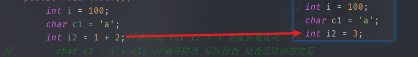
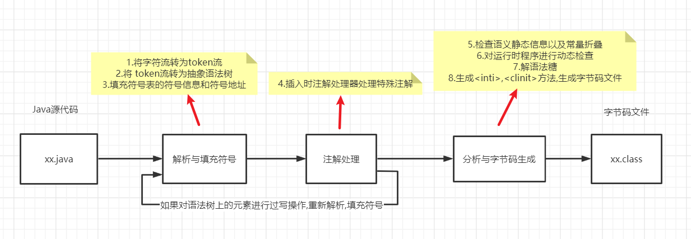
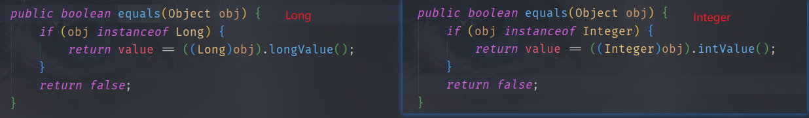
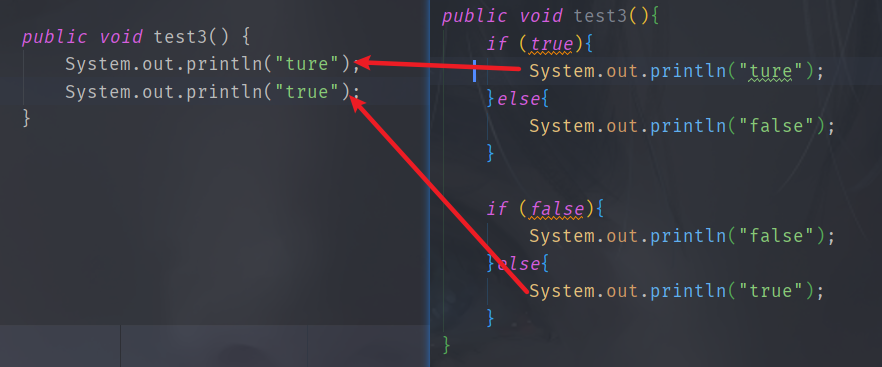
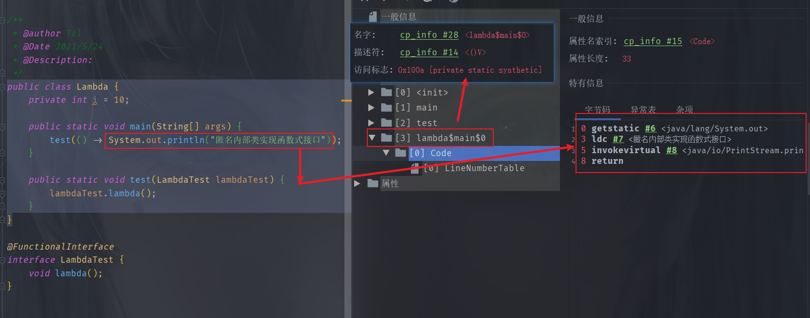
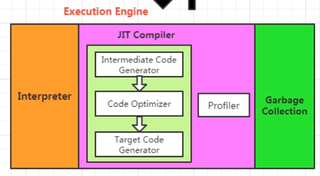
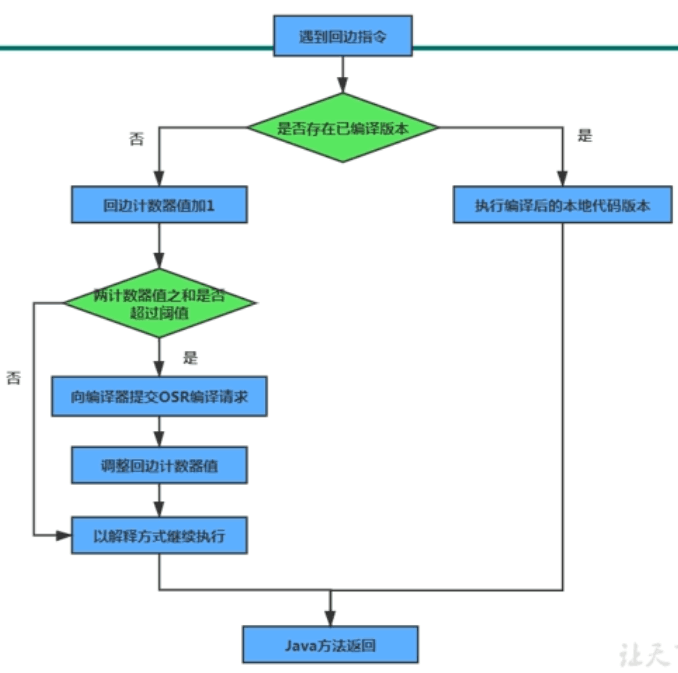

[toc]


## 编译器与执行引擎

### 编译器

Java编译器分类

- 前端编译器 (javac): Java源代码 -> Class文件
	- 优化对于程序员来说好用的语法糖
- 即时编译器 : (运行时)字节码 -> 本地机器码
	- 优化程序执行效率
- 提前编译器 : 程序 -> 本地二进制代码

#### 前端编译过程

- 准备阶段: 初始化插入式注解处理器

- 处理阶段

	- 解析与填充符号表

		1. **词法分析: 将Java源代码的字符流转变为token(标记)流**
			- 字符: 程序编写的最小单位
			- 标记(token) :  编译的最小单位
			- 比如 关键字 static 是一个标记 / 6个字符

		2. **语法分析: 将token流构造成抽象语法树**

		3. **填充符号表: 产生符号信息和符号地址**
			- 符号表是一组符号信息和符号地址构成的数据结构
			- 比如: 目标代码生成阶段,对符号名分配地址时,要查看符号表上该符号名对应的符号地址

	- 插入式注解处理器的注解处理

		4. **注解处理器处理特殊注解: 在编译器允许注解处理器对源代码中特殊注解作处理,可以读写抽象语法树中任意元素,如果发生了写操作,就要重新解析,填充符号表**
			- 比如: Lombok通过特殊注解,生成get/set/构造器等方法

	- 语义分析与字节码生成

		5. **标注检查: 对语义静态信息的检查以及常量折叠优化**

			```java
			int i = 1;
			char c1 = 'a';
			int i2 = 1 + 2;//编译成 int i2 = 3 常量折叠优化
			char c2 = i + c1; //编译错误 标注检查 检查语法静态信息 
			```

			

		6. **数据及控制流分析: 对程序运行时动态检查**

			- 比如方法中流程控制产生的各条路是否有合适的返回值

		7. **解语法糖: 将(方便程序员使用的简洁代码)语法糖转换为原始结构**

		8. **字节码生成: 生成`<init>,<clinit>`方法,并根据上述信息生成字节码文件**

> 总结流程图



> 源码分析


代码位置在JavaCompiler的compile方法中


#### Java中的语法糖

##### 泛型

**将操作的数据类型指定为方法签名中一种特殊参数,作用在方法,类,接口上时称为泛型方法,泛型类,泛型接口**

Java中的泛型是**类型擦除式泛型**,泛型只在源代码中存在,**在编译期擦除泛型,并在相应的地方加上强制转换代码**

> 与具现化式泛型(不会擦除,运行时也存在泛型)对比

- 优点: 只需要改动编译器,Java虚拟机和字节码指令不需要改变

	- 因为泛型是JDK5加入的,为了满足对以前版本代码的兼容采用类型擦除式泛型

- 缺点: 性能较低,使用没那么方便

	- 为提供基本类型的泛型,只能自动拆装箱,在相应的地方还会加速强制转换代码,所以性能较低

	- 运行期间无法获取到泛型类型信息

		- 比如书写泛型的List转数组类型时,需要在方法的参数中指定泛型类型

			```java
			public static <T> T[] listToArray(List<T> list,Class<T> componentType){
			        T[] instance = (T[]) Array.newInstance(componentType, list.size());
			        return instance;
			}
			```

			

##### 自动拆装箱,增强for循环与可变长参数


增强for循环 -> 迭代器

可变长参数 -> 数组装载参数

泛型擦除后会在某些位置插入强制转换代码

> 自动装箱,拆箱的错误用法

```java
		Integer a = 1;
        Integer b = 2;
        Integer c = 3;
        Integer d = 3;
        Integer e = 321;
        Integer f = 321;
        Long g = 3L;

        System.out.println(c == d);//true
        System.out.println(e == f);//false
        System.out.println(c == (a + b));//true
        System.out.println(c.equals(a + b));//true
        System.out.println(g == (b + a));//false
        System.out.println(g.equals(a + b));//true
```

- 注意: 

	1. 包装类重写的equals方法中不会自动转换类型

		

	2. 包装类的 == 就是去比较引用地址,不会自动拆箱


##### 条件编译

布尔类型+if语句 : **根据布尔值类型的真假,编译器会把分支中不成立的代码块消除(解语法糖)**




##### Lambda原理

> 编写函数式接口

```java
@FunctionalInterface
interface LambdaTest {
    void lambda();
}
```


> 编写测试类

```java
public class Lambda {
    private int i = 10;

    public static void main(String[] args) {
        test(() -> System.out.println("匿名内部类实现函数式接口"));
    }

    public static void test(LambdaTest lambdaTest) {
        lambdaTest.lambda();
    }
}
```


> 使用插件查看字节码文件



生成了一个私有静态的方法,这个方法中很明显就是lambda中的代码

**在使用lambda表达式的类中隐式生成一个静态私有的方法,这个方法代码块就是lambda表达式中写的代码**


执行class文件时带上参数`java -Djdk.internal.lambda.dumpProxyClasses 包名.类名`即可显示出这个匿名内部类


**使用`invokedynamic`生成了一个实现函数式接口的匿名内部类对象,在重写函数式接口的方法实现中调用了上面那个静态私有方法**


### 执行引擎

**执行引擎将字节码指令解释/编译为对应OS上的的机器指令**

> hotspot执行引擎结构图




#### 执行引擎执行方式

执行引擎执行方式大致分为3种

`-Xint`: 完全采用解释器执行

`-Xcomp`: 优先采用即时编译器执行,解释器是后备选择

`-Xmixed`: 采用解释器 + 即时编译器


- hotspot中有2种JIT编译器
	- Client模式下的**C1编译器:简单优化,耗时短**
		- C1优化策略:方法内联,去虚拟化,冗余消除
	- Server模式下的**C2编译器:深度优化,耗时长**
		- C2主要是逃逸分析的优化:标量替换,锁消除,栈上分配


#### 逃逸分析带来的优化

##### 逃逸

**对象不会发生逃逸: 对象的作用域只在某个方法,不会被外界调用到**


##### 栈上分配内存

```java
//-Xms1G -Xmx1G -XX:+PrintGCDetails 
public class StackMemory {
    public static void main(String[] args) {
        long start = System.currentTimeMillis();

        for (int i = 0; i < 10000000; i++) {
            memory();
        }

        System.out.println("花费时间:"+(System.currentTimeMillis()-start)+"ms");

        try {
            TimeUnit.SECONDS.sleep(1000);
        } catch (InterruptedException e) {
            e.printStackTrace();
        }
    }

    private static void memory(){
        StackMemory memory = new StackMemory();
    }
}
```

-XX:-DoEscapeAnalysis 花费时间:63ms  (未开启逃逸分析)

-XX:+DoEscapeAnalysis 花费时间:4ms (开启逃逸分析)

**默认开启逃逸分析**


##### 锁消除

同步加锁会带来开销

锁消除: 当加锁对象只作用某个方法时,JIT编译器借助逃逸分析判断 **使用的锁对象是不是只能被一个线程访问**,如果是这种情况下就不需要同步,可以取消这部分代码的同步,提高并发性能


##### 标量替换

标量: 无法再分解的数据 (基本数据类型)

聚合量: 还可以再分解的数据 (对象)

**标量替换: JIT借助逃逸分析,该对象不发生逃逸,只作用于某个方法会把该对象(聚合量)拆成若干个成员变量(标量)来代替**

**默认开启标量替换**

```java
public class ScalarSubstitution {
    static class Man{
        int age;
        int id;

        public Man() {
        }
    }

    public static void createInstance(){
        Man man = new Man();
        man.id = 123;
        man.age = 321;
    }
    public static void main(String[] args) {
        long start = System.currentTimeMillis();

        for (int i = 0; i < 10000000; i++) {
            createInstance();
        }

        System.out.println("花费时间:"+(System.currentTimeMillis()-start)+"ms");

        try {
            TimeUnit.SECONDS.sleep(1000);
        } catch (InterruptedException e) {
            e.printStackTrace();
        }
    }
}
```

```java
//-Xmx200m -Xms200m -XX:+PrintGCDetails 
//-XX:+DoEscapeAnalysis 设置开启逃逸分析
//-XX:-EliminateAllocations 设置不开启标量替换 
//开启逃逸分析 + 关闭标量替换 : 花费时间:93ms
```

```java
//开启逃逸分析 + 开启标量替换  : 花费时间:6ms
```


#### 分层编译

**分层编译策略: 程序解释执行(不开启逃逸分析)可以触发C1编译,开启逃逸分析可以触发C2编译**

**解释器,C1,C2同时工作,热点代码可能被编译多次**

解释器在程序刚刚开始的时候解释执行,不需要承担监控的开销

C1有着更快的编译速度,能为C2编译优化争取更多时间

C2用高复杂度算法,编译优化程度很高的代码


#### 解释执行与编译执行

Java虚拟机执行引擎在执行Java代码时,会有两种选择:==解释执行和编译执行==

- 解释执行:通过**字节码解释器把字节码解析为机器语言**执行
- 编译执行:通过**即时编译器产生本地代码**执行

Class文件中的代码到底是解释执行还是编译执行只有Java虚拟机自己才能判断准确

> 编译过程


经典编译原理: **1.对源码进行词法,语法分析处理 2.把源码转换为抽象语法树**

**javac编译器完成了对源码进行词法,语法分析处理为抽象语法树,再遍历抽象语法树生成线性字节码指令流的过程**

剩下的指令流

1. 由虚拟机内部的字节码解释器去将字节码指令进行逐行解释  (解释执行)

2. 或优化器(即时编译器)优化代码最后生成目标代码  (编译执行)


> 执行引擎流程图


#### 解释器与编译器

##### 解释器

- **作用: 对字节码指令逐行解释**

- 字节码解释器: 古老的,纯软件代码模拟字节码执行
- 模板解释器: 把每条字节码指令与模板函数关联
- 优点: 程序启动,解释器立即解释执行
- 缺点: 低效


##### 即时编译器

(just in time compiler)

- Java中的"编译期"不确定

	- 可能说的是执行javac指令时的前端编译器 (.java->.class)

	- 也可能是后端编译器JIT (字节指令->机器指令)
	- 还可能是AOT编译器(静态提前编译器)  (.java->机器指令)

- **作用: 将方法编译成机器码缓存到方法区,每次调用该方法执行编译后的机器码**

- 优点: 即时编译器把代码编译成本地机器码,执行效率高,高效

- 缺点: 程序启动时,需要先编译再执行


> 有了高效的JIT为什么还要解释器

hotspot中采用了解释器+JIT

JVM启动时,解释器可以先进行解释执行,而不必等JIT全编译后再执行,提高了响应速度,之后JIT慢慢把越来越多的代码编译为本地机器码,提高执行效率


#### 热点代码与热点探测

JIT编译器并不是编译所有的字节码,JIT编译器只编译热点代码

**热点代码: 被多次调用的方法 或 方法中多次循环的循环体**

**栈上替换(OSR): JIT将方法中的热点代码编译为本地机器指令(被多次执行的循环体)**

**编译对象都是方法,如果是栈上替换则"入口"在方法的循环体开始那里**

**热点探测功能**决定了被调用多少次的方法能成为热点代码

- hotspot采用**基于计数器的热点探测**

	- **方法调用计数器 : 统计方法调用次数**

	- **回边计数器 : 统计循环体执行循环次数**

		

> 执行引擎具体采用哪种执行方式流程图


#### 基于栈的指令集与基于寄存器的指令集

javac编译出的字节码指令流是基于栈的指令集架构,与之对应的是PC机中物理硬件支持的指令集架构,依赖寄存器(基于寄存器的指令集)

> 基于寄存器的指令集

指令带参数,依赖寄存器来访问与存储数据


> 基于栈的指令集

指令通常不带参数,依赖栈,在栈中进行操作,结果也存储在操作栈中(也可能保存到局部变量表中)

优点:

1. 字节码指令紧凑(每个字节对应一个指令还不用带参数,基于寄存器的指令集需要带参数)
2. 实现简单(不用考虑分配内存问题,因为操作都是在栈中)
3. 可移植性

缺点: 因为实现同功能指令会比基于寄存器指令多,频繁的对栈进行操作(栈实现在内存中,实际上就是对内存进行操作)会影响速度


> 栈顶缓存 ToS (Top-of-Stack Cashing)

虚拟机使用的这种基于栈式的指令集,相对于基于寄存器的指令集来说,使用零地址指令更加紧凑,但是执行相同的任务(调用某个方法)会带来更多的入栈出栈操作,从而频繁读写内存,影响执行速度

**使用栈顶缓存技术,将栈顶元素全缓存在物理CPU寄存器中,以此降低对内存读写,提升效率**


