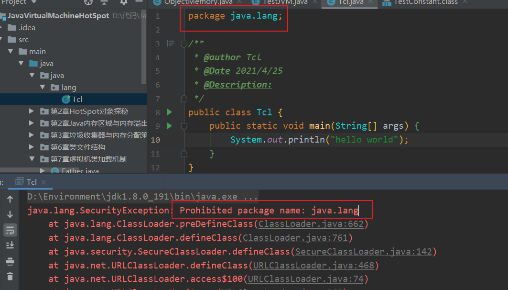

[toc]


## 虚拟机类加载机制

什么叫做类加载?

**类加载的定义: JVM把描述类的数据从Class文件加载到内存,并对数据进行校验,解析和初始化,最终变成可以被JVM直接使用的Java类型**(因为可以动态产生,这里的Class文件并不是具体存在磁盘中的文件,而是二进制数据流)


一个类型被加载到内存使用 到 结束卸载出内存,它的生命周期分为7个阶段: 加载->验证->准备->解析->初始化->使用->卸载


其中重要阶段一般的**开始顺序**: ==加载->验证->准备->解析->初始化==

验证,准备,解析合起来又称为连接所以也可以是==加载->连接->初始化==

注意这里的顺序是一般的开始顺序,并不一定是执行完某个阶段结束后才开始执行下一个阶段,也可以是执行到某个阶段的中途就开始执行下一个阶段

还有种特殊情况就是**解析可能在初始化之后(因为Java运行时的动态绑定)**


### 类加载阶段

接下来将对这五个阶段进行详细介绍

> Loading

#### 加载

- 加载的作用

1. **通过这个类的全限定名来查找并加载这个类的二进制字节流**
2. **将这个类所代表的静态存储结构转化为方法区运行时数据结构**
3. **在堆中创建这个类的Class对象,这个Class对象是对方法区访问数据的"入口"**

- 对于加载可以由JVM的自带类加载器来完成,也可以通过开发人员自定义的类加载器来完成(实现ClassLoader,重写findClass())

数组类是直接由JVM在内存中动态构造的,数组中的元素还是要靠类加载器进行加载


> Verification

#### 验证

- 验证的作用

	**确保要加载的类信息符合规范,防止危害JVM安全**

- 验证的具体划分

	- 文件格式验证

		**目的: 保证字节流能正确解析并存储到方法区之内,格式上符合Java类型信息**

		验证字节流是否符合Class文件格式规范(比如Class文件主,次版本号是否在当前虚拟机兼容范围内...)

		

	- 元数据验证

		**目的: 对类的元数据信息进行语义验证**

		> 什么是元数据?

		**简单的来说就是描述这个类与其他类之间关系的信息**

		元数据信息验证(举例):

		1. 这个类的父类有没有继承其他的最终类(被final修饰的类,不可让其他类继承)
		2. 若这个类不是抽象类,那这个类有没有实现(抽象父类)接口的所有方法

		

	- 字节码验证(验证中最复杂的一步)

		**目的: 对字节码进行验证,保证校验的类在运行时不会做出对JVM危险的行为**

		字节码验证举例:

		1. 类型转换有效: 子类转换为父类(安全,有效) 父类转换为子类(危险)

			

	- 符号引用验证

		发生在解析阶段前:符号引用转换为直接引用

		**目的: 保证符号引用转为直接引用时,该类不缺少它所依赖的资源(外部类),确保解析可以完成**


验证阶段是一个非常重要的阶段,但又不一定要执行(因为许多第三方的类,自己封装的类等都被反复"实验"过了)

在生产阶段可以考虑关闭 ==-Xverify:none==以此来缩短类加载时间


> Preparation

#### 准备

**准备阶段为类变量(静态变量)分配内存并默认初始化**

- 分配内存

	- 逻辑上应该分配在方法区,但是因为hotSpot在JDK7时将==字符串常量,静态变量==挪出永久代(放在堆中),所以实际上它应该在堆中

- 默认初始化

	- 类变量一般的默认初始化都是初始化该类型的==零值==

		| 类型      | 零值     |
		| --------- | -------- |
		| byte      | (byte)0  |
		| short     | (short)0 |
		| int       | 0        |
		| long      | 0L       |
		| float     | 0.0F     |
		| double    | 0.0      |
		| boolean   | false    |
		| char      | '\u0000' |
		| reference | null     |

	- 特殊的类变量的字段属性中存在==ConstantValue==属性值(被final修饰"常量"),会初始化为ConstantValue所指向的值(==**ConstantValue指向常量池中的值必须是基本类型或字符串才会在准备阶段默认赋值,否则会在初始化时赋值**==)

		```java
		 final int i = 111;
		```


> Resolution

#### 解析

- 解析的作用

	将常量池中的常量池中**符号引用替换为直接引用**（把符号引用代表的地址替换为真实地址）

	符号引用: 用一组符号来描述所引用的目标

	直接引用: 可以是直接指向对象,也可以是间接指向对象的句柄

- 并未规定解析的时间

	可以是类加载时就对常量池的符号引用解析为直接引用

	也可以在符号引用要使用的时候再去解析(动态调用时只能是这种情况)

- 同一个符号引用可能会被解析多次,所以会有缓存(标记该符号引用已经解析过),多次解析动作都要保证每次都是相同的结果(成功或异常)


##### 类和接口的解析

当我们要访问一个未解析过的类时

1. 把要解析的类的符号引用 交给当前所在类的类加载器 去加载 这个要解析的类
2. 解析前要进行符号引用验证,如果当前所在类没有权限访问这个要解析的类,抛出异常`IllegalAccessError`


##### 字段的解析

解析一个从未解析过的字段

1. 先对此字段所属的类(类, 抽象类, 接口)进行解析

2. 然后在此字段所属的类中**查找该字段简单名称和描述符都匹配的字段,返回它的直接引用**

	- 如果此字段所属的类有父类或实现了接口,要自下而上的寻找该字段

	- 找不到抛出`NoSuchFieldError`异常

3. 对此字段进行权限验证(如果不具备权限抛出`IllegalAccessError`异常)

**确保JVM获得字段唯一解析结果**

如果同名字段出现在父类,接口等中,编译器有时会更加严格,直接拒绝编译Class文件


##### 方法的解析

解析一个从未解析过的方法

1. 先对此方法所属的类(类, 抽象类, 接口)进行解析

2. 然后在此字段所属的类中**查找该方法简单名称和描述符都匹配的方法,返回它的直接引用**

	- 如果此方法所属类是接口直接抛出`IncompatibleClassChangeError`异常

	- 如果此方法所属的类有父类或实现了接口,要自下而上的寻找该方法(先找父类再找接口)
	- 如果在接口中找到了,说明所属类是抽象类,抛出`AbstractMethodError`异常(自身找不到,父类中找不到,最后在接口中找到了,说明他是抽象类),找不到抛出`NoSuchMethodError`异常

3. 对此方法进行权限验证(如果不具备权限抛出`IllegalAccessError`异常)


##### 接口方法的解析

解析一个从未解析过的接口方法

1. 先对此接口方法所属的接口进行解析

2. 然后在此接口方法所属的接口中**查找该接口方法简单名称和描述符都匹配的接口方法,返回它的直接引用**

	- 如果此接口方法所属接口是类直接抛出`IncompatibleClassChangeError`异常

	- 如果此方法所属的接口有父接口,要自下而上的寻找该接口方法
	- 如果多个不同的接口中都存在这个接口方法,会随机返回一个直接引用(编译会更严格,这种情况应该会拒绝编译)

3. 找不到抛出`NoSuchMethodError`


> Initializtion

#### 初始化

**执行类构造器<clinit>的过程**

- 什么是<clinit> ?

	<clinit>是**javac编译器 在编译期间自动收集类变量赋值的语句和静态代码块合并 自动生成的**

- 类和接口的类构造器

	- 类 

		<clinit>又叫类构造器,与<init>实例构造器不同,类构造器不用显示父类类构造器调用

		但是**父类要在子类之前初始化**,也就是完成类构造器

	- 接口

		执行接口的类构造器时,不会去执行它父类接口的类构造器,直到用到父接口中定义的变量被使用时才执行

- JVM会保证执行<clinit>在多线程环境下被正确的加锁和同步(也就是只会有一个线程去执行<clinit>其他线程会阻塞等待,直到<clinit>完成)

	```java
	public class TestJVM {
	    static class  A{
	        static {
	            if (true){
	                System.out.println(Thread.currentThread().getName() + "<clinit> init");
	                while (true){
	
	                }
	            }
	        }
	    }
	    @Test
	    public void test(){
	        Runnable runnable = new Runnable() {
	            @Override
	            public void run() {
	                System.out.println(Thread.currentThread().getName() + "start");
	                A a = new A();
	                System.out.println(Thread.currentThread().getName() + "end");
	            }
	        };
	
	        new Thread(runnable,"1号线程").start();
	        new Thread(runnable,"2号线程").start();
	    }
	
	}
	
	/*
	1号线程start
	2号线程start
	1号线程<clinit> init
	*/
	```


> JVM规定6种情况下必须进行初始化(主动引用)

##### 主动引用

- 遇到==new,getstatic,putstatic,invokestatic==四条字节码指令
	- new
	- 读/写 某类静态变量(不包括常量)
	- 调用 某类静态方法
- 使用`java.lan.reflect`包中方法对类型进行反射
- 父类未初始化要先初始化父类
- 虚拟机启动时,先初始化main方法所在的类
- 某类实现的接口中有默认方法(JDK8新加入的),要先对接口进行初始化
- JDK7新加入的动态语言支持,部分....


##### 被动引用

- 子类访问父类静态变量	

	```java
	public class TestMain {
	    static {
	        System.out.println("main方法所在的类初始化");
	    }
	
	    public static void main(String[] args) {
	        System.out.println(Sup.i);
	    }
	}
	
	class Sub{
	    static {
	        System.out.println("子类初始化");
	    }
	}
	
	class Sup{
	    static {
	        System.out.println("父类初始化");
	    }
	    static int i = 100;
	}
	
	/*
	main方法所在的类初始化
	父类初始化
	100
	*/
	```

	**子类调用父类静态变量是在父类类加载初始化的时候赋值的,所以子类不会类加载**

- 实例数组

  ```java
  public class TestArr {
      static {
          System.out.println("main方法所在的类初始化");
      }
      public static void main(String[] args) {
          Arr[] arrs = new Arr[1];
      }
  }
  
  class Arr{
      static {
          System.out.println("arr初始化");
      }
  }
  
  /*
  main方法所在的类初始化
  */
  ```

  例子里包名为：org.fenixsoft.classloading。该例子没有触发类org.fenixsoft.classloading.Arr的初始化阶段，但触发了另外一个名为“[Lorg.fenixsoft.classloading.Arr”的类的初始化阶段，对于用户代码来说，这并不是一个合法的类名称，它是一个**由虚拟机自动生成的、直接继承于Object的子类，创建动作由字节码指令newarray触发.**这个类**代表了一个元素类型为org.fenixsoft.classloading.Arr的一维数组**，数组中应有的属性和方法（用户可直接使用的只有被修饰为public的length属性和clone()方法）都实现在这个类里。

  **创建数组时不会对数组中的类型对象(Arr)发生类加载**

  **虚拟机自动生成的一个类,管理Arr的数组,会对这个类进行类加载**

- 调用静态常量

	```java
	public class TestConstant {
	    static {
	        System.out.println("main方法所在的类初始化");
	    }
	    public static void main(String[] args) {
	        System.out.println(Constant.NUM);
	    }
	}
	
	class Constant{
	    static {
	        System.out.println("Constant初始化");
	    }
	    static final int NUM = 555;
	}
	
	/*
	main方法所在的类初始化
	555
	*/
	```

	我们在连接阶段的准备中说明过,如果静态变量字段表中有`ConstantValue`(被final修饰)它在准备阶段就已经完成初始默认值了,不用进行初始化


### 类加载器

什么是类加载器?

**类加载器 在加载时,通过类的全限定名来获取该类的二进制字节流** (在JVM外部实现的)

所有类都由它本身和加载它的那个类在JVM中确定唯一性(也就是说判断俩个类是否为同一个类时,如果它们的类加载器都不同那肯定不是同一个类)


#### 类加载器种类

启动（引导）类加载器：Bootstrap Classloader c++编写，无法直接获取，**加载核心库`<JAVA_HOME>\lib`**

扩展类加载器：Extension Classloader **加载扩展库`<JAVA_HOME>\lib\ext\*.jar`**

应用程序(系统)类加载器: App(System) Classloader 最常用的加载器 **加载我们程序中自定义的类**

**自定义类加载器(实现ClassLoader类，重写findClass方法)**

通过代码来演示:

```java
public class TestClassLoader {
    public static void main(String[] args) {
        URL[] urLs = Launcher.getBootstrapClassPath().getURLs();
        System.out.println("启动类加载器能加载的api路径:");
        for (URL urL : urLs) {
            System.out.println(urL);
        }
        /*
        启动类加载器能加载的api路径:
        file:/D:/Environment/jdk1.8.0_191/jre/lib/resources.jar
        file:/D:/Environment/jdk1.8.0_191/jre/lib/rt.jar
        file:/D:/Environment/jdk1.8.0_191/jre/lib/sunrsasign.jar
        file:/D:/Environment/jdk1.8.0_191/jre/lib/jsse.jar
        file:/D:/Environment/jdk1.8.0_191/jre/lib/jce.jar
        file:/D:/Environment/jdk1.8.0_191/jre/lib/charsets.jar
        file:/D:/Environment/jdk1.8.0_191/jre/lib/jfr.jar
        file:/D:/Environment/jdk1.8.0_191/jre/classes
        */

        System.out.println("扩展类加载器能加载的api路径:");
        String property = System.getProperty("java.ext.dirs");
        System.out.println(property);
        /*
        扩展类加载器能加载的api路径:
        D:\Environment\jdk1.8.0_191\jre\lib\ext;C:\WINDOWS\Sun\Java\lib\ext
        */
        
        //sun.misc.Launcher$AppClassLoader@18b4aac2 
        //加载我们自定义类的类加载器是AppClassLoader,它是Launcher的内部类
        ClassLoader appClassLoader = TestClassLoader.class.getClassLoader();
        System.out.println(appClassLoader);
        
        //sun.misc.Launcher$ExtClassLoader@511d50c0
        //AppClassLoader的上一层加载器是ExtClassLoader,它也是Launcher的内部类
        ClassLoader extClassloader = appClassLoader.getParent();
        System.out.println(extClassloader);
        
        //null 实际上是启动类加载器,因为它是c/c++写的,所以显示null
        ClassLoader bootClassloader = extClassloader.getParent();
        System.out.println(bootClassloader);
    }
}

```

> 类装载器示意图：


系统类加载器和扩展类加载器是Launcher的内部类,它们间接实现了classloader

Java虚拟机规范中的分类: 

- 引导类加载器 (c写的那个Bootstrap ClassLoader)
- 自定义类加载器:由`ClassLoader`类派生的类加载器类(包括扩展类,系统类,程序员自定义加载器等) 
- **包含关系**


#### 双亲委派模型

- 源码

```java
protected Class<?> loadClass(String name, boolean resolve)
            throws ClassNotFoundException
    {
        synchronized (getClassLoadingLock(name)) {
            // 首先检查这个class是否已经加载过了
            Class<?> c = findLoadedClass(name);
            if (c == null) {
                long t0 = System.nanoTime();
                try {
                    // c==null表示没有加载，如果有父类的加载器则让父类加载器加载
                    if (parent != null) {
                        c = parent.loadClass(name, false);
                    } else {
                        //如果父类的加载器为空 则说明递归到bootStrapClassloader了
                        //则委托给BootStrap加载器加载
                        //bootStrapClassloader比较特殊无法通过get获取
                        c = findBootstrapClassOrNull(name);
                    }
                } catch (ClassNotFoundException e) {
                    //父类无法加载抛出异常
                }
                if (c == null) {
                    //如果父类加载器仍然没有加载过，则尝试自己去加载class
                    long t1 = System.nanoTime();
                    c = findClass(name);
                    sun.misc.PerfCounter.getParentDelegationTime().addTime(t1 - t0);
                    sun.misc.PerfCounter.getFindClassTime().addElapsedTimeFrom(t1);
                    sun.misc.PerfCounter.getFindClasses().increment();
                }
            }
            if (resolve) {
                resolveClass(c);
            }
            return c;
        }
    }
```

- 分析：

	1. 先检查这个类是否加载过

	2. 没有加载过，查看父类加载器是否为空，

		如果不为空，就交给父类加载器去加载（递归），

		如果为空，说明已经到启动类加载器了（启动类加载器不能get因为是c++写的）

	3. 如果启动类加载器没有加载过，则递归回来自己加载

- 图像演示 (网络图片:别的大佬画的图)

	 

- 举例

  1. 假如我现在自己定义一个MyString类,它会自己找（先在系统类加载器中找，然后在扩展类加载器中找，最后去启动类加载器中找，启动类加载器无法加载然后退回扩展类加载器，扩展类加载器无法加载然后退回系统类加载器，然后系统类加载器就完成加载）

  2. 我们都知道Java有java.lang.String这个类

  	那我再创建一个java.lang.String运行时，报错

  	

  	可是我明明写了main方法

  	这是因为**类装载器的沙箱安全机制**

  	很明显这里的报错是因为它找到的是启动类加载器中的java.lang.String而不是在应用程序类加载器中的java.lang.String(我们写的)
  	
  	而且核心类库的包名也是被禁止使用的
  	
  	

  **类装载器的加载机制：启动类加载器->扩展类加载器->应用程序类加载器**

- 作用

	1. 防止重复加载同一个class文件
	2. 保证核心类不能被篡改

