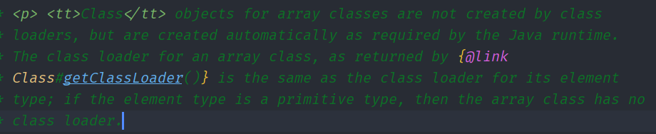
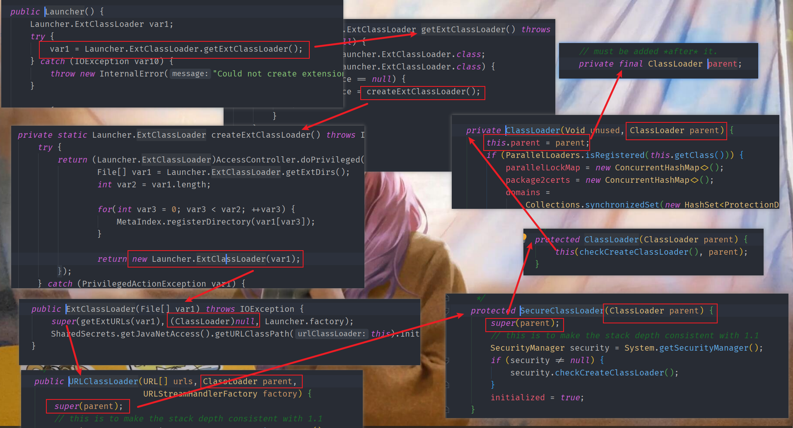
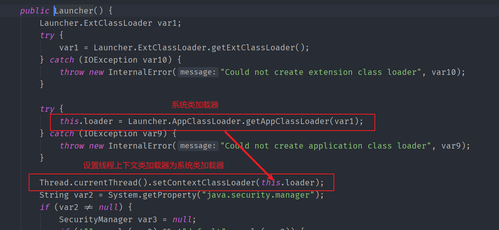
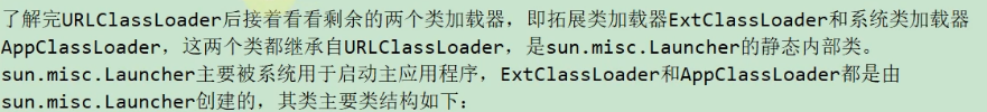
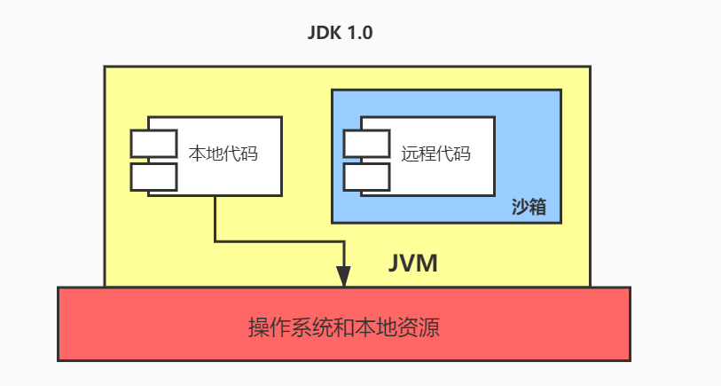
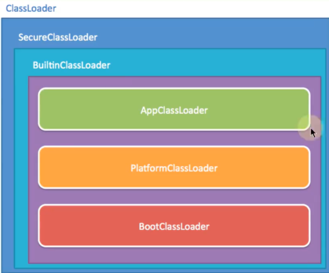
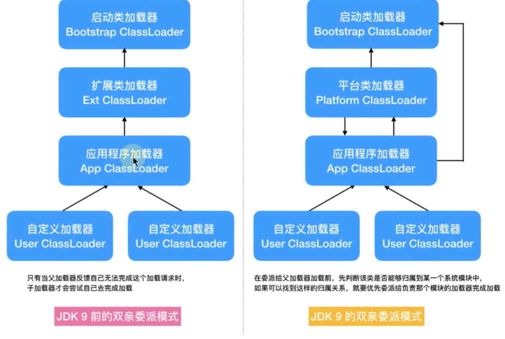

[toc]


## 虚拟机类加载机制

### 类的生命周期

> 什么叫做类加载?

**类加载的定义: JVM把描述类的数据从Class文件加载到内存,并对数据进行校验,解析和初始化,最终变成可以被JVM直接使用的Java类型**(因为可以动态产生,这里的Class文件并不是具体存在磁盘中的文件,而是二进制数据流)

一个类型被加载到内存使用 到 结束卸载出内存,它的生命周期分为7个阶段: 加载->验证->准备->解析->初始化->使用->卸载

其中重要阶段一般的**开始顺序**: ==加载->验证->准备->解析->初始化==

验证,准备,解析合起来又称为连接所以也可以是==加载->连接->初始化==

注意这里的顺序是一般的开始顺序,并不一定是执行完某个阶段结束后才开始执行下一个阶段,也可以是执行到某个阶段的中途就开始执行下一个阶段

还有种特殊情况就是**解析可能在初始化之后(因为Java运行时的动态绑定)**

**基本数据类型不需要加载,引用类型才需要被类加载**


### 类加载阶段

接下来将对这五个阶段进行详细介绍

> Loading

#### 加载

- 加载的作用

1. **通过这个类的全限定名来查找并加载这个类的二进制字节流**
	- JVM通过文件系统加载某个class后缀文件
	- 读取jar包中的类文件
	- 数据库中类的二进制数据
	- 使用类似HTTP等协议通过网络加载
	- 运行时动态生成Class二进制数据流
2. **将这个类所代表的静态存储结构(静态常量池)转化为方法区运行时数据结构(运行时常量池)**
3. **在堆中创建这个类的Class对象,这个Class对象是对方法区访问数据的"入口"**
	- 堆中实例对象中对象头的类型指针指向它这个类方法区的Class对象

- 对于加载可以由JVM的自带类加载器来完成,也可以通过开发人员自定义的类加载器来完成(实现ClassLoader,重写findClass())

>  注意

1. 数组类是直接由JVM在内存中动态构造的,数组中的元素还是要靠类加载器进行加载
2. 反射正是通过加载创建的Class对象才能在运行期使用反射


> Verification

#### 验证

- 验证的作用

	**确保要加载的字节码符合规范,防止危害JVM安全**

- 验证的具体划分

  - 文件格式验证

  	**目的: 保证字节流能正确解析并存储到方法区之内,格式上符合Java类型信息**

  	验证字节流是否符合Class文件格式规范(比如Class文件主,次版本号是否在当前虚拟机兼容范围内...)

  	

  - 元数据验证

  	**目的: 对类的元数据信息进行语义验证**

  	> 什么是元数据?

  	**简单的来说就是描述这个类与其他类之间关系的信息**

  	元数据信息验证(举例):

  	1. 这个类的父类有没有继承其他的最终类(被final修饰的类,不可让其他类继承)
  	2. 若这个类不是抽象类,那这个类有没有实现(抽象父类)接口的所有方法

  	

  - 字节码验证(验证中最复杂的一步)

    **目的: 对字节码进行验证,保证校验的类在运行时不会做出对JVM危险的行为**

    字节码验证举例:

    1. 类型转换有效: 子类转换为父类(安全,有效) 父类转换为子类(危险)

    2. 进行算术运算,使用的是否是相同类型指令等

    	

  - 符号引用验证

    发生在解析阶段前:符号引用转换为直接引用

    **目的: 保证符号引用转为直接引用时,该类不缺少它所依赖的资源(外部类),确保解析可以完成**

    


验证阶段是一个非常重要的阶段,但又不一定要执行(因为许多第三方的类,自己封装的类等都被反复"实验"过了)

在生产阶段可以考虑关闭 ==-Xverify:none==以此来缩短类加载时间


> Preparation

#### 准备

**准备阶段为类变量(静态变量)分配内存并默认初始化**

- 分配内存

  - 逻辑上应该分配在方法区,但是因为hotSpot在JDK7时将==字符串常量,静态变量==挪出永久代(放在堆中)
  - 实际上它应该在堆中

- 默认初始化

	- 类变量一般的默认初始化都是初始化该类型的==零值==

		| 类型      | 零值     |
		| --------- | -------- |
		| byte      | (byte)0  |
		| short     | (short)0 |
		| int       | 0        |
		| long      | 0L       |
		| float     | 0.0F     |
		| double    | 0.0      |
		| boolean   | false    |
		| char      | '\u0000' |
		| reference | null     |

	- 特殊的类变量的字段属性中存在==ConstantValue==属性值,会初始化为ConstantValue所指向在常量池中的值

	- ==**只有被final修饰的基本类型或字面量且要赋的值在常量池中才会被加上`ConstantValue`属性**==
	
		


> Resolution

#### 解析

- 解析的作用

  将常量池中的常量池中**符号引用替换为直接引用**（把符号引用代表的地址替换为真实地址）

  - 符号引用
  	- **使用一组符号描述引用**(为了定位到目标引用)
  	- 与虚拟机内存布局无关
  	- 还是符号引用时目标引用不一定被加载到内存
  - 直接引用
  	- **直接执行目标的指针,相对偏移量或间接定位目标引用的句柄**
  	- 与虚拟机内存布局相关
  	- 解析直接引用时目标引用已经被加载到内存中

- 并未规定解析的时间

	可以是类加载时就对常量池的符号引用解析为直接引用

	也可以在符号引用要使用的时候再去解析(动态调用时只能是这种情况)

- 同一个符号引用可能会被解析多次,所以会有缓存(标记该符号引用已经解析过),多次解析动作都要保证每次都是相同的结果(成功或异常)


##### 类和接口的解析

当我们要访问一个未解析过的类时

1. 把要解析的类的符号引用 交给当前所在类的类加载器 去加载 这个要解析的类
2. 解析前要进行符号引用验证,如果当前所在类没有权限访问这个要解析的类,抛出异常`IllegalAccessError`


##### 字段的解析

解析一个从未解析过的字段

1. 先对此字段所属的类(类, 抽象类, 接口)进行解析

2. 然后在此字段所属的类中**查找该字段简单名称和描述符都匹配的字段,返回它的直接引用**

	- 如果此字段所属的类有父类或实现了接口,要自下而上的寻找该字段

	- 找不到抛出`NoSuchFieldError`异常

3. 对此字段进行权限验证(如果不具备权限抛出`IllegalAccessError`异常)

**确保JVM获得字段唯一解析结果**

如果同名字段出现在父类,接口等中,编译器有时会更加严格,直接拒绝编译Class文件


##### 方法的解析

解析一个从未解析过的方法

1. 先对此方法所属的类(类, 抽象类, 接口)进行解析

2. 然后在此方法所属的类中**查找该方法简单名称和描述符都匹配的方法,返回它的直接引用**

	- 如果此方法所属类是接口直接抛出`IncompatibleClassChangeError`异常

	- 如果此方法所属的类有父类或实现了接口,要自下而上的寻找该方法(先找父类再找接口)
	- 如果在接口中找到了,说明所属类是抽象类,抛出`AbstractMethodError`异常(自身找不到,父类中找不到,最后在接口中找到了,说明他是抽象类),找不到抛出`NoSuchMethodError`异常

3. 对此方法进行权限验证(如果不具备权限抛出`IllegalAccessError`异常)


##### 接口方法的解析

解析一个从未解析过的接口方法

1. 先对此接口方法所属的接口进行解析

2. 然后在此接口方法所属的接口中**查找该接口方法简单名称和描述符都匹配的接口方法,返回它的直接引用**

	- 如果此接口方法所属接口是类直接抛出`IncompatibleClassChangeError`异常

	- 如果此方法所属的接口有父接口,要自下而上的寻找该接口方法
	- 如果多个不同的接口中都存在这个接口方法,会随机返回一个直接引用(编译会更严格,这种情况应该会拒绝编译)

3. 找不到抛出`NoSuchMethodError`


> Initializtion

#### 初始化

**执行类构造器<clinit>的过程**

- 什么是<clinit> ?

  - <clinit>是**javac编译器 在编译期间自动收集类变量赋值的语句和静态代码块合并 自动生成的**
  - 如果没有对类变量赋值动作或者静态代码块<clinit>可能不会生成 (带有`ConstantValue`属性的类变量初始化已经在准备阶段做过了,不会在这里初始化)

- 类和接口的类构造器

	- 类 

		<clinit>又叫类构造器,与<init>实例构造器不同,类构造器不用显示父类类构造器调用

		但是**父类要在子类之前初始化**,也就是完成类构造器

	- 接口

		执行接口的类构造器时,不会去执行它父类接口的类构造器,直到用到父接口中定义的变量被使用时才执行

- JVM会保证执行<clinit>在多线程环境下被正确的加锁和同步(也就是只会有一个线程去执行<clinit>其他线程会阻塞等待,直到<clinit>完成)

	```java
	public class TestJVM {
	    static class  A{
	        static {
	            if (true){
	                System.out.println(Thread.currentThread().getName() + "<clinit> init");
	                while (true){
	
	                }
	            }
	        }
	    }
	    @Test
	    public void test(){
	        Runnable runnable = new Runnable() {
	            @Override
	            public void run() {
	                System.out.println(Thread.currentThread().getName() + "start");
	                A a = new A();
	                System.out.println(Thread.currentThread().getName() + "end");
	            }
	        };
	
	        new Thread(runnable,"1号线程").start();
	        new Thread(runnable,"2号线程").start();
	    }
	
	}
	
	/*
	1号线程start
	2号线程start
	1号线程<clinit> init
	*/
	```


> JVM规定6种情况下必须进行初始化(主动引用)

##### 主动引用

- 遇到==new,getstatic,putstatic,invokestatic==四条字节码指令
	- new
	- 读/写 某类静态变量(不包括常量)
	- 调用 某类静态方法
- 使用`java.lan.reflect`包中方法对类型进行反射
- 父类未初始化要先初始化父类 (不适用于接口)
- 虚拟机启动时,先初始化main方法所在的类
- 某类实现的接口中有默认方法(JDK8新加入的),要先对接口进行初始化
- JDK7新加入的动态语言支持,部分....


##### 被动引用

> 1. 当访问静态字段时,只有真正声明这个字段的类才会被初始化

(子类访问父类静态变量)

```java
public class TestMain {
    static {
        System.out.println("main方法所在的类初始化");
    }

    public static void main(String[] args) {
        System.out.println(Sup.i);
    }
}

class Sub{
    static {
        System.out.println("子类初始化");
    }
}

class Sup{
    static {
        System.out.println("父类初始化");
    }
    static int i = 100;
}

/*
main方法所在的类初始化
父类初始化
100
*/
```

**子类调用父类静态变量是在父类类加载初始化的时候赋值的,所以子类不会类加载**


> 2. 实例数组

```java
public class TestArr {
    static {
        System.out.println("main方法所在的类初始化");
    }
    public static void main(String[] args) {
        Arr[] arrs = new Arr[1];
    }
}

class Arr{
    static {
        System.out.println("arr初始化");
    }
}

/*
main方法所在的类初始化
*/
```

例子里包名为：org.fenixsoft.classloading。该例子没有触发类org.fenixsoft.classloading.Arr的初始化阶段，但触发了另外一个名为“[Lorg.fenixsoft.classloading.Arr”的类的初始化阶段，对于用户代码来说，这并不是一个合法的类名称，它是一个**由虚拟机自动生成的、直接继承于Object的子类，创建动作由字节码指令anewarray触发.**这个类**代表了一个元素类型为org.fenixsoft.classloading.Arr的一维数组**，数组中应有的属性和方法（用户可直接使用的只有被修饰为public的length属性和clone()方法）都实现在这个类里。

**创建数组时不会对数组中的类型对象(Arr)发生类加载**

**虚拟机自动生成的一个类,管理Arr的数组,会对这个类进行类加载**


> 3. 调用静态常量

```java
public class TestConstant {
    static {
        System.out.println("main方法所在的类初始化");
    }
    public static void main(String[] args) {
        System.out.println(Constant.NUM);
    }
}

class Constant{
    static {
        System.out.println("Constant初始化");
    }
    static final int NUM = 555;
}

/*
main方法所在的类初始化
555
*/
```

我们在连接阶段的准备中说明过,如果静态变量字段表中有`ConstantValue`(被final修饰)它在准备阶段就已经完成初始默认值了,不用进行初始化


> 4. 调用classLoader类的loadClass()方法加载类不导致类初始化


#### 卸载

方法区的垃圾回收主要有两部分: ==不使用的常量和类==

回收方法区性价比比较低,因为不使用的常量和类比较少

> 不使用的常量

**没有任何地方引用常量池中的某常量**,则该常量会在垃圾回收时,被收集器回收


> 不使用的类

成为不使用的类需要满足以下要求:

1. **没有该类的任何实例对象**
2. **加载该类的类加载器被回收**
3. **该类对应的Class对象没在任何地方被引用**

注意: 就算被允许回收也不一定会被回收, 一般只会回收自定义的类加载器加载的类


### 类加载器

#### 简介

> 什么是类加载器?

**类加载器 在加载时,通过类的全限定名来获取该类的二进制字节流** (在JVM外部实现的)


> 显示加载与隐式加载

- 显示加载: 显示调用ClassLoader加载class对象
- 隐式加载: 不显示调用ClassLoader加载class对象(因为虚拟机会在第一次使用到某个类时自动加载这个类)

```java
//显示类加载
//Class.forName("第7章虚拟机类加载机制.User");
            
//隐式类加载
new User();    
```


> 唯一性与命名空间

- 唯一性
	- **所有类都由它本身和加载它的那个类在JVM中确定唯一性**
	- 也就是说判断俩个类是否为同一个类时,如果它们的类加载器都不同那肯定不是同一个类
- 命名空间
	- **每个类加载有自己的命名空间,命名空间由所有父类加载器和该加载器所加载的类组成**
	- 同一命名空间中,不存在类完整名相同的俩个类 
	- 不同命名空间中,允许存在类完整名相同的俩个类
		- 也就是说,多个自定义类加载加载同一个类时,会在各个类加载器中生成对应的命名,且它们都不是同一个类


> 基本特征

- 双亲委派模型

	- 

- 可见性

	- 子类加载器可以访问父类加载器所加载的类*

	- (命名空间包含父类加载器加载的类)

- 单一性 

	- 因为可见性,所以父类加载器加载过的类,子类加载器不会再加载
	- 同一级的自定义类加载器可能都会加载同一个类,因为它们互不可见


#### 类加载器分类


- 引导类加载器 (c/c++写的Bootstrap ClassLoader)
- 自定义类加载器:由`ClassLoader`类派生的类加载器类(包括扩展类,系统类,程序员自定义加载器等) 


系统类加载器和扩展类加载器是Launcher的内部类,它们间接实现了`ClassLoader`

>  注意

平常说的系统类加载器的父类加载器是扩展类加载器,而扩展类加载器的父类加载器是启动类加载器,都是"逻辑"上的父类加载器

实际上扩展类加载器和系统类加载器间接继承的`ClassLoader`中有一个字段`parent`用来表示自己的逻辑父类加载器


#### 类加载器种类

- 启动（引导）类加载器
	- Bootstrap Classloader c++编写，无法直接获取
	- **加载核心库`<JAVA_HOME>\lib\部分jar包`**
	- 不继承`java.lang.ClassLoader`,没有父类加载器
	- 加载扩展类加载器和应用程序类加载器,并指定为它们的父类加载器
- 扩展类加载器
	- Extension Classloader 
	- **加载扩展库`<JAVA_HOME>\lib\ext\*.jar`**
	- 间接继承`java.lang.ClassLoader`,父类加载器为启动类加载器
- 应用程序(系统)类加载器
	- App(System) Classloader 最常用的加载器
	-  **负责加载环境变量classpath或java.class.path指定路径下的类库 ,一般加载我们程序中自定义的类**
	- 间接继承`java.lang.ClassLoader`,父类加载器为扩展类加载器
	- 使用`ClassLoader.getSystemClassLoader()`获得

- **自定义类加载器(实现ClassLoader类，重写findClass方法)**

通过代码来演示:

```java
public class TestClassLoader {
    public static void main(String[] args) {
        URL[] urLs = Launcher.getBootstrapClassPath().getURLs();
        /*
        启动类加载器能加载的api路径:
        file:/D:/Environment/jdk1.8.0_191/jre/lib/resources.jar
        file:/D:/Environment/jdk1.8.0_191/jre/lib/rt.jar
        file:/D:/Environment/jdk1.8.0_191/jre/lib/sunrsasign.jar
        file:/D:/Environment/jdk1.8.0_191/jre/lib/jsse.jar
        file:/D:/Environment/jdk1.8.0_191/jre/lib/jce.jar
        file:/D:/Environment/jdk1.8.0_191/jre/lib/charsets.jar
        file:/D:/Environment/jdk1.8.0_191/jre/lib/jfr.jar
        file:/D:/Environment/jdk1.8.0_191/jre/classes
        */
        System.out.println("启动类加载器能加载的api路径:");
        for (URL urL : urLs) {
            System.out.println(urL);
        } 

        /*
        扩展类加载器能加载的api路径:
        D:\Environment\jdk1.8.0_191\jre\lib\ext;C:\WINDOWS\Sun\Java\lib\ext
        */
        System.out.println("扩展类加载器能加载的api路径:");
        String property = System.getProperty("java.ext.dirs");
        System.out.println(property);
        
        //加载我们自定义类的类加载器是AppClassLoader,它是Launcher的内部类
        ClassLoader appClassLoader = TestClassLoader.class.getClassLoader();
        //sun.misc.Launcher$AppClassLoader@18b4aac2 
        System.out.println(appClassLoader);
        
        //AppClassLoader的上一层加载器是ExtClassLoader,它也是Launcher的内部类
        ClassLoader extClassloader = appClassLoader.getParent();
        //sun.misc.Launcher$ExtClassLoader@511d50c0
        System.out.println(extClassloader);
        
        //实际上是启动类加载器,因为它是c/c++写的,所以显示null
        ClassLoader bootClassloader = extClassloader.getParent();
        //null 
        System.out.println(bootClassloader);
        
        int[] ints = new int[10];
        //null
        System.out.println(ints.getClass().getClassLoader());
        
        String[] strings = new String[10];
        //null
        System.out.println(strings.getClass().getClassLoader());
        
        TestClassLoader[] testClassLoaderArray = new TestClassLoader[10];
        //sun.misc.Launcher$AppClassLoader@18b4aac2
        System.out.println(testClassLoaderArray.getClass().getClassLoader());

        //sun.misc.Launcher$AppClassLoader@18b4aac2
        System.out.println(Thread.currentThread().getContextClassLoader());
    }
}
```

从上面可以得出结论

1. **数组类型的类加载器是数组元素的类加载器**
2. **基本类型不需要类加载**
3. **线程上下文类加载器是系统类加载器**


#### 关于类加载源码解析

##### 用源码来解释上文结论

- `ClassLoader`中的官方注释

	**虚拟机自动生成的一个类,管理数组,会对这个类进行类加载**

	**对数组类类加载器是数组元素的类加载器**

	**如果数组元素是基本类型则不会有类加载器**

- 源码解释扩展类加载器的父类是null

	

- 源码解释系统类加载器的父类是扩展类加载器

	

- 源码解释线程上下文类加载器是系统类加载器

	


##### ClassLoader主要方法

> loadClass()

`ClassLoader`的 `loadClass`方法 (双亲委派模型的源码)

```java
public Class<?> loadClass(String name) throws ClassNotFoundException {
    return loadClass(name, false);
}
```

```java
											//resolve:是否要解析类
protected Class<?> loadClass(String name, boolean resolve)
            throws ClassNotFoundException
    {
       //加锁同步 保证只加载一次
        synchronized (getClassLoadingLock(name)) {
            // 首先检查这个class是否已经加载过了
            Class<?> c = findLoadedClass(name);
            if (c == null) {
                long t0 = System.nanoTime();
                try {
                    // c==null表示没有加载，如果有父类的加载器则让父类加载器加载
                    if (parent != null) {
                        c = parent.loadClass(name, false);
                    } else {
                        //如果父类的加载器为空 则说明递归到bootStrapClassloader了
                        //则委托给BootStrap加载器加载
                        //bootStrapClassloader比较特殊无法通过get获取
                        c = findBootstrapClassOrNull(name);
                    }
                } catch (ClassNotFoundException e) {
                    //父类无法加载抛出异常
                }
                //如果父类加载器仍然没有加载过，则尝试自己去加载class
                if (c == null) {
                    long t1 = System.nanoTime();
                    c = findClass(name);
                    sun.misc.PerfCounter.getParentDelegationTime().addTime(t1 - t0);
                    sun.misc.PerfCounter.getFindClassTime().addElapsedTimeFrom(t1);
                    sun.misc.PerfCounter.getFindClasses().increment();
                }
            }
            //是否要解析
            if (resolve) {
                resolveClass(c);
            }
            return c;
        }
}
```

**先递归交给父类加载器去加载,父类加载器未加载再由自己加载**


> findClass()

`ClassLoader`的`findClass()`

```java
	protected Class<?> findClass(String name) throws ClassNotFoundException {
        throw new ClassNotFoundException(name);
    }
```

由子类`URLClassLoader`重写findClass去寻找类的规则


最后都会来到`defineClass()`方法


> defineClass()

```java
protected final Class<?> defineClass(String name, byte[] b, int off, int len)
```

根据从off开始长度为len定字节数组b转换为Class实例

**在自定义类加载器时,覆盖`findClass()`编写加载规则,取得要加载的类的字节码后转换为流调用`defineClass()`生成Class对象**


> resolveClass()

```java
	protected final void resolveClass(Class<?> c) {
        resolveClass0(c);
    }
```

使用该方法可以在生成Class对象后,解析类(符号引用 -> 直接引用)


> findLoadedClass()

```java
	protected final Class<?> findLoadedClass(String name) {
        if (!checkName(name))
            return null;
        return findLoadedClass0(name);
    }
```

如果加载过某个类则返回Class对象否则返回null


##### SecureClassLoader与URLClassLoader


**编写自定义类加载器不用太复杂时可以继承URLClassLoader不用覆写`findClass()`**


##### ExtClassLoader与AppClassLoader




##### Class.forName()与ClassLoader.loadClass()区别

- Class.forName()
	- 传入一个类的全限定名返回一个Class对象
	- **将Class文件加载到内存时会初始化,主动引用**
- ClassLoader.loadClass()
	- 需要class loader对象调用
	- 通过上面的源码分析可以知道,双亲委派模型调用loadClass,**只是将Class文件加载到内存,不会初始化和解析,直到这个类第一次使用才进行初始化**


#### 双亲委派模型

##### 简介

双亲委派模型源码实现对应`ClassLoader`的`loadClass()`


- 分析：

	1. 先检查这个类是否加载过

	2. 没有加载过，查看父类加载器是否为空，

		如果不为空，就交给父类加载器去加载（递归），

		如果为空，说明已经到启动类加载器了（启动类加载器不能get因为是c++写的）

	3. 如果父类加载器没有加载过，则递归回来自己加载

- 举例

  1. 假如我现在自己定义一个MyString类,它会自己找（先在系统类加载器中找，然后在扩展类加载器中找，最后去启动类加载器中找，启动类加载器无法加载然后退回扩展类加载器，扩展类加载器无法加载然后退回系统类加载器，然后系统类加载器就完成加载）

  2. 我们都知道Java有java.lang.String这个类

  	那我再创建一个java.lang.String运行时，报错

  	

  	可是我明明写了main方法

  	这是因为**类装载器的沙箱安全机制**

  	很明显这里的报错是因为它找到的是启动类加载器中的java.lang.String而不是在应用程序类加载器中的java.lang.String(我们写的)
  	
  	而且核心类库的包名也是被禁止使用的
  	
  	

  **类装载器的加载机制：启动类加载器->扩展类加载器->应用程序类加载器**

  3. 如果自定义类加载器重写`loadClass`不使用双亲委派模型是否就能够用自定义类加载器加载核心类库了呢?

  	**JDK为核心类库提供一层保护机制,不管用什么类加载器最终都会调用`defineClass()`,该方法会执行`preDefineClass()`,它提供对JDK核心类库的保护**

  	


- 优点

	1. **防止重复加载同一个class文件**
	2. **保证核心类不能被篡改**

- 缺点
	- **父类加载器无法访问子类加载器**
		- 比如系统类中提供一个接口,实现这个接口的实现类需要在系统类加载器加载,而该接口提供静态工厂方法用于返回接口的实现类的实例,但由于启动类加载器无法访问系统类加载器,这时静态工厂方法就无法创建由系统类加载器加载的实例
- Java虚拟机规范只是建议使用双亲委派模型,不是一定要使用
	- Tomcat中是由自己先去加载,加载失败再由父类加载器去加载


##### "破坏"双亲委派模型

> 第一次破坏双亲委派模型

jdk1.2前还没有双亲委派模型,为了加入双亲委派模型,兼容用户自定义的类加载器代码

加入了`findClass()`方法,引导用户不要覆写`loadClass()`方法,而是去覆写`findClass()`


> 第二次破坏双亲委派模型

上文说过**父类加载器无法访问子类加载器**

服务提供者接口SPI(rt.jar中提供外部服务,可由应用层自行实现的接口)

当JDBC等不仅要加载基本类还可能要加载其他厂商实现的服务提供者接口SPI时就会破坏双亲委派机制(有基础类型又要调回用户代码,这是双亲委派模型的弊端)

**为了解决启动类加载器不能访问子类加载器要加载的代码引入线程上下文类加载器**

**线程上下文类加载器在创建线程时未设置会在父线程中继承,全局范围都没设置的话默认系统类加载器**

使用线程上下文类加载器去加载SPI 


> 第三次破坏双亲委派模型


##### 沙箱安全机制

> JDK1.0

Java将执行程序分为**本地代码和远程代码**

本地代码是可信任的,可以访问本地资源

而不可信任的远程代码安全依赖于沙箱机制




> JDK1.1

增加安全策略,给受信任的远程代码也可以访问到本地资源


> JDK1.2

改进安全机制,增加代码签名

无论本地代码还是远程代码都按照用户的安全策略,由类加载器把代码加载到不同权限的空间


> JDK1.6

引入域的概念

把代码加载到不同的应用域和系统域( 类似 Linux用户态和内核态 )

系统域负责与本地资源交互

应用域负责通过系统域提供的接口来进行对需要资源的访问

应用域中各部分权限不同,可以使用系统域提供的接口权限也不同


##### 自定义类加载器

1. 继承`ClassLoader`类
2. 可以覆写`loadClass`方法,也可以覆写`findClass`方法
	- 建议覆写`findClass`方法,因为loadClass是双亲委派模型实现的方法,其中父类类加载器加载不到时会调用`findClass`尝试自己加载
3. 编写好后调用`loadClass`方法来实现类加载

> 自定义类加载器代码

```java
public class MyClassLoader extends ClassLoader {

    /**
     * 字节码文件路径
     */
    private final String codeClassPath;

    public MyClassLoader(String codeClassPath) {
        this.codeClassPath = codeClassPath;
    }

    @Override
    protected Class<?> findClass(String name) throws ClassNotFoundException {
        //字节码文件完全路径
        String path = codeClassPath + name + ".class";
        System.out.println(path);

        Class<?> aClass = null;
        try (
                BufferedInputStream bis = new BufferedInputStream(new FileInputStream(path));
                ByteArrayOutputStream baos = new ByteArrayOutputStream()
        ) {
            int len = -1;
            byte[] bytes = new byte[1024];
            while ((len = bis.read(bytes)) != -1) {
                baos.write(bytes,0,len);
            }
            byte[] classCode = baos.toByteArray();
            //用字节码流 创建 Class对象
            aClass = defineClass(null, classCode, 0, classCode.length);
        } catch (IOException e) {
            e.printStackTrace();
        }
        return aClass;
    }
}
```

> 客户端调用自定义类加载器加载类

```java
public class Client {
    public static void main(String[] args) {
        MyClassLoader myClassLoader = new MyClassLoader("C:\\");
        try {
            Class<?> classLoader = myClassLoader.loadClass("HotTest");
            System.out.println("类加载器为:" + classLoader.getClassLoader().getClass().getName());
            System.out.println("父类加载器为" + classLoader.getClassLoader().getParent().getClass().getName());
        } catch (ClassNotFoundException e) {
            e.printStackTrace();
        }
    }
}
```

记得对要加载的类先进行编译


- 注意:
	- 要加载的类不要放在父类加载器可以加载的目录下
	- 自定义类加载器父类加载器为系统类加载器
	- JVM所有类类加载都使用loadClass


> 解释如果类加载器不同那么它们肯定不是同一个类

```java
		MyClassLoader myClassLoader1 = new MyClassLoader("D:\\代码\\JavaVirtualMachineHotSpot\\src\\main\\java\\");
        MyClassLoader myClassLoader2 = new MyClassLoader("D:\\代码\\JavaVirtualMachineHotSpot\\src\\main\\java\\");
        try {
            Class<?> aClass1 = myClassLoader1.findClass("HotTest");
            Class<?> aClass2 = myClassLoader2.findClass("HotTest");
            System.out.println(aClass1 == aClass2);//false
        } catch (ClassNotFoundException e) {
            e.printStackTrace();
        }
```


- 优点

	- 隔离加载类 (各个中间件jar包中类名可能相同,但自定义类加载器不同)
	- 修改类加载方式
	- 扩展加载源 (可以从网络,数据库中进行加载)
	- 防止源码泄漏 (Java反编译容易,可以编译时进行加密,自定义类加载解码字节码)

	


##### 热替换

**热替换: 服务不中断,修改会立即表现在运行的系统上**

对Java来说,如果一个类被类加载器加载过了,就无法被再加载了

但是如果每次加载这个类的类加载不同,那么就可以实现热替换

还是使用上面写好的自定义类加载器

```java
		//测试热替换
        try {
            while (true){
                MyClassLoader myClassLoader = new MyClassLoader("D:\\代码\\JavaVirtualMachineHotSpot\\src\\main\\java\\");
                Class<?> aClass = myClassLoader.findClass("HotTest");
                Method hot = aClass.getMethod("hot");
                Object instance = aClass.newInstance();
                Object invoke = hot.invoke(instance);
                TimeUnit.SECONDS.sleep(3);
            }
        } catch (Exception e){
            e.printStackTrace();
        }
```

通过反射调用HotTest类的hot方法

中途修改hot方法并重新编译


#### JDK 9 类加载的新特性







