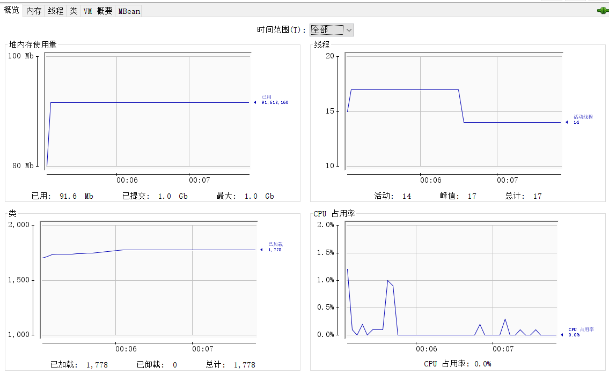
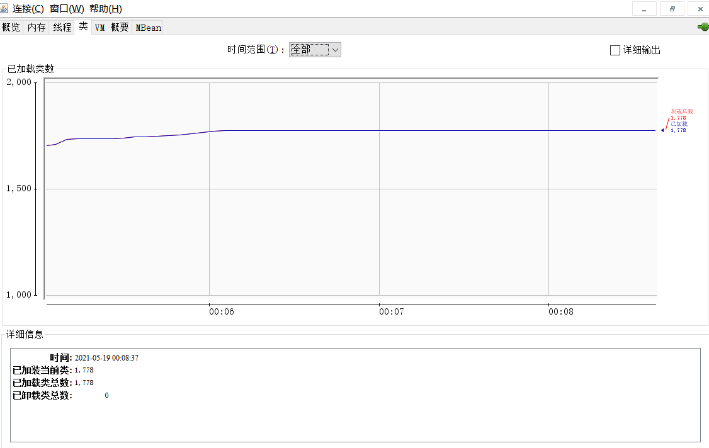
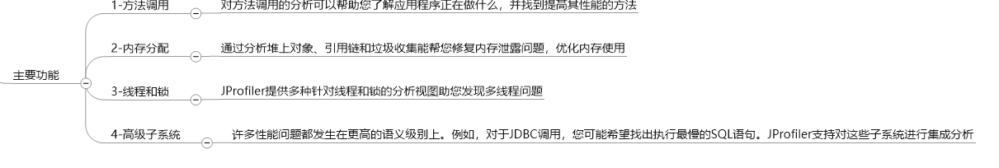
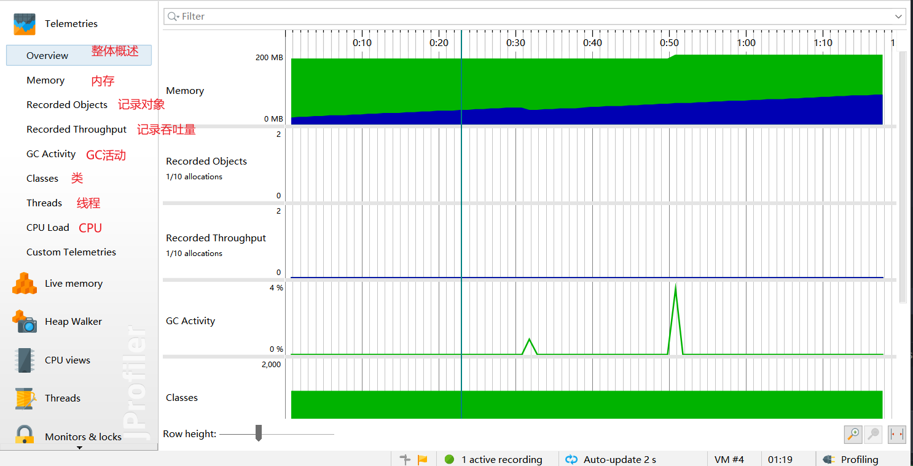
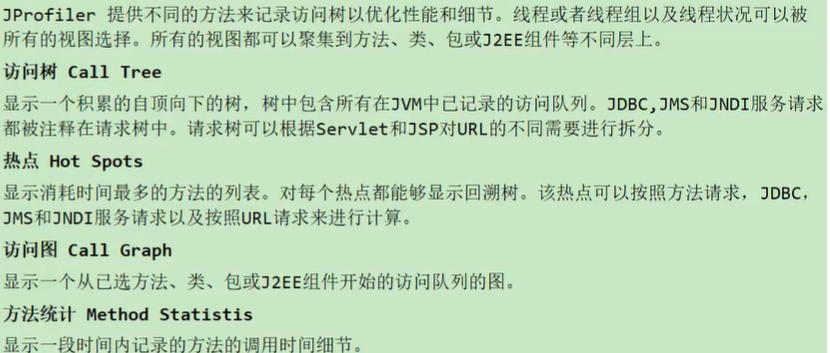
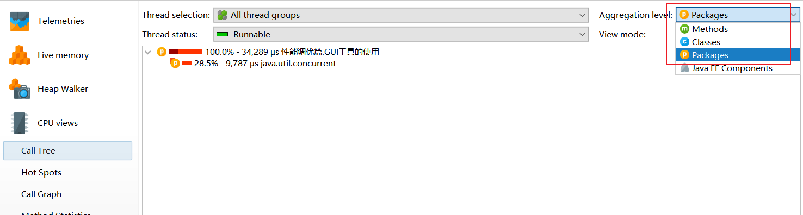
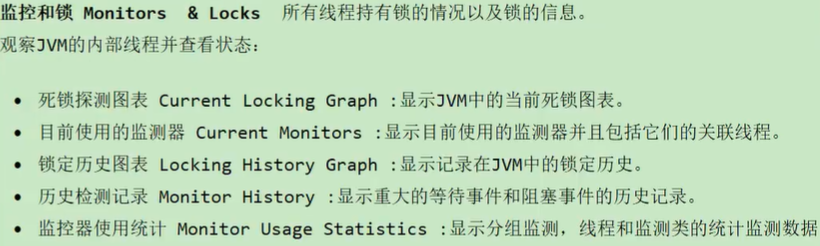

[toc]


## JVM监控及诊断工具-GUI篇

很多JDK自带的GUI工具都在bin目录下

### Jconsole 了解

#### 启动


#### 连接


无法连接解决方案,启动JVM参数加上

```java
-Dcom.sun.management.jmxremote  
-Dcom.sun.management.jmxremote.port=8011 
-Dcom.sun.management.jmxremote.ssl=false
-Dcom.sun.management.jmxremote.authenticate=false
```


#### 查看信息

> 概述信息



> 内存信息


> 线程信息 可检查死锁


> 关于类信息



> 有关VM以及参数等信息 


### Visual VM 熟练

包含Jconsole的功能,还可以增加插件等


#### 查看堆dump文件


#### 查看线程dump文件


#### 查看CPU,内存抽样


### OQL

类似SQL语句用于查询对象

> select


> from 


> where


### JProfile 熟练

#### 简介





#### 数据采集方式

- instrumentation 重构模式
	- 堆栈信息准确,对性能有影响
- sampling 样本采集 (推荐使用)
	- 样本统计(默认5ms)统计信息,性能影响小


#### 摇杆检测 Telemetries




#### 内存视图分析 Live memory

可以通过对比分析,如果增加很多对象可能有几种情况

1. **频繁创建对象,死循环或循环次数多**
2. **存在大对象(读取文件byte[]不要太大,边写边读,长时间不写出会导致byte[]过大)**
3. **每次GC后,内存依次递增可能存在内存泄漏**


- All Objects  所有对象
	- Size显示的是该实例对象的浅堆(不包含它引用字段的实际大小)
- Recorded Objects 记录对象
	- 可以动态看到类的对象变化情况 (默认不开启,开启后影响性能)


- Allocation Call Tree 分配访问树
	- 将执行方法所占时间显示成树 (默认不开启,开启后影响性能)


- Allocation Call Tree 分配热点
	- 显示什么方法时间占比大


- Class Tracker 类追踪器


#### 堆遍历 Heap Walker

通过对比发现对象增长过快,可以查看该对象的引用链


#### CPU 视图 CPU views



关于这种分析 都可以从范围大的到范围小的 **package -> class -> method**




#### 线程视图 Threads


查看线程运行状态,可以知道线程执行情况,比如main线程大部分时间在等待,少部分时间在运行


#### 监视器和锁 Monitors & Locks




### Arthas 阿尔萨斯

上述的GUI诊断工具不利于在生产环境使用

官方文档: https://arthas.aliyun.com/doc

#### 下载并使用

在Linux中

```shell
#下载
curl -O https://arthas.aliyun.com/arthas-boot.jar
```


随便启动一个Java程序再启动arthas分析

```shell
#启动
java -jar arthas-boot.jar
```


```shell
#关闭服务器(关闭所有客户端)
stop

#关闭当前客户端
quit
```


#### 基础命令

- help——查看命令帮助信息
- [cat](https://arthas.aliyun.com/doc/cat.html)——打印文件内容，和linux里的cat命令类似
- [echo](https://arthas.aliyun.com/doc/echo.html)–打印参数，和linux里的echo命令类似
- [grep](https://arthas.aliyun.com/doc/grep.html)——匹配查找，和linux里的grep命令类似
- [base64](https://arthas.aliyun.com/doc/base64.html)——base64编码转换，和linux里的base64命令类似
- [tee](https://arthas.aliyun.com/doc/tee.html)——复制标准输入到标准输出和指定的文件，和linux里的tee命令类似
- [pwd](https://arthas.aliyun.com/doc/pwd.html)——返回当前的工作目录，和linux命令类似
- cls——清空当前屏幕区域
- session——查看当前会话的信息
- [reset](https://arthas.aliyun.com/doc/reset.html)——重置增强类，将被 Arthas 增强过的类全部还原，Arthas 服务端关闭时会重置所有增强过的类
- version——输出当前目标 Java 进程所加载的 Arthas 版本号
- history——打印命令历史
- quit——退出当前 Arthas 客户端，其他 Arthas 客户端不受影响
- stop——关闭 Arthas 服务端，所有 Arthas 客户端全部退出
- [keymap](https://arthas.aliyun.com/doc/keymap.html)——Arthas快捷键列表及自定义快捷键


#### jvm相关

- [dashboard](https://arthas.aliyun.com/doc/dashboard.html)——当前系统的实时数据面板
- [thread](https://arthas.aliyun.com/doc/thread.html)——查看当前 JVM 的线程堆栈信息
- [jvm](https://arthas.aliyun.com/doc/jvm.html)——查看当前 JVM 的信息
- [sysprop](https://arthas.aliyun.com/doc/sysprop.html)——查看和修改JVM的系统属性
- [sysenv](https://arthas.aliyun.com/doc/sysenv.html)——查看JVM的环境变量
- [vmoption](https://arthas.aliyun.com/doc/vmoption.html)——查看和修改JVM里诊断相关的option
- [perfcounter](https://arthas.aliyun.com/doc/perfcounter.html)——查看当前 JVM 的Perf Counter信息
- [logger](https://arthas.aliyun.com/doc/logger.html)——查看和修改logger
- [getstatic](https://arthas.aliyun.com/doc/getstatic.html)——查看类的静态属性
- [ognl](https://arthas.aliyun.com/doc/ognl.html)——执行ognl表达式
- [mbean](https://arthas.aliyun.com/doc/mbean.html)——查看 Mbean 的信息
- [heapdump](https://arthas.aliyun.com/doc/heapdump.html)——dump java heap, 类似jmap命令的heap dump功能
- [vmtool](https://arthas.aliyun.com/doc/vmtool.html)——从jvm里查询对象，执行forceGc


#### class/classloader相关

- [sc](https://arthas.aliyun.com/doc/sc.html)——查看JVM已加载的类信息
- [sm](https://arthas.aliyun.com/doc/sm.html)——查看已加载类的方法信息
- [jad](https://arthas.aliyun.com/doc/jad.html)——反编译指定已加载类的源码
- [mc](https://arthas.aliyun.com/doc/mc.html)——内存编译器，内存编译`.java`文件为`.class`文件
- [retransform](https://arthas.aliyun.com/doc/retransform.html)——加载外部的`.class`文件，retransform到JVM里
- [redefine](https://arthas.aliyun.com/doc/redefine.html)——加载外部的`.class`文件，redefine到JVM里
- [dump](https://arthas.aliyun.com/doc/dump.html)——dump 已加载类的 byte code 到特定目录
- [classloader](https://arthas.aliyun.com/doc/classloader.html)——查看classloader的继承树，urls，类加载信息，使用classloader去getResource


#### monitor/watch/trace相关

> 请注意，这些命令，都通过字节码增强技术来实现的，会在指定类的方法中插入一些切面来实现数据统计和观测，因此在线上、预发使用时，请尽量明确需要观测的类、方法以及条件，诊断结束要执行 `stop` 或将增强过的类执行 `reset` 命令。

- [monitor](https://arthas.aliyun.com/doc/monitor.html)——方法执行监控
- [watch](https://arthas.aliyun.com/doc/watch.html)——方法执行数据观测
- [trace](https://arthas.aliyun.com/doc/trace.html)——方法内部调用路径，并输出方法路径上的每个节点上耗时
- [stack](https://arthas.aliyun.com/doc/stack.html)——输出当前方法被调用的调用路径
- [tt](https://arthas.aliyun.com/doc/tt.html)——方法执行数据的时空隧道，记录下指定方法每次调用的入参和返回信息，并能对这些不同的时间下调用进行观测