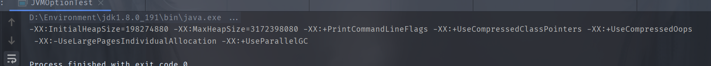
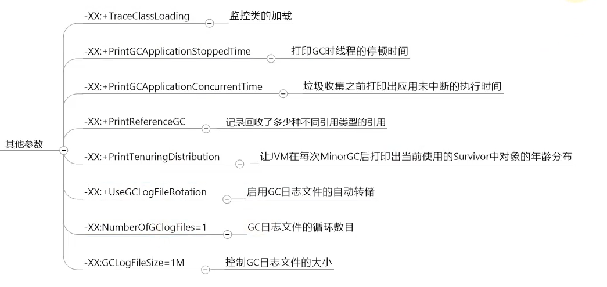

[toc]

## JVM运行时参数

官方文档: https://docs.oracle.com/javase/8/docs/technotes/tools/unix/java.html

### JVM参数分类

#### 标准(-)参数选项

- **以`-`开头**
- 稳定,后续版本基本不变
- 不常用

#### -X非标准参数选项

- **以`-X`开头**
- 较稳定,后续版本可能改变

> 部分参数说明

- `-Xint`: 只使用解释器 
- `-Xcomp`: 只使用编译器  
- `-Xmixed`: 混用,前期解释器解释字节码执行,等程序运行起来后后端编译器缓存热点代码,加速执行效率

- 特殊的-X非标准参数
	- `-Xss` 设置线程(栈)内存大小 等效于`-XX:ThreadStackSize`
	- `-Xms`设置堆内存初始大小 等效于`-XX:InitalHeapSize`
	- `-Xmx`设置堆内存最大大小 等效于 `-XX:MaxHeapSize`
	- `Xmn` 设置年轻代内存,等同于`-XX:NewSize`+`-XX:MaxNewSize`

#### -XX非标准参数选项

- **以`-XX`开头**
- 不稳定,后续版本会改动
- 常用

> 分类

- Boolean类型格式
	- `-XX:+参数名` 启动
		- `-XX:+UseParallelGC` 使用parallel垃圾收集器
	- `-XX:-参数名` 禁用
		- `-XX:-UseParallelGC` 不使用parallel垃圾收集器
- 非Boolean类型格式
	- 数值型 `-XX:参数名=数值`
		- `-XX:SurvivorRatio=8` 设置新生代中Eden区与survivor区占比为: 8:1:1
	- 非数值型 `-XX:参数名=非数值`
		- `-XX:HeapDumpPath=/usr/local/cl.hprof` 设置堆Dump快照放在此地址

### 常用JVM参数

#### 打印设置的-XX选项

- `-XX:+PrintCommandLineFlags` **打印命令行启动时添加的-XX选项或JVM自动设置的-XX选项**

	

- `-XX:+PrintFlagsInitinal` **打印出所有-XX选项默认值**

	部分图片

	

- `-XX:+PrintFlagsFinal` **打印出-XX选项最终在程序运行时的值**(使用 `jinfo -flag 修改参数 pid` 进行修改)

	

- `-XX:+PrintVMOption` 打印JVM参数

	

#### 运行时内存区的-XX选项

##### 栈的-XX选项

- `-Xss100k` 设置栈内存为100k,等同于`-XX:ThreadStackSize`

##### 堆的-XX选项

- `Xms100m` 设置堆内存初始化为100m,等同于`-XX:InitalHeapSize=100m`
- `Xmx100m` 设置最大堆内存为100m,等同于`-XX:MaxHeapSize=100m`
- `Xmn2g` 设置年轻代最大内存为2g,等同于`-XX:NewSize=2g`+`-XX:MaxNewSize=2g`

- `-XX:+UseAdaptiveSizePolicy` 自动选择各区比例大小(默认开启)
- `-XX:SurvivorRatio=8` 设置survivor:Eden占比为 1:1:8
	- 这个值默认为8,如果`-XX:+UseAdaptiveSizePolicy`是开启的,survivor:eden比例会被自动调成为1:1:6
- `-XX:NewRatio=2` 设置年轻代:老年代占比为 1:2
- `-XX:PretenureSizeThreadshold=2014` 设置内存大于此值(byte)的对象作为大对象直接分配到老年代
- `-XX:MaxTenuringThreshold=15` 对象年龄超过15进入老年代
- `-XX:+PrintTenuringDistribution` JVM每次MinorGC后打印出当前使用的Survivor中对象的年龄分布
- `-XX:TargetSurvivorRatio` MinorGC结束后Survivor区域中占用空间的期望比例

##### 方法区的-XX选项

- `-XX:MetaspaceSize` 元空间初始大小
- `-XX:MaxMetasoaceSize` 元空间最大大小
- `-XX:+UseCompressedOops` 使用压缩对象指针
- `-XX:+UseCompressedClassPointers` 使用压缩类执行
- `-XX:ComporessedClassSpaceSize` 设置ClassMetaspace大小,默认1g

##### 直接内存的-XX选项

- `-XX:MaxDiectMemorySize` 设置直接内存大小,未指定则和最大堆内存一致

#### OOM相关的-XX选项

- `-XX:+HeapDumpOutOfMemoryError` 发生OOM时生成堆dump文件

- `-XX:+HeapDumpBeforeFullGC` 发生FullGC时生成堆dump文件

	- OOM前会多次FullGC也就是可能多次生成dump文件

		

- `-XX:HeapDumpPath=d:\`指定生成堆dump文件路径为d:\ (默认生成的dump文件在项目当前目录下)

- `-XX:OnOutOfMemoryError=/opt/restart.sh`  发生OOM时去执行/opt/restart.sh文件

	

#### 垃圾收集器相关的-XX选项

##### Serial 串行收集器 

- `-XX:+UseSerialGC` 年轻代,老年代都使用串行收集器

##### ParNew 并行收集器

- `-XX:+UseParNewGC` 年轻代使用ParNew收集器
- JDK14 CMS被移除 没有老年代收集器配合 , 被废弃 

##### Parallel 吞吐量优先并行收集器

- `-XX:+UseParallelGC`  `-XX:+UseParallelOldGC` 使用任意一个参数,新生代,老年代就会使用Parallel收集器
- `-XX:ParallelGCThreads` 设置年轻代并行收集线程个数 
	- 逻辑处理器(CPU)个数 < 8 : 设置与核心数相同
	- CPU个数 > 8 : 设置线程数 = 3 + (5 * 核心数) / 8
- `-XX:+UseAdaptiveSizePolicy` 自适应调节策略
- `-XX:MaxGCPauseMillis` 设置最大STW时间,单位ms
	- Parallel 主打高吞吐量优先,该参数具体值最好由`-XX:+UseAdaptiveSizePolicy`来分配
- `-XX:GCTimeRatio=N` 垃圾收集时间占比(1/N+1)
	- 用于衡量吞吐量,该值设置越大就与设置最大STW时间`-XX:MaxGCPauseMillis` 矛盾,不能同时使用

##### CMS 并发收集器

- `-XX:+UseConcMarkSweepGC`老年代使用CMS垃圾收集器,新生代使用ParNew收集器
- `-XX:CMSInitiatingOccupancyFraction`设置老年代使用多少空间时开始垃圾回收
	- 如果设置的太高,不够内存分配,不能满足并发执行,就会冻结用户线程启动Serial Old收集器,停顿时间就会变长
	- 如果内存增长缓慢可以设置高一些,如果内存增长很快就要设置低一些 默认92%
- `-XX:+UseCMSCompactAtFullCollection`指定在FULL GC后是否对内存进行压缩整理
	- 开启后,通过`-XX:CMSFullGCsBeforeCompaction`设置执行多少次FULL GC后进行内存压缩整理
- `-XX:ParallelCMSThreads` 设置CMS线程数量

##### G1 低延迟分代收集器

- `-XX:+UseG1GC` 使用G1收集器

- `-XX:G1HeapRegionSize`设置每个region大小

- `-XX:MaxGCPauseMillis`设置预期停顿时间 (默认200ms,最好不要太小)

- `-XX:ParallelGCThread`设置STW时GC线程数

- `-XX:ConcGCThreads`设置并发标记线程数

- `-XX:InitiatingHeapOccupancyPercent`设置触发老年代GC的堆占用率阈值

	

使用分代收集器最好不要使用`-XX:NewRatio` , `-Xmn`这种参数,会影响G1自动调节

#### GC日志相关的-XX选项

- `-XX:+PrintGC` 或 `-verbose:gc` 输出简单GC日志信息

	

- ` -XX:+PrintGCDeatils` 输出详细GC日志信息 **常用**

	

- `-XX:+PrintGCTimeStamps`  需要搭配输出GC信息使用,输出程序运行时间  **常用**

	

- `-XX:+PrintGCDateStamps` 需要搭配输出GC信息使用,输出时间戳 

	

- ` -Xloggc:d:\gc.log` 将GC信息输出到d:\gc.log文件中 **常用**

- `-XX:PrintHeapAtGC` 每次GC前后打印堆信息

> 其他

#### 其他JVM参数

