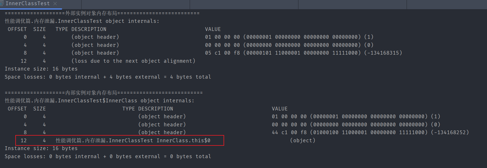

## 内存泄漏

### 简介

**内存泄漏: 不需要使用对象,但是GC无法回收它**

> 宽泛意义上的内存泄漏

**不良的操作导致对象生命周期变长**


Y的声明周期结束后, 由于X引用Y导致GC无法回收Y (如果A,B,C生命周期少于X也是同理)

**当大量内存泄漏,没有内存为新对象分配时发生内存溢出**


### 举例内存泄漏

#### 导致对象生命周期变长引发内存泄漏

##### 静态集合类

```java
public class StaticClass {
    private static final List<Object> list = new ArrayList<>();

    /**
     * 尽管这个局部变量Object生命周期非常短
     * 但是它被生命周期非常长的静态列表引用
     * 所以不会被GC回收 发生内存溢出
     */
    public void addObject(){
        Object o = new Object();
        list.add(o);
    }
}
```

类卸载的条件非常苛刻,这个静态列表生命周期基本与JVM一样长

**静态集合引用局部对象,使得局部对象生命周期变长,发生内存泄漏**


##### 饿汉式单例模式

```java
public class Singleton {
    private static final Singleton INSTANCE = new Singleton();

    private Singleton(){
        if (INSTANCE!=null){
            throw new RuntimeException("not create instance");
        }
    }

    public static Singleton getInstance(){
        return INSTANCE;
    }
}
```

**饿汉式的单例模式也是被静态变量引用,即时不需要使用这个单例对象了,GC也不会回收**


##### 非静态内部类

**非静态内部类会有一个指针指向外部类**

```java
public class InnerClassTest {

    class InnerClass {

    }

    public InnerClass getInnerInstance() {
        return this.new InnerClass();
    }

    public static void main(String[] args) {
        InnerClass innerInstance = null;

        {
            InnerClassTest innerClassTest = new InnerClassTest();
            innerInstance = innerClassTest.getInnerInstance();
            System.out.println("===================外部实例对象内存布局==========================");
            System.out.println(ClassLayout.parseInstance(innerClassTest).toPrintable());

            System.out.println("===================内部实例对象内存布局===========================");
            System.out.println(ClassLayout.parseInstance(innerInstance).toPrintable());
        }

        //省略很多代码.....
    }
}
```

当调用外部类实例方法通过外部实例对象返回一个内部实例对象时(调用代码中的getInnerInstance方法)

外部实例对象不需要使用了,但内部实例对象被长期使用,会导致这个外部实例对象生命周期变长

**因为内部实例对象隐藏了一个指针指向(引用)创建它的外部实例对象**




##### 实例变量作用域不合理

如果只需要一个变量作为局部变量,在方法结束就不使用它了,但是把他设置为实例变量,此时如果该类的实例对象生命周期很长也会导致该变量无法回收发生内存泄漏(因为实例对象引用了它)

**变量作用域设置的不合理会导致内存泄漏**


##### 隐式内存泄漏

动态数组ArrayList中remove操作会改变size的同时将删除位置置空,从而不再引用元素,避免内存泄漏


不置空要删除的元素对数组的添加删除查询等操作毫无影响(看起来是正常的),只是会带来隐式内存泄漏


#### 不关闭资源引发内存泄漏

各种连接: 数据库连接,网络连接,IO连接在使用后忘记关闭,GC无法回收它们,会发生内存泄漏

所以使用连接时要**使用 `try-with-resource` 自动关闭连接**


#### 改变对象哈希值引发内存泄漏

一般认为对象逻辑相等,只要对象关键域相等即可

一个对象加入到散列表是通过计算该对象的哈希值,通过哈希算法得到放入到散列表哪个索引中

如果将对象存入散列表后,修改了该对象的关键域,就会改变对象哈希值,导致后续要在散列表中删除该对象,会找错索引从而找不到该对象导致删除失败(极小概率找得到)

```java
public class HashCodeTest {
    /**
     * 假设该对象实例变量a,d是关键域
     * a,d分别相等的对象逻辑相等
     */
    private int a;
    private double d;

    @Override
    public boolean equals(Object o) {
        if (this == o) return true;
        if (o == null || getClass() != o.getClass()) return false;
        HashCodeTest that = (HashCodeTest) o;
        return a == that.a &&
                Double.compare(that.d, d) == 0;
    }

    @Override
    public int hashCode() {
        return Objects.hash(a, d);
    }

    public HashCodeTest(int a, double d) {
        this.a = a;
        this.d = d;
    }

    public HashCodeTest() {
    }

    @Override
    public String toString() {
        return "HashCodeTest{" +
                "a=" + a +
                ", d=" + d +
                '}';
    }

    public static void main(String[] args) {
        HashMap<HashCodeTest, Integer> map = new HashMap<>();
        HashCodeTest h1 = new HashCodeTest(1, 1.5);
        map.put(h1, 100);
        map.put(new HashCodeTest(2, 2.5), 200);

        //修改关键域 导致改变哈希值
        h1.a=100;

        System.out.println(map.remove(h1));//null

        Set<Map.Entry<HashCodeTest, Integer>> entrySet = map.entrySet();
        for (Map.Entry<HashCodeTest, Integer> entry : entrySet) {
            System.out.println(entry);
        }
        //HashCodeTest{a=100, d=1.5}=100
        //HashCodeTest{a=2, d=2.5}=200
    }
}
```

所以说对象当作Key存入散列表时,该对象最好是逻辑不可变对象,不能在外界改变它的关键域,从而无法改变哈希值


将关键域设置为final,只能在实例代码块中初始化或构造器中

如果关键域是引用类型,可以用final修饰后,对外不提供改变该引用关键域的方法,从而让外界无法修改引用关键域中的值 (如同String类型,所以String常常用来当作散列表的Key)


#### 缓存引发内存泄漏

当缓存充当散列表的Key时,如果不再使用该缓存,就要手动在散列表中删除,否则会发生内存泄漏

如果使用的是WeakHashMap,它内部的Entry是弱引用,当它的Key不再使用时,下次垃圾回收就会回收掉,不会发生内存泄漏

```java
public class CacheTest {
    private static Map<String, String> weakHashMap = new WeakHashMap<>();
    private static  Map<String, String> map = new HashMap<>();
    public static void main(String[] args) {
        //模拟要缓存的对象
        String s1 = new String("O1");
        String s2 = new String("O2");
        weakHashMap.put(s1,"S1");
        map.put(s2,"S2");

        //模拟不再使用缓存
        s1=null;
        s2=null;

        //垃圾回收WeakHashMap中存的弱引用
        System.gc();
        try {
            TimeUnit.SECONDS.sleep(5);
        } catch (InterruptedException e) {
            e.printStackTrace();
        }

        //遍历各个散列表
        System.out.println("============HashMap===========");
        traverseMaps(map);
        System.out.println();
        System.out.println("============WeakHashMap===========");
        traverseMaps(weakHashMap);
    }

    private static void traverseMaps(Map<String, String> map){
        for (Map.Entry<String, String> entry : map.entrySet()) {
            System.out.println(entry);
        }
    }
}
```

结果


注意: 监听器和回调 也应该像这样成为弱引用


