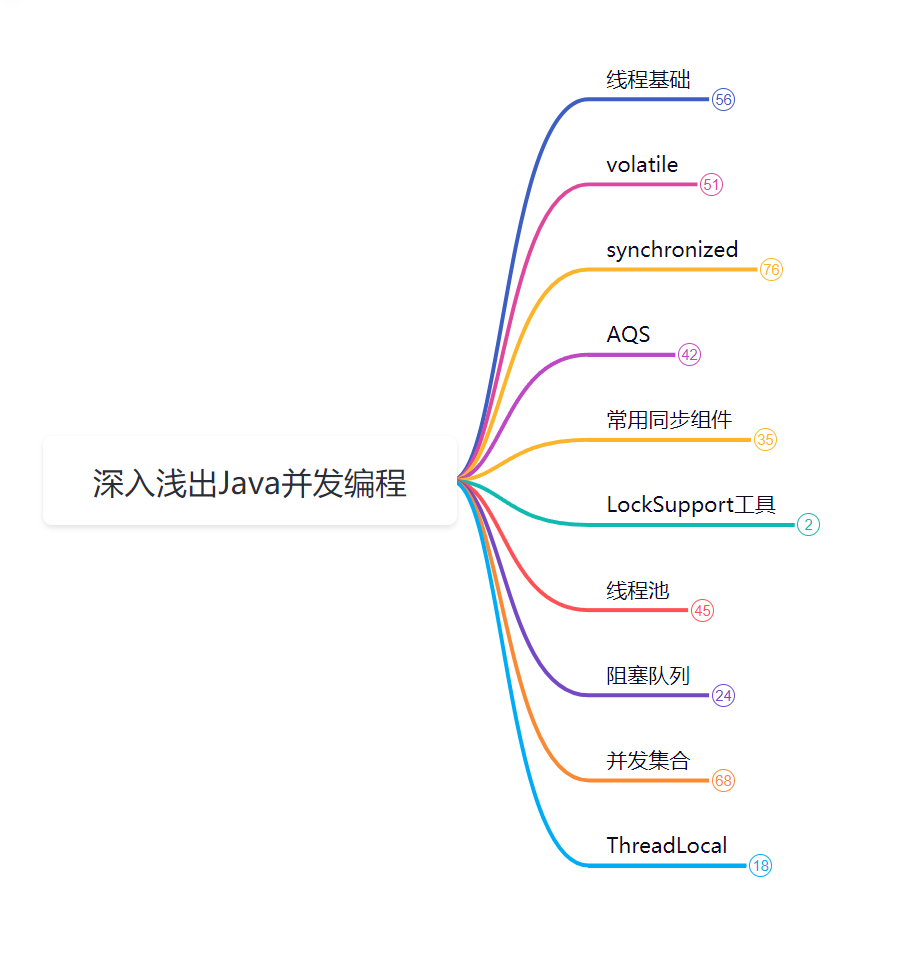
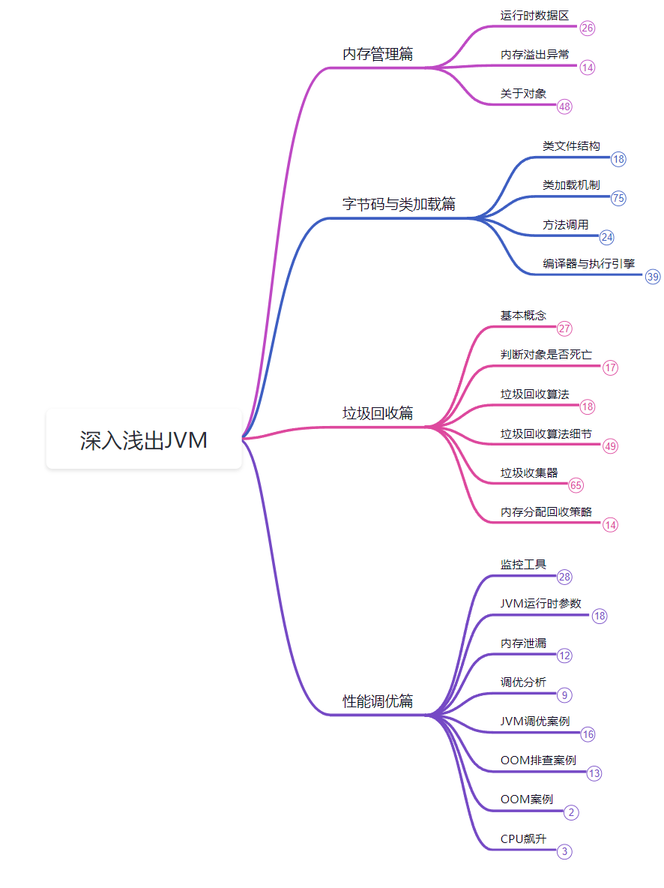
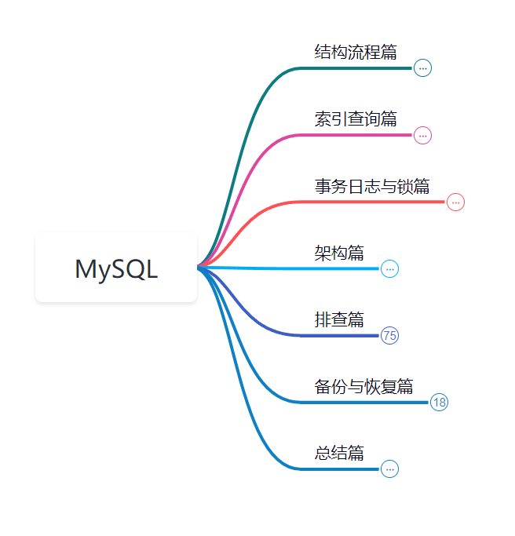
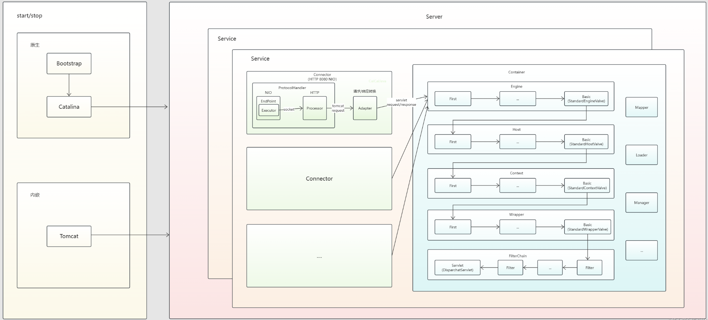
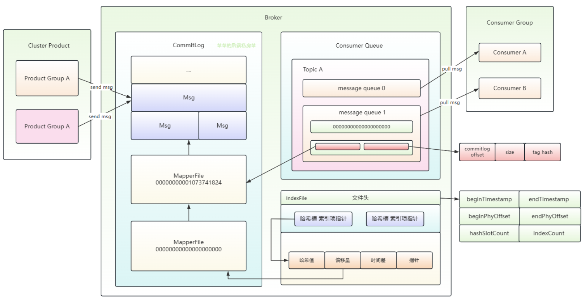

## 菜菜的Java进阶之路🚀

😁你好呀！我是菜菜，热爱技术交流、分享与写作，喜欢图文并茂、通俗易懂的输出知识

📚你可以在这找到Java技术栈进阶的相关知识：Java并发编程与JVM原理、Spring和MyBatis等常用框架及Tomcat服务器的源码解析，以及MySQL、Redis数据库的进阶知识，同时还提供关于消息中间件和网络框架Netty等主题的系列文章，都以通俗易懂的方式探讨这些复杂的技术点

🏆除此之外，我还是掘金优秀创作者、腾讯云年度影响力作者、华为云年度十佳博主....

👫我对技术交流、知识分享以及写作充满热情，如果你愿意，欢迎加我一起交流（vx:CaiCaiJava666），也可以持续关注我的公众号：菜菜的后端私房菜

⭐️我会分享更多技术干货，期待与更多志同道合的朋友携手并进，觉得不错可以点个Star持续关注

### 章节说明

#### 深入浅出Java并发编程:boom: 

- JavaConcurrentProgramming：案例源码

- 笔记📔

  - PDF笔记：菜菜的Java进阶之路🚀深入浅出构建Java并发编程知识体系.pdf🎉

  - 思维导图：菜菜的Java进阶之路🚀深入浅出构建Java并发编程知识体系（.pos 使用ProcessOn打开，.xmind使用XMind打开）

    

#### 深入浅出Java虚拟机🖥️

- JavaVirtualMachineHotSpot： 案例源码

- 笔记📔

  - 内存管理篇🛩️

    - JVM运行时数据区以及可能发生的异常OOM
    - hotspot中的对象内存情况
    - JMM

  - 字节码与类加载篇🎈

    - 字节码文件结构、字节码指令集
    - 类加载机制、编译器与执行引擎、方法调用

  - 垃圾回收篇🧨

    - 引用、垃圾回收算法
    - 垃圾收集器

  - 性能调优篇🚀

    - 分析GC日志
    - JVM运行时参数
    - GUI、命令行工具
    - 调优案例

  - 思维导图：.pos  .xmind .png

    

  

#### Effective Java🛩️

- EffectiveJava：案例源码
- 笔记📔
  - PDF笔记：菜菜的Java进阶之路🚀EffectiveJava.pdf
  - 思维导图：菜菜的Java进阶之路🚀EffectiveJava.pos

####  MySQL进阶之路🐬

笔记📔

- PDF笔记：菜菜的Java进阶之路🚀MySQL进阶之路.pdf🎉

- 思维导图：深入浅出构建Java并发编程知识体系（.pos .mm 使用ProcessOn打开）

  

#### Tomcat运行原理及核心组件解析🐱

笔记📔

- PDF笔记：菜菜的Java进阶之路🚀Tomcat运行原理及核心组件解析🐱.pdf🎉

从自顶向下解析架构到核心组件源码实现，以通俗易懂、图文结合的形式，抽丝剥茧”解密“Tomcat中间件

#### 消息中间件🚀

主要更新RocketMQ 4.X运行原理以及核心组件解析，Kafka、RabbitMQ等其他常用消息中间件持续更新~

笔记📔

- PDF笔记：菜菜的Java进阶之路🚀RocketMQ运行原理及核心组件解析.pdf🎉

