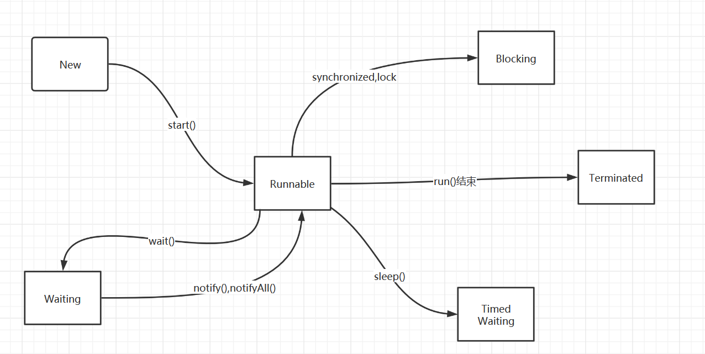

[toc]

## Java内存模型与线程

### Java内存模型

**目的: 为了定义程序中各种共享变量访问规则**

Java内存模型规定:

1. **所有的共享变量都存储在主内存中**(物理上是虚拟机的一部分)
2. **每条线程有自己的工作内存**
3. **线程的工作内存保存了被该线程使用变量的主内存副本**
4. **线程对内存的所有操作(读写等)都要在工作内存进行,不能直接操作主内存**
5. **不同线程间无法访问对方工作内存的变量,线程间变量值传递需要通过主内存来完成**

注意: ==主内存与工作内存== 可以类比为 ==内存与高速缓冲存储器(cache)==

从主内存中读取数据到工作内存,线程操作工作内存修改数据,最终从工作内存写到主内存上

从内存中读取数据到cache,CPU操作cache上的数据,最终从cache再写回到主内存上


#### 交互操作以及注意事项

```java
/**
 * @author Tc.l
 * @Date 2020/11/3
 * @Description:
 * 线程A读到num为0,让num为0时,线程A就循环
 * 然后通过主线程修改num的值
 * 但是程序不能停下来 一直处于运行状态(线程A依旧在循环)
 */
public class JavaMemoryModel {
    static int num = 0;
    public static void main(String[] args) {
        new Thread(()->{
            while (num==0){
                
            }
        },"线程A").start();

        try {
            TimeUnit.SECONDS.sleep(1);
        } catch (InterruptedException e) {
            e.printStackTrace();
        }

        num=1;
    }
}
```

上面的代码用Java内存模型图可以这样表示:


> 8种内存交互操作

主内存与工作内存交互操作有8种，虚拟机实现必须保证每一个操作都是原子的，不可在分的（对于double和long类型的变量来说，load、store、read和write操作在某些平台上允许例外）

1. lock   （锁定）：作用于主内存的变量，把一个变量标识为线程独占状态

2. unlock （解锁）：作用于主内存的变量，它把一个处于锁定状态的变量释放出来，释放后的变量才可以被其他线程锁定

3. read  （读取）：作用于主内存变量，它把一个变量的值从主内存传输到线程的工作内存中，以便随后的load动作使用
4. load   （载入）：作用于工作内存的变量，它把read操作从主存中变量放入工作内存中
5. use   （使用）：作用于工作内存中的变量，它把工作内存中的变量传输给执行引擎，每当虚拟机遇到一个需要使用到变量的值，就会使用到这个指令
6. assign （赋值）：作用于工作内存中的变量，它把一个从执行引擎中接受到的值放入工作内存的变量副本中
7. store  （存储）：作用于主内存中的变量，它把一个从工作内存中一个变量的值传送到主内存中，以便后续的write使用
8. write 　（写入）：作用于主内存中的变量，它把store操作从工作内存中得到的变量的值放入主内存的变量中


> 使用规则与注意事项

JMM对这八种指令的使用，制定了如下规则：

1. 不允许read和load、store和write操作之一单独出现。**即使用了read必须load，使用了store必须write**

2. 不允许线程丢弃他最近的assign操作，即**工作变量的数据改变了之后，必须告知主存**

3. 不允许一个线程将没有assign的数据从工作内存同步回主内存,即**未改变数据,又把数据从工作内存写回主内存**

4. 一个新的变量必须在主内存中诞生，不允许工作内存直接使用一个未被初始化的变量。**就是对变量实施use、store操作之前，必须经过load,assign操作**

5. 一个变量同一时间只有一个线程能对其进行lock。**多次lock后，必须执行相同次数的unlock才能解锁**

6. 如果对一个变量进行lock操作，**加锁会清空所有工作内存中此变量的值，在执行引擎使用这个变量前，必须重新load或assign操作初始化变量的值**

7. 如果一个变量**没有被lock，就不能对其进行unlock操作**。**也不能unlock一个被其他线程锁住的变量**

8. 对一个变量进行**unlock操作之前，必须把此变量同步回主内存**


#### volatile特性

**volatile是Java虚拟机提供最轻量级的同步机制**

##### 可见性

> 验证可见性

**保证此变量对所有线程的可见性(例子中: 主线程修改num后,线程A识别num不为0退出循环)**

```java
public class JavaMemoryModel {
    static volatile int num = 0;
    public static void main(String[] args) {
        new Thread(()->{
            while (num==0){
                
            }
        },"线程A").start();

        try {
            TimeUnit.SECONDS.sleep(1);
        } catch (InterruptedException e) {
            e.printStackTrace();
        }

        num=1;
    }
}
```

**保证新值能立即同步到主内存,以及每次使用前立即从主内存刷新**


##### 不保证原子性

> 验证不保证原子性

原子性: 要么同时成功,要么同时失败

```java
public class AtomicTest {
    static int num = 0;

    public static void add(){
        num++;
    }
    public static void main(String[] args) {
        //多线程 执行 num自增 十万次
        for (int i = 0; i < 10; i++) {
            new Thread(()->{
                for (int j = 0; j <10000 ; j++) {
                   add();
                }
            }).start();
        }
        //保证线程都执行完
        while (Thread.activeCount()>2){
            Thread.yield();
        }
        //38806 ,  26357
        System.out.println(num);
    }
}
```

理论上num应该为十万,但是每次都少很多

使用`javap -c`进行反编译 查看字节码 

实际上num++时需要拿到这个静态变量然后操作,操作完再记录回去,在多线程中可能有的线程已经自加了但是还未记录回去,让别的线程读到错误的数量而导致不安全


##### 禁止指令重排序

> 指令重排

Java虚拟机的即时编译器有对指令重排序的优化

指令重排序: 不影响最终正确结果的情况下,指令执行顺序可能会与程序代码中执行顺序不同

我们写的程序到机器可以执行的指令,之间这个过程可能会改变指令执行的顺序

源代码->编译器优化重排->指令并行重排->内存重排->机器执行

==进行指令重排时,会考虑数据间的依赖==

```java
int x = 0;//1
int y = 4;//2
y = x - 1;//3
x = x * x;//4
```

我们写的顺序是1234,但是执行的时候可能是2134或1423这都是不影响结果的

但是在多线程中(默认一开始b,c,x,y都是0)

| 线程A | 线程B |
| ----- | ----- |
| x = c | y = b |
| b = 1 | c = 2 |

结果: x = 0, y = 0

重排指令后

| 线程A | 线程B |
| ----- | ----- |
| b = 1 | c = 2 |
| x = c | y = b |

结果: x = 2 , y = 1

在多线程中是不安全的(逻辑上存在的)

==使用volatile可以禁止指令重排,以防这种情况发生==


> volatile避免指令重排

CPU指令的作用,使用内存屏障==指令重排不能把内存屏障后的指令重排到内存屏障前==

1. 保证特定操作执行顺序(比如禁止指令顺序交换)
2. 保证某些变量内存可见性(利用这个volatile实现可见性)

内存屏障是一个lock前缀的空操作,把前面锁住,前面没执行完就不能执行后面

**lock前缀空操作的作用: 将本处理器的缓存写入内存中,该写入动作也会引起别的处理器或别的内核无效化其缓存,相当于把缓存中的变量store,write写入主内存中,别的处理器发现缓存无效了立马去主内存中读,就实现了可见性**通过这个空操作,volatile实现可见性

lock前缀空操作指令修改同步到内存时,意味着之前操作执行完成,所以指令重排序无法越过内存屏障


> volatile变量与普通变量消耗性能的区别

- 读操作: volatile变量与普通变量读操作时消耗性能差不多
- 写操作: 因为volatile变量要使用内存屏障防止指令重排所以消耗会大些


#### double,long的非原子性协定

允许虚拟机自行实现是否保证64位数据类型的load,stroe,read,write四个原子性操作

主流平台下64位Java虚拟机不会出现非原子性访问行为,而32位存在此风险


#### 原子性,可见性与有序性

- 原子性

	lock,unlock操作未直接开放给用户,但是提供了字节码指令`monitorenter,monitorexit`来隐式使用lock,unlock(==在Java代码中就是synchronized关键字==)

- 可见性
	- volatile : **保证新值能立即同步到主内存,以及每次使用前立即从主内存刷新**
	- synchronized: **对变量执行unlock前,要先执行store,write操作写入主内存**
	- final : **被final修饰不能改变所以无须同步可以被其他线程正确访问(引用未逃逸的情况下)**
- 有序性
	- volatile : **禁止指令重排**
	- synchronized : **一个变量在同一时刻只允许一条线程对其lock操作** ==决定持有同一个锁的多个同步块只能串行进入==


#### 先行发生原则

- 程序次序规则: **同个线程内,书写在前面的操作先行发生于书写在后面的操作**
- 管程锁定规则: **一个unlock操作先行发生在后面对同一个锁的lock操作**
- volatile变量规则: **对一个volatile变量的写操作先行发生于后面对这个变量的读操作**
- 线程启动规则: **线程start()先行发生于此线程每个动作**
- 线程终止规则: **线程所有操作先行发生于此线程终止检测**
- 线程中断规则: **线程interrupt()方法调用先行发生于被中断线程的代码检测到中端事件发生**
- 对象终结规则: **一个对象初始化完成先行发生于他的finalize()方法**
- 线程join规则: **如果在线程A中执行 ThreadB.join()成功的话,线程B的操作先行发生于线程A的ThreadB.join()返回**
- 传递性: **操作A先行发生于操作B,操作B先行发生于操作C,可得操作A先行发生于操作C**

**时间先后顺序于先行发生原则没有因果关系,衡量并发问题不要受时间顺序干扰,一切必须以先行发生原则为准**


### 线程

线程是比进程更轻量级的调度执行单位

#### 线程的实现

线程的实现主要有三种方法: **使用内核线程实现,使用用户线程实现,使用用户线程加轻量级进程混合实现**


##### 内核线程实现

内核线程就是直接由操作系统内核支持的线程,该线程由内核来完成线程的切换

内核通过线程调度器对线程进行调度,并负责将线程任务映射到各个处理器

一般使用内核线程的高级接口==轻量级进程(线程)==,轻量级进程与内核线程1:1对应


**系统调用代价高,需要在用户态和内核态切换,会消耗一定内核资源,所以一个系统支持轻量级进程有限**


##### 用户线程实现

广义: 只要不是内核线程就是用户线程

侠义: 完全建立在用户态上的线程(系统内核不知道线程如何实现)


**不需要内核帮助,执行速度快,低消耗,支持大规模线程数量,但是线程的创建,消耗,切换都必须要用户去考虑**


##### 混合实现


**支持大规模用户线程并发,轻量级进程作为用户线程和内核线程的桥梁,内核提供线程调度功能**


#### Java线程的实现

**hotspot: 每个Java线程直接映射到操作系统原生线程来实现,中间没有额外间接结构,全权交给操作系统**


#### Java线程的调度

调度分为协同式线程调度和抢占式线程调度

- 协同式线程调度
	- 优点: 实现简单
	- 缺点: 线程执行时间不可控制,不告诉系统切换就不切换,如果某个线程阻塞就一直阻塞(一直等)
- 抢占式线程调度(Java线程的调度方式)
	- 优点: 系统来进行分配执行时间,线程切换不由线程本身决定(可以通过设置线程优先级来优先执行,但这是不稳定的,Java中有10个优先级,Windows有7个,效果不会很理想)
	- 缺点: 线程无法主动获取执行时间(可以被动让出`yield()`)


#### 线程状态转换

- `NEW`  尚未启动的线程处于此状态
- `RUNNABLE`  在Java虚拟机中执行的线程处于此状态(**RUNNABLE状态可能处于执行状态也可能处于就绪状态**)
- `BLOCKED` 被阻塞等待监视器锁定的线程处于此状态**被阻塞**
- `WAITING` 正在等待另一个线程执行特定动作的线程处于此状态  **等待** 
- `TIMED_WAITING` 正在等待另一个线程执行动作达到指定等待时间的线程处于此状态 **定时等待**
- `TERMINATED`  已退出的线程处于此状态 **死亡**




