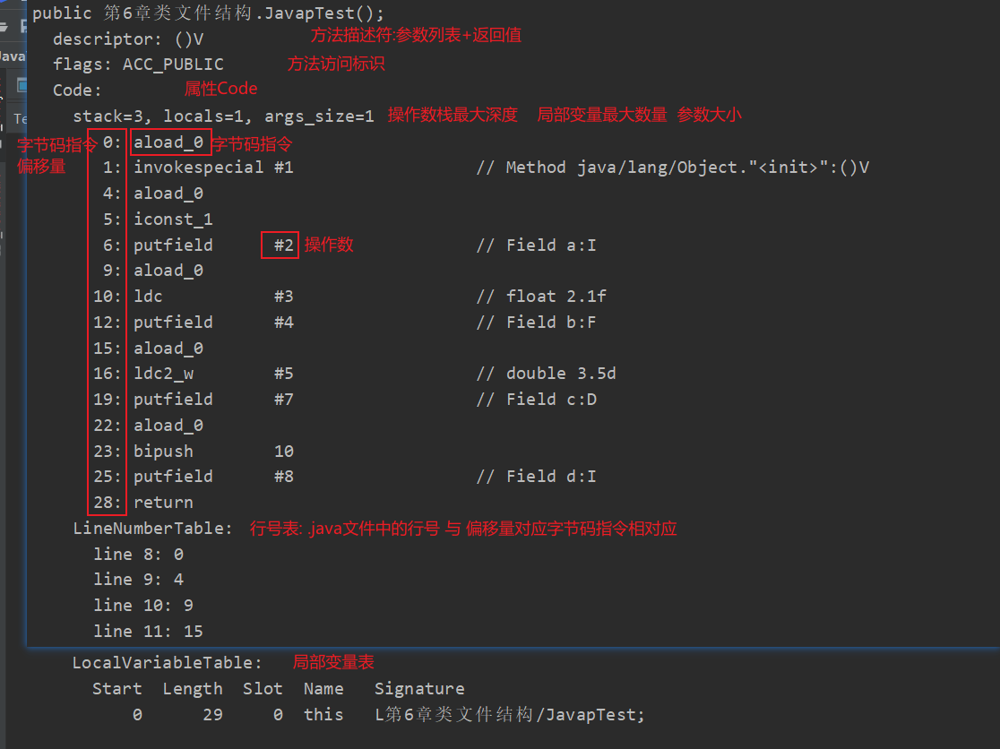

[toc]


## 编译器与执行引擎

### 编译器

Java编译器分类

- 前端编译器 (javac): Java源代码 -> Class文件
	- 优化对于程序员来说好用的语法糖
- 即时编译器 : (运行时)字节码 -> 本地机器码
	- 优化程序执行效率
- 提前编译器 : 程序 -> 本地二进制代码

#### 前端编译过程

- 准备阶段: 初始化插入式注解处理器

- 处理阶段

	- 解析与填充符号表

		1. **词法分析: 将Java源代码的字符流转变为token(标记)流**
			- 字符: 程序编写的最小单位
			- 标记(token) :  编译的最小单位
			- 比如 关键字 static 是一个标记 / 6个字符

		2. **语法分析: 将token流构造成抽象语法树**

		3. **填充符号表: 产生符号信息和符号地址**
			- 符号表是一组符号信息和符号地址构成的数据结构
			- 比如: 目标代码生成阶段,对符号名分配地址时,要查看符号表上该符号名对应的符号地址

	- 插入式注解处理器的注解处理

		4. **注解处理器处理特殊注解: 在编译器允许注解处理器对源代码中特殊注解作处理,可以读写抽象语法树中任意元素,如果发生了写操作,就要重新解析,填充符号表**
			- 比如: Lombok通过特殊注解,生成get/set/构造器等方法

	- 语义分析与字节码生成

		5. **标注检查: 对语义静态信息的检查以及常量折叠优化**

			```java
			int i = 1;
			char c1 = 'a';
			int i2 = 1 + 2;//编译成 int i2 = 3 常量折叠优化
			char c2 = i + c1; //编译错误 标注检查 检查语法静态信息 
			```

			

		6. **数据及控制流分析: 对程序运行时动态检查**

			- 比如方法中流程控制产生的各条路是否有合适的返回值

		7. **解语法糖: 将(方便程序员使用的简洁代码)语法糖转换为原始结构**

		8. **字节码生成: 生成`<init>,<clinit>`方法,并根据上述信息生成字节码文件**

> 总结流程图


> 源码分析


代码位置在JavaCompiler的compile方法中


#### Java中的语法糖

##### 泛型

**将操作的数据类型指定为方法签名中一种特殊参数,作用在方法,类,接口上时称为泛型方法,泛型类,泛型接口**

Java中的泛型是**类型擦除式泛型**,泛型只在源代码中存在,**在编译期擦除泛型,并在相应的地方加上强制转换代码**

> 与具现化式泛型(不会擦除,运行时也存在泛型)对比

- 优点: 只需要改动编译器,Java虚拟机和字节码指令不需要改变

	- 因为泛型是JDK5加入的,为了满足对以前版本代码的兼容采用类型擦除式泛型

- 缺点: 性能较低,使用没那么方便

	- 为提供基本类型的泛型,只能自动拆装箱,在相应的地方还会加速强制转换代码,所以性能较低

	- 运行期间无法获取到泛型类型信息

		- 比如书写泛型的List转数组类型时,需要在方法的参数中指定泛型类型

			```java
			public static <T> T[] listToArray(List<T> list,Class<T> componentType){
			        T[] instance = (T[]) Array.newInstance(componentType, list.size());
			        return instance;
			}
			```

			

##### 自动拆装箱,增强for循环与可变长参数


增强for循环 -> 迭代器

可变长参数 -> 数组装载参数

泛型擦除后会在某些位置插入强制转换代码

> 自动装箱,拆箱的错误用法

```java
		Integer a = 1;
        Integer b = 2;
        Integer c = 3;
        Integer d = 3;
        Integer e = 321;
        Integer f = 321;
        Long g = 3L;

        System.out.println(c == d);//true
        System.out.println(e == f);//false
        System.out.println(c == (a + b));//true
        System.out.println(c.equals(a + b));//true
        System.out.println(g == (b + a));//false
        System.out.println(g.equals(a + b));//true
```

- 注意: 

	1. 包装类重写的equals方法中不会自动转换类型

		

	2. 包装类的 == 就是去比较引用地址,不会自动拆箱


##### 条件编译

布尔类型+if语句 : **根据布尔值类型的真假,编译器会把分支中不成立的代码块消除(解语法糖)**


##### Lambda原理

> 编写函数式接口

```java
@FunctionalInterface
interface LambdaTest {
    void lambda();
}
```


> 编写测试类

```java
public class Lambda {
    private int i = 10;

    public static void main(String[] args) {
        test(() -> System.out.println("匿名内部类实现函数式接口"));
    }

    public static void test(LambdaTest lambdaTest) {
        lambdaTest.lambda();
    }
}
```


> 使用插件查看字节码文件


生成了一个私有静态的方法,这个方法中很明显就是lambda中的代码

**在使用lambda表达式的类中隐式生成一个静态私有的方法,这个方法代码块就是lambda表达式中写的代码**


执行class文件时带上参数`java -Djdk.internal.lambda.dumpProxyClasses 包名.类名`即可显示出这个匿名内部类


**使用`invokedynamic`生成了一个实现函数式接口的匿名内部类对象,在重写函数式接口的方法实现中调用了上面那个静态私有方法**


### 执行引擎

**执行引擎将字节码指令解释/编译为对应OS上的的机器指令**

> hotspot执行引擎结构图


#### 执行引擎执行方式

执行引擎执行方式大致分为3种

`-Xint`: 完全采用解释器执行

`-Xcomp`: 优先采用即时编译器执行,解释器是后备选择

`-Xmixed`: 采用解释器 + 即时编译器


- hotspot中有2种JIT编译器
	- Client模式下的**C1编译器:简单优化,耗时短**
		- C1优化策略:方法内联,去虚拟化,冗余消除
	- Server模式下的**C2编译器:深度优化,耗时长**
		- C2主要是逃逸分析的优化:标量替换,锁消除,栈上分配


#### 逃逸分析带来的优化

##### 逃逸

**对象不会发生逃逸: 对象的作用域只在某个方法,不会被外界调用到**


##### 栈上分配内存

```java
//-Xms1G -Xmx1G -XX:+PrintGCDetails 
public class StackMemory {
    public static void main(String[] args) {
        long start = System.currentTimeMillis();

        for (int i = 0; i < 10000000; i++) {
            memory();
        }

        System.out.println("花费时间:"+(System.currentTimeMillis()-start)+"ms");

        try {
            TimeUnit.SECONDS.sleep(1000);
        } catch (InterruptedException e) {
            e.printStackTrace();
        }
    }

    private static void memory(){
        StackMemory memory = new StackMemory();
    }
}
```

-XX:-DoEscapeAnalysis 花费时间:63ms  (未开启逃逸分析)

-XX:+DoEscapeAnalysis 花费时间:4ms (开启逃逸分析)

**默认开启逃逸分析**


##### 锁消除

同步加锁会带来开销

锁消除: 当加锁对象只作用某个方法时,JIT编译器借助逃逸分析判断 **使用的锁对象是不是只能被一个线程访问**,如果是这种情况下就不需要同步,可以取消这部分代码的同步,提高并发性能


##### 标量替换

标量: 无法再分解的数据 (基本数据类型)

聚合量: 还可以再分解的数据 (对象)

**标量替换: JIT借助逃逸分析,该对象不发生逃逸,只作用于某个方法会把该对象(聚合量)拆成若干个成员变量(标量)来代替**

**默认开启标量替换**

```java
public class ScalarSubstitution {
    static class Man{
        int age;
        int id;

        public Man() {
        }
    }

    public static void createInstance(){
        Man man = new Man();
        man.id = 123;
        man.age = 321;
    }
    public static void main(String[] args) {
        long start = System.currentTimeMillis();

        for (int i = 0; i < 10000000; i++) {
            createInstance();
        }

        System.out.println("花费时间:"+(System.currentTimeMillis()-start)+"ms");

        try {
            TimeUnit.SECONDS.sleep(1000);
        } catch (InterruptedException e) {
            e.printStackTrace();
        }
    }
}
```

```java
//-Xmx200m -Xms200m -XX:+PrintGCDetails 
//-XX:+DoEscapeAnalysis 设置开启逃逸分析
//-XX:-EliminateAllocations 设置不开启标量替换 
//开启逃逸分析 + 关闭标量替换 : 花费时间:93ms
```

```java
//开启逃逸分析 + 开启标量替换  : 花费时间:6ms
```


#### 分层编译

**分层编译策略: 程序解释执行(不开启逃逸分析)可以触发C1编译,开启逃逸分析可以触发C2编译**

**解释器,C1,C2同时工作,热点代码可能被编译多次**

解释器在程序刚刚开始的时候解释执行,不需要承担监控的开销

C1有着更快的编译速度,能为C2编译优化争取更多时间

C2用高复杂度算法,编译优化程度很高的代码


#### 解释执行与编译执行

Java虚拟机执行引擎在执行Java代码时,会有两种选择:==解释执行和编译执行==

- 解释执行:通过**字节码解释器把字节码解析为机器语言**执行
- 编译执行:通过**即时编译器产生本地代码**执行

Class文件中的代码到底是解释执行还是编译执行只有Java虚拟机自己才能判断准确

> 编译过程


经典编译原理: **1.对源码进行词法,语法分析处理 2.把源码转换为抽象语法树**

**javac编译器完成了对源码进行词法,语法分析处理为抽象语法树,再遍历抽象语法树生成线性字节码指令流的过程**

剩下的指令流

1. 由虚拟机内部的字节码解释器去将字节码指令进行逐行解释  (解释执行)

2. 或优化器(即时编译器)优化代码最后生成目标代码  (编译执行)


> 执行引擎流程图


#### 解释器与编译器

##### 解释器

- **作用: 对字节码指令逐行解释**

- 字节码解释器: 古老的,纯软件代码模拟字节码执行
- 模板解释器: 把每条字节码指令与模板函数关联
- 优点: 程序启动,解释器立即解释执行
- 缺点: 低效


##### 即时编译器

(just in time compiler)

- Java中的"编译期"不确定

	- 可能说的是执行javac指令时的前端编译器 (.java->.class)

	- 也可能是后端编译器JIT (字节指令->机器指令)
	- 还可能是AOT编译器(静态提前编译器)  (.java->机器指令)

- **作用: 将方法编译成机器码缓存到方法区,每次调用该方法执行编译后的机器码**

- 优点: 即时编译器把代码编译成本地机器码,执行效率高,高效

- 缺点: 程序启动时,需要先编译再执行


> 有了高效的JIT为什么还要解释器

hotspot中采用了解释器+JIT

JVM启动时,解释器可以先进行解释执行,而不必等JIT全编译后再执行,提高了响应速度,之后JIT慢慢把越来越多的代码编译为本地机器码,提高执行效率


#### 热点代码与热点探测

JIT编译器并不是编译所有的字节码,JIT编译器只编译热点代码

**热点代码: 被多次调用的方法 或 方法中多次循环的循环体**

**栈上替换(OSR): JIT将方法中的热点代码编译为本地机器指令(被多次执行的循环体)**

**编译对象都是方法,如果是栈上替换则"入口"在方法的循环体开始那里**

**热点探测功能**决定了被调用多少次的方法能成为热点代码

- hotspot采用**基于计数器的热点探测**

	- **方法调用计数器 : 统计方法调用次数**

	- **回边计数器 : 统计循环体执行循环次数**

		

> 执行引擎具体采用哪种执行方式流程图


#### 基于栈的指令集与基于寄存器的指令集

javac编译出的字节码指令流是基于栈的指令集架构,与之对应的是PC机中物理硬件支持的指令集架构,依赖寄存器(基于寄存器的指令集)

> 基于寄存器的指令集

指令带参数,依赖寄存器来访问与存储数据


> 基于栈的指令集

指令通常不带参数,依赖栈,在栈中进行操作,结果也存储在操作栈中(也可能保存到局部变量表中)

优点:

1. 字节码指令紧凑(每个字节对应一个指令还不用带参数,基于寄存器的指令集需要带参数)
2. 实现简单(不用考虑分配内存问题,因为操作都是在栈中)
3. 可移植性

缺点: 因为实现同功能指令会比基于寄存器指令多,频繁的对栈进行操作(栈实现在内存中,实际上就是对内存进行操作)会影响速度


> 栈顶缓存 ToS (Top-of-Stack Cashing)

虚拟机使用的这种基于栈式的指令集,相对于基于寄存器的指令集来说,使用零地址指令更加紧凑,但是执行相同的任务(调用某个方法)会带来更多的入栈出栈操作,从而频繁读写内存,影响执行速度

**使用栈顶缓存技术,将栈顶元素全缓存在物理CPU寄存器中,以此降低对内存读写,提升效率**


 


## 方法调用

**方法调用的唯一目的:确定要调用哪一个方法**

方法调用分为**解析调用和分派调用**


#### 非虚方法与虚方法

**非虚方法: 静态方法,私有方法,父类中的方法,被final修饰的方法,实例构造器**

与之对应不是非虚方法的就是虚方法了

它们都没有重写出其他版本的方法,非常适合**在类加载阶段就进行解析(符号引用->直接引用)**


#### 调用指令

- 普通调用指令

	- **`invokestatic`:调用静态方法**
	- **`invokespecial`:调用私有方法,父类中的方法,实例构造器<init>方法,final方法**
	- **`invokeinterface`:调用接口方法**
	- **`invokevirtual`: 调用虚方法**

	**使用`invokestatic`和`invokespecial`指令的一定是非虚方法**

	使用`invokeinterface`指令一定是虚方法(因为接口方法需要具体的实现类去实现)

	使用`invokevirtual`指令的是虚方法

- 动态调用指令

	- `invokedynamic`: 动态解析出需要调用的方法再执行

	jdk 7 出现`invokedynamic`,支持动态语言


> 测试虚方法代码

- 父类

```java
public class Father {
    public static void staticMethod(){
        System.out.println("father static method");
    }

    public final void finalMethod(){
        System.out.println("father final method");
    }

    public Father() {
        System.out.println("father init method");
    }

    public void overrideMethod(){
        System.out.println("father override method");
    }
}
```

- 接口

```java
public interface TestInterfaceMethod {
    void testInterfaceMethod();
}
```

- 子类

```java
public class Son extends Father{

    public Son() {
        //invokespecial 调用父类init 非虚方法
        super();
        //invokestatic 调用父类静态方法 非虚方法
        staticMethod();
        //invokespecial 调用子类私有方法 特殊的非虚方法
        privateMethod();
        //invokevirtual 调用子类的重写方法 虚方法
        overrideMethod();
        //invokespecial 调用父类方法 非虚方法
        super.overrideMethod();
        //invokespecial 调用父类final方法 非虚方法
        super.finalMethod();
        //invokedynamic 动态生成接口的实现类 动态调用
        TestInterfaceMethod test = ()->{
            System.out.println("testInterfaceMethod");
        };
        //invokeinterface 调用接口方法 虚方法
        test.testInterfaceMethod();
    }

    @Override
    public void overrideMethod(){
        System.out.println("son override method");
    }

    private void privateMethod(){
        System.out.println("son private method");
    }

    public static void main(String[] args) {
        new Son();
    }
}
```


**注意: 接口中的默认方法也是`invokeinterface`,接口中的静态方法是`invokestatic`**


#### 解析调用

**在编译就确定了要调用哪个方法,运行时不可以改变**

**解析调用 调用的是 非虚方法**

 


#### 分派调用

分派又分为静态分派与动态分配


**早期绑定:解析调用和静态分派这种编译期间可以确定调用哪个方法**

**晚期绑定: 动态分派这种编译期无法确定,要到运行时才能确定调用哪个方法**


##### 静态分派

```java
//  静态类型      	 实际类型
	List list = new ArrayList();
```

**静态分派: 根据静态类型决定方法执行的版本的分派**

**发生在编译期,特殊的解析调用**

典型的表现就是方法的重载	

```java
public class StaticDispatch {
    public void test(List list){
        System.out.println("list");
    }

    public void test(ArrayList arrayList){
        System.out.println("arrayList");
    }

    public static void main(String[] args) {
        ArrayList arrayList = new ArrayList();
        List list = new ArrayList();
        StaticDispatch staticDispatch = new StaticDispatch();
        staticDispatch.test(list);
        staticDispatch.test(arrayList);
    }
}
/*
list
arrayList
*/
```

方法的版本并不是唯一的,往往只能确定一个最适合的版本


##### 动态分派

**动态分派:动态期根据实际类型确定方法执行版本的分派**

动态分派与重写有着紧密的联系

```java
public class DynamicDispatch {
    public static void main(String[] args) {
        Father father = new Father();
        Father son = new Son();

        father.hello();
        son.hello();
    }
    static class Father{
        public void hello(){
            System.out.println("Father hello");
        }
    }

    static class Son extends Father{
        @Override
        public void hello() {
            System.out.println("Son hello");
        }
    }
}
/*
Father hello
Son hello
*/
```


虽然常量池中的符号引用相同,`invokevirtual`指令最终指向的方法却不一样

> 分析invokevirtual指令搞懂它是如何确定调用的方法

1. invokevirtual找到栈顶元素的==实际类型==
2. 如果在这个实际类型中找到与常量池中描述符与简单名称相符的方法,并通过访问权限的验证就返回这个方法的引用(未通过权限验证返回`IllegalAccessException`非法访问异常)
3. 如果在实际类型中未找到,就去实际类型的父类中寻找(没找到抛出`AbstractMethodError`异常)

因此,子类重写父类方法时,根据invokevirtual指令规则,先找实际类型,所以才存在重写的多态

**频繁的动态分派会重新查找栈顶元素实际类型,会影响执行效率**

**为提高性能,JVM在该类方法区建立虚方法表使用索引表来代替查找**


> 字段不存在多态

当子类出现与父类相同的字段,子类会覆盖父类的字段

```java
public class DynamicDispatch {
    public static void main(String[] args) {
        Father son = new Son();
    }
    static class Father{
        int num = 1;

        public Father() {
            hello();
        }

        public void hello(){
            System.out.println("Father hello " + num);
        }
    }

    static class Son extends Father{
        int num = 2;

        public Son() {
            hello();
        }

        @Override
        public void hello() {
            System.out.println("Son hello "+ num);
        }
    }
}
/*
Son hello 0
Son hello 2
*/
```

先对父类进行初始化,所以会先执行父类中的构造方法,而构造方法去执行了`hello()`方法,此时的实际类型是Son于是会去执行Son的hello方法,此时子类还未初始化成员变量,只是有个默认值,所以输出`Son hello 0`


##### 单分派与多分派

```java
public class DynamicDispatch {
    public static void main(String[] args) {
        Father son = new Son();
        Father father = new Father();

        son.hello(new Nod());
        father.hello(new Wave());
    }
    static class Father{


        public void hello(Nod nod){
            System.out.println("Father nod hello " );
        }

        public void hello(Wave wave){
            System.out.println("Father wave hello " );
        }
    }

    static class Son extends Father{

        @Override
        public void hello(Nod nod) {
            System.out.println("Son nod hello");
        }

        @Override
        public void hello(Wave wave) {
            System.out.println("Son wave hello");
        }
    }

    //招手
    static class Wave{}
    //点头
    static class Nod{}
}
/*
Son nod hello
Father wave hello 
*/
```

宗量: 方法参数与方法调用者

分派还可以分为单,多分派

单分派:根据一个宗量选择方法

多分派:根据多个宗量选择方法

在编译时,不仅要关心静态类型是Father还是Son,还要关心参数是Nod还是Wave,所以静态分派是多分派(根据两个宗量对方法进行选择)

在执行`son.hello(new Nod())`时只需要关心实际类型是Son还是Father,所以动态分派是单分派(根据一个宗量对方法进行选择)


## 类文件结构

### 无关性的基石

曾经: 源代码->经过编译->本地机器码

Java: 源代码->经过编译->字节码 -> 解释器 -> 本地机器码


**字节码: 与操作系统和机器指令集无关的,平台中立的程序编译后的存储格式**


> 字节码是无关性的基石

平台无关性的基石: 

1. **所有平台都统一支持字节码**
2. **不同的Java虚拟机都可以执行平台无关的字节码**

因此实现了 **一次编译,到处运行**


语言无关性的基石:

1. **Java虚拟机**
2. **字节码**

Java虚拟机不是只可以执行Java源代码编译而成的字节码,只要符合要求(安全...)的字节码,它都可以执行

因此Kotlin...等语言可以运行在Java虚拟机上


### Class类文件结构

> 文件格式存取数据的类型

1. 无符号数 : u1,u2,u4,u8代表1,2,4,8个字节的无符号数(可以表示数字,UTF-8的字符串,索引引用....)
2. 表: 由n个无符号数或n个表组成(命名以`_info`结尾)


#### 初识Class文件格式

> 编写Java源代码

```java
public class Test {
    private int m;
    private final int CONSTANT=111;

    public int inc() throws Exception {
        int x;
        try {
            x = 1;
            return x;
        }catch (Exception e){
            x = 2;
            return  x;
        }finally{
            x = 3;
        }
    }
}
```


> 使用可视化工具classpy查看反编译的结果


**每个集合前都有一个计数器来统计集合中元素的数量**


> Class文件格式的描述

| 数据类型       | 名称                | 数量                    | 对应图中名字     | 作用                                            |
| -------------- | ------------------- | ----------------------- | ---------------- | ----------------------------------------------- |
| u4             | magic               | 1                       | 魔数             | 确定这个文件是否是一个能被虚拟机接受的Class文件 |
| u2             | minor_version       | 1                       | 次版本号         | 虚拟机必须拒绝执行超过其版本号的Class文件       |
| u2             | major_version       | 1                       | 主版本号         | 虚拟机必须拒绝执行超过其版本号的Class文件       |
| u2             | constant_pool_count | 1                       | 常量池容量计数器 | 统计常量数量                                    |
| cp_info        | constant_pool       | constant_pool_count - 1 | 常量池           | 存放常量                                        |
| u2             | access_flags        | 1                       | 访问标志         | 识别类(类,接口)的访问信息                       |
| u2             | this_class          | 1                       | 类索引           | 确定类的全限定名                                |
| u2             | super_class         | 1                       | 父类索引         | 确定父类的全限定名                              |
| u2             | interfaces_count    | 1                       | 接口计数器       | 统计该类实现接口数量                            |
| u2             | interfaces          | interfaces_count        | 接口索引集合     | 描述该类实现了的接口                            |
| u2             | fields_count        | 1                       | 字段表集合计数器 | 统计类的字段数量                                |
| field_info     | fields              | fields_count            | 字段表集合       | 描述类声明的字段(类变量,实例变量)               |
| u2             | methods_count       | 1                       | 方法表集合计数器 | 统计类的方法数量                                |
| method_info    | methods             | methods_count           | 方法表集合       | 描述类声明的方法                                |
| u2             | attribute_count     | 1                       | 属性表集合计数器 | 统计属性数量                                    |
| attribute_info | attributes          | attributes_count        | 属性表集合       | 描述属性                                        |


#### 魔数与主次版本号

- **魔数: 确定这个文件是否为一个能被虚拟机接受的有效Class文件**

- **主次版本号: 虚拟机拒绝执行超过其版本号的Class文件**
	- 不同版本的Java前端编译器编译生成对应的Class文件主次版本号不同
	- 支持高版本JVM执行低版本前端编译器生成的Class文件(向下兼容)
	- 拒绝低版本JVM执行高版本前端编译器生成的Clsss文件


#### 常量池

常量池包含两大常量: **字面量和符号引用**

> 符号引用与直接引用

- 符号引用
	- **使用一组符号描述引用**(为了定位到目标引用)
	- **与虚拟机内存布局无关**
	- **还是符号引用时目标引用不一定被加载到内存**
- 直接引用
	- **直接执行目标的指针,相对偏移量或间接定位目标引用的句柄**
	- **与虚拟机内存布局相关**
	- **解析直接引用时目标引用已经被加载到内存中**


> 字面量与符号引用

- **字面量**
	- **文本字符串**
	- **被final声明的常量**

- **符号引用**
	- **全限定名**
	- **方法或字段的简单名称和描述符**


图中的常量有我们代码中熟悉的常量也有很多没有显示出现在代码中的常量


#### 访问标志

**用于识别类或接口的访问信息**

是否是一个接口,枚举,模块,注解...

是否被final(public,abstract...)修饰


ACC_PUBLIC:被public修饰

ACC_SUPER: 允许使用invokespecial字节码指令


#### 类索引,父类索引与接口索引集合

> 类索引

**用于确定本类的全限定名**


类索引指向常量池中表示该类的符号引用


> 父类索引

**用于确定父类的全限定名**


父类索引指向常量池中表示该类父类的符号引用

除了Object外,所有类的父类索引都不为0


> 接口索引集合

**描述这个类实现了哪些接口**

我们的例子中没有实现接口,就没有(接口索引集合计数器为0)


> 总结

**Class文件由 类索引,父类索引,接口索引集合 来确定该类的继承关系**


#### 字段表集合

**描述类声明的字段**

**字段包括类变量和成员变量(实例变量),不包括局部变量**


> 简单名称和描述符

- **简单名称**

	- **字段: 没有描述字段类型的名称**
	- **方法: 没有描述参数列表和返回类型的名称** 

- **描述符**

	- **字段: 描述字段的类型**

	- **方法: 描述参数列表和返回值**

	- **描述符字符含义(long,boolean,对象类型是J,Z,L 其他都是首字母大写)**

		| 标识字符 | 含义                         |
		| -------- | ---------------------------- |
		| B        | byte                         |
		| C        | char                         |
		| D        | double                       |
		| F        | float                        |
		| I        | int                          |
		| J        | long                         |
		| S        | short                        |
		| Z        | boolean                      |
		| V        | void                         |
		| L        | 对象类型,如Ljava/lang/Object |

	- 描述符描述n维数组

		- 在前面先写n个`[` 再写标识字符

			比如java.lang.Integer[ ] =>  `[Ljava.lang.Integer`

	- 描述符描述方法

		- 参数列表按照从左到右的顺序写在`()`中

		- 返回类型写到最后

			比如String method(long[],int,String[]) => `([JIL[java.lang.String)Ljava.lang.String`

因此Class文件中字段描述符指向常量池中的#07 I 符号引用(的索引)


> 注意

1. **字段表集合不会列出父类或父接口中声明的字段**

2. **只用 简单名称 来确定字段,所以不能有重名字段**

3. **用 简单名称 和 描述符  确定方法,所以方法可以重名(重载)**

	- 字节码文件 规定 简单名称+描述符相同才是同一个方法
	- 但是 Java语法 规定 重载 = 简单名称相同 +  描述符的参数列表不同 + 描述符的返回类型不能不同

	


#### 方法表集合

**描述类声明的方法**

与字段表集合类似


> 注意

**方法表集合中不会列出父类方法信息(不重写的情况)**


#### 属性表集合

属性比较多,这里只说明我们例子中出现的,其他的会总结

**用于描述某些场景专有信息**

刚刚在字段,方法表集合中都可以看到属性表集合,说明属性表集合是可以被携带的

> 怎么没看到Java源代码中的代码呢?

实际上它属于属性表集合中的Code属性

##### Code属性

**Java源代码中方法体中的代码经过编译后编程字节码指令存储在Code属性内**


其中的异常表集合代表 **编译器为这段代码生成的多条异常记录,对应着可能出现的代码执行路径**

(程序在try中不抛出异常会怎么执行,抛出异常又会怎么执行....)


##### Exceptions属性

**列举出方法中可能抛出的检查异常(Checked Exception),也就是方法声明throws关键字后面的列举异常**


##### LineNumberTable属性

**描述Java源码行号与字节码指令行号(字节码偏移量)对应关系**


##### SourceFile属性

**记录生成此Class文件的源码名称**


##### StackMapTable属性

**虚拟机类加载验证阶段的字节码验证时,不需要再检验了,只需要查看StackMapTable属性中的记录是否合法**

**编译阶段将一系列的验证类型结果记录在StackMapTable属性中**


##### ConstantValue

**在类加载的准备阶段,为静态变量(常量)赋值**

只有类变量才有这个属性

实例变量的赋值: 在实例构造器<init>

类变量的赋值: 在类构造器<clinit>或 带有ConstantValue属性在类加载的准备阶段

**如果类变量被final修饰(此时该变量是一个常量),且该变量数据类型是基本类型或字符串,就会生成ConstantValue属性,该属性指向常量池中要赋值的常量,在类加载的准备阶段,直接把在常量池中ConstantValue指向的常量赋值给该变量**


##### 总结所有属性

| 属性名                 | 作用                                                         |
| ---------------------- | ------------------------------------------------------------ |
| Code                   | 方法体内的代码经过编译后变为字节码指令存储在Code属性中       |
| Exceptions             | 列举出方法可能抛出的检查异常(Checked Exception)              |
| LineNumberTable        | Java源码行号与字节码偏移量(字节码行号)对应关系               |
| LocalVariableTable     | Java源码定义的局部变量与栈帧中局部变量表中的变量对应关系(==局部变量名称,描述符,局部变量槽位置,局部变量作用范围等==) |
| LocalVariableTypeTable | 与`LocalVariableTable`相似,只是把`LocalVariableTable`的描述符换成了字段的特征签名(完成对泛型的描述) |
| SourceFile             | 记录生成这个Class文件的源码文件名称                          |
| SourceDebugExtension   | 用于存储额外的代码调式信息                                   |
| ConstantValue          | 在类加载的准备阶段,为静态变量(常量)赋值                      |
| InnerClasses           | 记录内部类与宿主类之间的关系                                 |
| Deprecated             | 用于表示某个字段,方法或类已弃用 (可以用注解@deprecated表示)  |
| Synthetic              | 用于表示某字段或方法不是由Java源代码生成的,而是由编译器自行添加的 |
| StackMapTable          | 虚拟机类加载验证阶段的字节码验证时,不需要再检验了,只需要查看StackMapTable属性中的记录是否合法 |
| Signature              | 记录泛型签名信息                                             |
| BootstrapMethods       | 保存动态调用(invokeeddynamic)指令引用的引导方法限定符        |
| MethodParameters       | 记录方法的各个形参名称与信息                                 |


### javap解析Class文件

#### 关于javac

`javac xx.java` 编译Java源文件,不会生成对应的局部变量表

`javac -g xx.java` 编译Java源文件,生成对应的局部变量表

idea中编译Java源文件使用的是`javac -g`


#### 关于javap


> 常用

`javap -v` 基本上可以反汇编出Class文件中的很多信息(常量池,字段集合,方法集合...)

但是它不会显示私有字段或方法的信息,所以可以使用`javap -v -p`


> 详解javap -v -p

```java
public class JavapTest {
    private int a = 1;
    float b = 2.1F;
    protected double c = 3.5;
    public  int d = 10;

    private void test(int i){
        i+=1;
        System.out.println(i);
    }

    public void test1(){
        String s = "test1";
        System.out.println(s);
    }
}
```





## 虚拟机类加载机制

### 类的生命周期

> 什么叫做类加载?

**类加载的定义: JVM把描述类的数据从Class文件加载到内存,并对数据进行校验,解析和初始化,最终变成可以被JVM直接使用的Java类型**(因为可以动态产生,这里的Class文件并不是具体存在磁盘中的文件,而是二进制数据流)

一个类型被加载到内存使用 到 结束卸载出内存,它的生命周期分为7个阶段: 加载->验证->准备->解析->初始化->使用->卸载

其中重要阶段一般的**开始顺序**: ==加载->验证->准备->解析->初始化==

验证,准备,解析合起来又称为连接所以也可以是==加载->连接->初始化==

注意这里的顺序是一般的开始顺序,并不一定是执行完某个阶段结束后才开始执行下一个阶段,也可以是执行到某个阶段的中途就开始执行下一个阶段

还有种特殊情况就是**解析可能在初始化之后(因为Java运行时的动态绑定)**

**基本数据类型不需要加载,引用类型才需要被类加载**


### 类加载阶段

接下来将对这五个阶段进行详细介绍

> Loading

#### 加载

- 加载的作用

1. **通过这个类的全限定名来查找并加载这个类的二进制字节流**
	- JVM通过文件系统加载某个class后缀文件
	- 读取jar包中的类文件
	- 数据库中类的二进制数据
	- 使用类似HTTP等协议通过网络加载
	- 运行时动态生成Class二进制数据流
2. **将这个类所代表的静态存储结构(静态常量池)转化为方法区运行时数据结构(运行时常量池)**
3. **在堆中创建这个类的Class对象,这个Class对象是对方法区访问数据的"入口"**
	- 堆中实例对象中对象头的类型指针指向它这个类方法区的类元数据

- 对于加载可以由JVM的自带类加载器来完成,也可以通过开发人员自定义的类加载器来完成(实现ClassLoader,重写findClass())

>  注意

1. 数组类是直接由JVM在内存中动态构造的,数组中的元素还是要靠类加载器进行加载
2. 反射正是通过加载创建的Class对象才能在运行期使用反射


> Verification

#### 验证

- 验证的作用

	**确保要加载的字节码符合规范,防止危害JVM安全**

- 验证的具体划分

	- 文件格式验证

		**目的: 保证字节流能正确解析并存储到方法区之内,格式上符合Java类型信息**

		验证字节流是否符合Class文件格式规范(比如Class文件主,次版本号是否在当前虚拟机兼容范围内...)

		

	- 元数据验证

		**目的: 对类的元数据信息进行语义验证**

		> 什么是元数据?

		**简单的来说就是描述这个类与其他类之间关系的信息**

		元数据信息验证(举例):

		1. 这个类的父类有没有继承其他的最终类(被final修饰的类,不可让其他类继承)
		2. 若这个类不是抽象类,那这个类有没有实现(抽象父类)接口的所有方法

		

	- 字节码验证(验证中最复杂的一步)

		**目的: 对字节码进行验证,保证校验的类在运行时不会做出对JVM危险的行为**

		字节码验证举例:

		1. 类型转换有效: 子类转换为父类(安全,有效) 父类转换为子类(危险)

		2. 进行算术运算,使用的是否是相同类型指令等

			

	- 符号引用验证

		发生在解析阶段前:符号引用转换为直接引用

		**目的: 保证符号引用转为直接引用时,该类不缺少它所依赖的资源(外部类),确保解析可以完成**

		


验证阶段是一个非常重要的阶段,但又不一定要执行(因为许多第三方的类,自己封装的类等都被反复"实验"过了)

在生产阶段可以考虑关闭 ==-Xverify:none==以此来缩短类加载时间


> Preparation

#### 准备

**准备阶段为类变量(静态变量)分配内存并默认初始化**

- 分配内存

	- 逻辑上应该分配在方法区,但是因为hotSpot在JDK7时将==字符串常量,静态变量==挪出永久代(放在堆中)
	- 实际上它应该在堆中

- 默认初始化

	- 类变量一般的默认初始化都是初始化该类型的==零值==

		| 类型      | 零值     |
		| --------- | -------- |
		| byte      | (byte)0  |
		| short     | (short)0 |
		| int       | 0        |
		| long      | 0L       |
		| float     | 0.0F     |
		| double    | 0.0      |
		| boolean   | false    |
		| char      | '\u0000' |
		| reference | null     |

	- 特殊的类变量的字段属性中存在==ConstantValue==属性值,会初始化为ConstantValue所指向在常量池中的值

	- ==**只有被final修饰的基本类型或字面量且要赋的值在常量池中才会被加上`ConstantValue`属性**==

		


> Resolution

#### 解析

- 解析的作用

	将常量池中的常量池中**符号引用替换为直接引用**（把符号引用代表的地址替换为真实地址）

	- 符号引用
		- **使用一组符号描述引用**(为了定位到目标引用)
		- 与虚拟机内存布局无关
		- 还是符号引用时目标引用不一定被加载到内存
	- 直接引用
		- **直接执行目标的指针,相对偏移量或间接定位目标引用的句柄**
		- 与虚拟机内存布局相关
		- 解析直接引用时目标引用已经被加载到内存中

- 并未规定解析的时间

	可以是类加载时就对常量池的符号引用解析为直接引用

	也可以在符号引用要使用的时候再去解析(动态调用时只能是这种情况)

- 同一个符号引用可能会被解析多次,所以会有缓存(标记该符号引用已经解析过),多次解析动作都要保证每次都是相同的结果(成功或异常)


##### 类和接口的解析

当我们要访问一个未解析过的类时

1. 把要解析的类的符号引用 交给当前所在类的类加载器 去加载 这个要解析的类
2. 解析前要进行符号引用验证,如果当前所在类没有权限访问这个要解析的类,抛出异常`IllegalAccessError`


##### 字段的解析

解析一个从未解析过的字段

1. 先对此字段所属的类(类, 抽象类, 接口)进行解析

2. 然后在此字段所属的类中**查找该字段简单名称和描述符都匹配的字段,返回它的直接引用**

	- 如果此字段所属的类有父类或实现了接口,要自下而上的寻找该字段

	- 找不到抛出`NoSuchFieldError`异常

3. 对此字段进行权限验证(如果不具备权限抛出`IllegalAccessError`异常)

**确保JVM获得字段唯一解析结果**

如果同名字段出现在父类,接口等中,编译器有时会更加严格,直接拒绝编译Class文件


##### 方法的解析

解析一个从未解析过的方法

1. 先对此方法所属的类(类, 抽象类, 接口)进行解析

2. 然后在此方法所属的类中**查找该方法简单名称和描述符都匹配的方法,返回它的直接引用**

	- 如果此方法所属类是接口直接抛出`IncompatibleClassChangeError`异常

	- 如果此方法所属的类有父类或实现了接口,要自下而上的寻找该方法(先找父类再找接口)
	- 如果在接口中找到了,说明所属类是抽象类,抛出`AbstractMethodError`异常(自身找不到,父类中找不到,最后在接口中找到了,说明他是抽象类),找不到抛出`NoSuchMethodError`异常

3. 对此方法进行权限验证(如果不具备权限抛出`IllegalAccessError`异常)


##### 接口方法的解析

解析一个从未解析过的接口方法

1. 先对此接口方法所属的接口进行解析

2. 然后在此接口方法所属的接口中**查找该接口方法简单名称和描述符都匹配的接口方法,返回它的直接引用**

	- 如果此接口方法所属接口是类直接抛出`IncompatibleClassChangeError`异常

	- 如果此方法所属的接口有父接口,要自下而上的寻找该接口方法
	- 如果多个不同的接口中都存在这个接口方法,会随机返回一个直接引用(编译会更严格,这种情况应该会拒绝编译)

3. 找不到抛出`NoSuchMethodError`


> Initializtion

#### 初始化

**执行类构造器<clinit>的过程**

- 什么是<clinit> ?

	- <clinit>是**javac编译器 在编译期间自动收集类变量赋值的语句和静态代码块合并 自动生成的**
	- 如果没有对类变量赋值动作或者静态代码块<clinit>可能不会生成 (带有`ConstantValue`属性的类变量初始化已经在准备阶段做过了,不会在这里初始化)

- 类和接口的类构造器

	- 类 

		<clinit>又叫类构造器,与<init>实例构造器不同,类构造器不用显示父类类构造器调用

		但是**父类要在子类之前初始化**,也就是完成类构造器

	- 接口

		执行接口的类构造器时,不会去执行它父类接口的类构造器,直到用到父接口中定义的变量被使用时才执行

- JVM会保证执行<clinit>在多线程环境下被正确的加锁和同步(也就是只会有一个线程去执行<clinit>其他线程会阻塞等待,直到<clinit>完成)

	```java
	public class TestJVM {
	    static class  A{
	        static {
	            if (true){
	                System.out.println(Thread.currentThread().getName() + "<clinit> init");
	                while (true){
	
	                }
	            }
	        }
	    }
	    @Test
	    public void test(){
	        Runnable runnable = new Runnable() {
	            @Override
	            public void run() {
	                System.out.println(Thread.currentThread().getName() + "start");
	                A a = new A();
	                System.out.println(Thread.currentThread().getName() + "end");
	            }
	        };
	
	        new Thread(runnable,"1号线程").start();
	        new Thread(runnable,"2号线程").start();
	    }
	
	}
	
	/*
	1号线程start
	2号线程start
	1号线程<clinit> init
	*/
	```


> JVM规定6种情况下必须进行初始化(主动引用)

##### 主动引用

- 遇到==new,getstatic,putstatic,invokestatic==四条字节码指令
	- new
	- 读/写 某类静态变量(不包括常量)
	- 调用 某类静态方法
- 使用`java.lan.reflect`包中方法对类型进行反射
- 父类未初始化要先初始化父类 (不适用于接口)
- 虚拟机启动时,先初始化main方法所在的类
- 某类实现的接口中有默认方法(JDK8新加入的),要先对接口进行初始化
- JDK7新加入的动态语言支持,部分....


##### 被动引用

> 1. 当访问静态字段时,只有真正声明这个字段的类才会被初始化

(子类访问父类静态变量)

```java
public class TestMain {
    static {
        System.out.println("main方法所在的类初始化");
    }

    public static void main(String[] args) {
        System.out.println(Sup.i);
    }
}

class Sub{
    static {
        System.out.println("子类初始化");
    }
}

class Sup{
    static {
        System.out.println("父类初始化");
    }
    static int i = 100;
}

/*
main方法所在的类初始化
父类初始化
100
*/
```

**子类调用父类静态变量是在父类类加载初始化的时候赋值的,所以子类不会类加载**


> 2. 实例数组

```java
public class TestArr {
    static {
        System.out.println("main方法所在的类初始化");
    }
    public static void main(String[] args) {
        Arr[] arrs = new Arr[1];
    }
}

class Arr{
    static {
        System.out.println("arr初始化");
    }
}

/*
main方法所在的类初始化
*/
```

例子里包名为：org.fenixsoft.classloading。该例子没有触发类org.fenixsoft.classloading.Arr的初始化阶段，但触发了另外一个名为“[Lorg.fenixsoft.classloading.Arr”的类的初始化阶段，对于用户代码来说，这并不是一个合法的类名称，它是一个**由虚拟机自动生成的、直接继承于Object的子类，创建动作由字节码指令anewarray触发.**这个类**代表了一个元素类型为org.fenixsoft.classloading.Arr的一维数组**，数组中应有的属性和方法（用户可直接使用的只有被修饰为public的length属性和clone()方法）都实现在这个类里。

**创建数组时不会对数组中的类型对象(Arr)发生类加载**

**虚拟机自动生成的一个类,管理Arr的数组,会对这个类进行类加载**


> 3. 调用静态常量

```java
public class TestConstant {
    static {
        System.out.println("main方法所在的类初始化");
    }
    public static void main(String[] args) {
        System.out.println(Constant.NUM);
    }
}

class Constant{
    static {
        System.out.println("Constant初始化");
    }
    static final int NUM = 555;
}

/*
main方法所在的类初始化
555
*/
```

我们在连接阶段的准备中说明过,如果静态变量字段表中有`ConstantValue`(被final修饰)它在准备阶段就已经完成初始默认值了,不用进行初始化


> 4. 调用classLoader类的loadClass()方法加载类不导致类初始化


#### 卸载

方法区的垃圾回收主要有两部分: ==不使用的常量和类==

回收方法区性价比比较低,因为不使用的常量和类比较少

> 不使用的常量

**没有任何地方引用常量池中的某常量**,则该常量会在垃圾回收时,被收集器回收


> 不使用的类

成为不使用的类需要满足以下要求:

1. **没有该类的任何实例对象**
2. **加载该类的类加载器被回收**
3. **该类对应的Class对象没在任何地方被引用**

注意: 就算被允许回收也不一定会被回收, 一般只会回收自定义的类加载器加载的类


### 类加载器

#### 简介

> 什么是类加载器?

**类加载器 在加载时,通过类的全限定名来获取该类的二进制字节流** (在JVM外部实现的)


> 显示加载与隐式加载

- 显示加载: 显示调用ClassLoader加载class对象
- 隐式加载: 不显示调用ClassLoader加载class对象(因为虚拟机会在第一次使用到某个类时自动加载这个类)

```java
//显示类加载
//Class.forName("第7章虚拟机类加载机制.User");
            
//隐式类加载
new User();    
```


> 唯一性与命名空间

- 唯一性
	- **所有类都由它本身和加载它的那个类在JVM中确定唯一性**
	- 也就是说判断俩个类是否为同一个类时,如果它们的类加载器都不同那肯定不是同一个类
- 命名空间
	- **每个类加载有自己的命名空间,命名空间由所有父类加载器和该加载器所加载的类组成**
	- 同一命名空间中,不存在类完整名相同的俩个类 
	- 不同命名空间中,允许存在类完整名相同的俩个类
		- 也就是说,多个自定义类加载加载同一个类时,会在各个类加载器中生成对应的命名,且它们都不是同一个类


> 基本特征

- 双亲委派模型

	- 

- 可见性

	- 子类加载器可以访问父类加载器所加载的类*

	- (命名空间包含父类加载器加载的类)

- 单一性 

	- 因为可见性,所以父类加载器加载过的类,子类加载器不会再加载
	- 同一级的自定义类加载器可能都会加载同一个类,因为它们互不可见


#### 类加载器分类


- 引导类加载器 (c/c++写的Bootstrap ClassLoader)
- 自定义类加载器:由`ClassLoader`类派生的类加载器类(包括扩展类,系统类,程序员自定义加载器等) 


系统类加载器和扩展类加载器是Launcher的内部类,它们间接实现了`ClassLoader`

>  注意

平常说的系统类加载器的父类加载器是扩展类加载器,而扩展类加载器的父类加载器是启动类加载器,都是"逻辑"上的父类加载器

实际上扩展类加载器和系统类加载器间接继承的`ClassLoader`中有一个字段`parent`用来表示自己的逻辑父类加载器


#### 类加载器种类

- 启动（引导）类加载器
	- Bootstrap Classloader c++编写，无法直接获取
	- **加载核心库`<JAVA_HOME>\lib\部分jar包`**
	- 不继承`java.lang.ClassLoader`,没有父类加载器
	- 加载扩展类加载器和应用程序类加载器,并指定为它们的父类加载器
- 扩展类加载器
	- Extension Classloader 
	- **加载扩展库`<JAVA_HOME>\lib\ext\*.jar`**
	- 间接继承`java.lang.ClassLoader`,父类加载器为启动类加载器
- 应用程序(系统)类加载器
	- App(System) Classloader 最常用的加载器
	- **负责加载环境变量classpath或java.class.path指定路径下的类库 ,一般加载我们程序中自定义的类**
	- 间接继承`java.lang.ClassLoader`,父类加载器为扩展类加载器
	- 使用`ClassLoader.getSystemClassLoader()`获得

- **自定义类加载器(实现ClassLoader类，重写findClass方法)**

通过代码来演示:

```java
public class TestClassLoader {
    public static void main(String[] args) {
        URL[] urLs = Launcher.getBootstrapClassPath().getURLs();
        /*
        启动类加载器能加载的api路径:
        file:/D:/Environment/jdk1.8.0_191/jre/lib/resources.jar
        file:/D:/Environment/jdk1.8.0_191/jre/lib/rt.jar
        file:/D:/Environment/jdk1.8.0_191/jre/lib/sunrsasign.jar
        file:/D:/Environment/jdk1.8.0_191/jre/lib/jsse.jar
        file:/D:/Environment/jdk1.8.0_191/jre/lib/jce.jar
        file:/D:/Environment/jdk1.8.0_191/jre/lib/charsets.jar
        file:/D:/Environment/jdk1.8.0_191/jre/lib/jfr.jar
        file:/D:/Environment/jdk1.8.0_191/jre/classes
        */
        System.out.println("启动类加载器能加载的api路径:");
        for (URL urL : urLs) {
            System.out.println(urL);
        } 

        /*
        扩展类加载器能加载的api路径:
        D:\Environment\jdk1.8.0_191\jre\lib\ext;C:\WINDOWS\Sun\Java\lib\ext
        */
        System.out.println("扩展类加载器能加载的api路径:");
        String property = System.getProperty("java.ext.dirs");
        System.out.println(property);
        
        //加载我们自定义类的类加载器是AppClassLoader,它是Launcher的内部类
        ClassLoader appClassLoader = TestClassLoader.class.getClassLoader();
        //sun.misc.Launcher$AppClassLoader@18b4aac2 
        System.out.println(appClassLoader);
        
        //AppClassLoader的上一层加载器是ExtClassLoader,它也是Launcher的内部类
        ClassLoader extClassloader = appClassLoader.getParent();
        //sun.misc.Launcher$ExtClassLoader@511d50c0
        System.out.println(extClassloader);
        
        //实际上是启动类加载器,因为它是c/c++写的,所以显示null
        ClassLoader bootClassloader = extClassloader.getParent();
        //null 
        System.out.println(bootClassloader);
        
        int[] ints = new int[10];
        //null
        System.out.println(ints.getClass().getClassLoader());
        
        String[] strings = new String[10];
        //null
        System.out.println(strings.getClass().getClassLoader());
        
        TestClassLoader[] testClassLoaderArray = new TestClassLoader[10];
        //sun.misc.Launcher$AppClassLoader@18b4aac2
        System.out.println(testClassLoaderArray.getClass().getClassLoader());

        //sun.misc.Launcher$AppClassLoader@18b4aac2
        System.out.println(Thread.currentThread().getContextClassLoader());
    }
}
```

从上面可以得出结论

1. **数组类型的类加载器是数组元素的类加载器**
2. **基本类型不需要类加载**
3. **线程上下文类加载器是系统类加载器**


#### 关于类加载源码解析

##### 用源码来解释上文结论

- `ClassLoader`中的官方注释

	**虚拟机自动生成的一个类,管理数组,会对这个类进行类加载**

	**对数组类类加载器是数组元素的类加载器**

	**如果数组元素是基本类型则不会有类加载器**

- 源码解释扩展类加载器的父类是null

	

- 源码解释系统类加载器的父类是扩展类加载器

	

- 源码解释线程上下文类加载器是系统类加载器

	


##### ClassLoader主要方法

> loadClass()

`ClassLoader`的 `loadClass`方法 (双亲委派模型的源码)

```java
public Class<?> loadClass(String name) throws ClassNotFoundException {
    return loadClass(name, false);
}
```

```java
											//resolve:是否要解析类
protected Class<?> loadClass(String name, boolean resolve)
            throws ClassNotFoundException
    {
       //加锁同步 保证只加载一次
        synchronized (getClassLoadingLock(name)) {
            // 首先检查这个class是否已经加载过了
            Class<?> c = findLoadedClass(name);
            if (c == null) {
                long t0 = System.nanoTime();
                try {
                    // c==null表示没有加载，如果有父类的加载器则让父类加载器加载
                    if (parent != null) {
                        c = parent.loadClass(name, false);
                    } else {
                        //如果父类的加载器为空 则说明递归到bootStrapClassloader了
                        //则委托给BootStrap加载器加载
                        //bootStrapClassloader比较特殊无法通过get获取
                        c = findBootstrapClassOrNull(name);
                    }
                } catch (ClassNotFoundException e) {
                    //父类无法加载抛出异常
                }
                //如果父类加载器仍然没有加载过，则尝试自己去加载class
                if (c == null) {
                    long t1 = System.nanoTime();
                    c = findClass(name);
                    sun.misc.PerfCounter.getParentDelegationTime().addTime(t1 - t0);
                    sun.misc.PerfCounter.getFindClassTime().addElapsedTimeFrom(t1);
                    sun.misc.PerfCounter.getFindClasses().increment();
                }
            }
            //是否要解析
            if (resolve) {
                resolveClass(c);
            }
            return c;
        }
}
```

**先递归交给父类加载器去加载,父类加载器未加载再由自己加载**


> findClass()

`ClassLoader`的`findClass()`

```java
	protected Class<?> findClass(String name) throws ClassNotFoundException {
        throw new ClassNotFoundException(name);
    }
```

由子类`URLClassLoader`重写findClass去寻找类的规则


最后都会来到`defineClass()`方法


> defineClass()

```java
protected final Class<?> defineClass(String name, byte[] b, int off, int len)
```

根据从off开始长度为len定字节数组b转换为Class实例

**在自定义类加载器时,覆盖`findClass()`编写加载规则,取得要加载的类的字节码后转换为流调用`defineClass()`生成Class对象**


> resolveClass()

```java
	protected final void resolveClass(Class<?> c) {
        resolveClass0(c);
    }
```

使用该方法可以在生成Class对象后,解析类(符号引用 -> 直接引用)


> findLoadedClass()

```java
	protected final Class<?> findLoadedClass(String name) {
        if (!checkName(name))
            return null;
        return findLoadedClass0(name);
    }
```

如果加载过某个类则返回Class对象否则返回null


##### SecureClassLoader与URLClassLoader


**编写自定义类加载器不用太复杂时可以继承URLClassLoader不用覆写`findClass()`**


##### ExtClassLoader与AppClassLoader


##### Class.forName()与ClassLoader.loadClass()区别

- Class.forName()
	- 传入一个类的全限定名返回一个Class对象
	- **将Class文件加载到内存时会初始化,主动引用**
- ClassLoader.loadClass()
	- 需要class loader对象调用
	- 通过上面的源码分析可以知道,双亲委派模型调用loadClass,**只是将Class文件加载到内存,不会初始化和解析,直到这个类第一次使用才进行初始化**


#### 双亲委派模型

##### 简介

双亲委派模型源码实现对应`ClassLoader`的`loadClass()`


- 分析：

	1. 先检查这个类是否加载过

	2. 没有加载过，查看父类加载器是否为空，

		如果不为空，就交给父类加载器去加载（递归），

		如果为空，说明已经到启动类加载器了（启动类加载器不能get因为是c++写的）

	3. 如果父类加载器没有加载过，则递归回来自己加载

- 举例

	1. 假如我现在自己定义一个MyString类,它会自己找（先在系统类加载器中找，然后在扩展类加载器中找，最后去启动类加载器中找，启动类加载器无法加载然后退回扩展类加载器，扩展类加载器无法加载然后退回系统类加载器，然后系统类加载器就完成加载）

	2. 我们都知道Java有java.lang.String这个类

		那我再创建一个java.lang.String运行时，报错

		

		可是我明明写了main方法

		这是因为**类装载器的沙箱安全机制**

		很明显这里的报错是因为它找到的是启动类加载器中的java.lang.String而不是在应用程序类加载器中的java.lang.String(我们写的)

		而且核心类库的包名也是被禁止使用的

		

	**类装载器的加载机制：启动类加载器->扩展类加载器->应用程序类加载器**

	3. 如果自定义类加载器重写`loadClass`不使用双亲委派模型是否就能够用自定义类加载器加载核心类库了呢?

		**JDK为核心类库提供一层保护机制,不管用什么类加载器最终都会调用`defineClass()`,该方法会执行`preDefineClass()`,它提供对JDK核心类库的保护**

		


- 优点

	1. **防止重复加载同一个class文件**
	2. **保证核心类不能被篡改**

- 缺点
	- **父类加载器无法访问子类加载器**
		- 比如系统类中提供一个接口,实现这个接口的实现类需要在系统类加载器加载,而该接口提供静态工厂方法用于返回接口的实现类的实例,但由于启动类加载器无法访问系统类加载器,这时静态工厂方法就无法创建由系统类加载器加载的实例
- Java虚拟机规范只是建议使用双亲委派模型,不是一定要使用
	- Tomcat中是由自己先去加载,加载失败再由父类加载器去加载


##### "破坏"双亲委派模型

> 第一次破坏双亲委派模型

jdk1.2前还没有双亲委派模型,为了加入双亲委派模型,兼容用户自定义的类加载器代码

加入了`findClass()`方法,引导用户不要覆写`loadClass()`方法,而是去覆写`findClass()`


> 第二次破坏双亲委派模型

上文说过**父类加载器无法访问子类加载器**

服务提供者接口SPI(rt.jar中提供外部服务,可由应用层自行实现的接口)

当JDBC等不仅要加载基本类还可能要加载其他厂商实现的服务提供者接口SPI时就会破坏双亲委派机制(有基础类型又要调回用户代码,这是双亲委派模型的弊端)

**为了解决启动类加载器不能访问子类加载器要加载的代码引入线程上下文类加载器**

**线程上下文类加载器在创建线程时未设置会在父线程中继承,全局范围都没设置的话默认系统类加载器**

使用线程上下文类加载器去加载SPI 


> 第三次破坏双亲委派模型


##### 沙箱安全机制

> JDK1.0

Java将执行程序分为**本地代码和远程代码**

本地代码是可信任的,可以访问本地资源

而不可信任的远程代码安全依赖于沙箱机制


> JDK1.1

增加安全策略,给受信任的远程代码也可以访问到本地资源


> JDK1.2

改进安全机制,增加代码签名

无论本地代码还是远程代码都按照用户的安全策略,由类加载器把代码加载到不同权限的空间


> JDK1.6

引入域的概念

把代码加载到不同的应用域和系统域( 类似 Linux用户态和内核态 )

系统域负责与本地资源交互

应用域负责通过系统域提供的接口来进行对需要资源的访问

应用域中各部分权限不同,可以使用系统域提供的接口权限也不同


##### 自定义类加载器

1. 继承`ClassLoader`类
2. 可以覆写`loadClass`方法,也可以覆写`findClass`方法
	- 建议覆写`findClass`方法,因为loadClass是双亲委派模型实现的方法,其中父类类加载器加载不到时会调用`findClass`尝试自己加载
3. 编写好后调用`loadClass`方法来实现类加载

> 自定义类加载器代码

```java
public class MyClassLoader extends ClassLoader {

    /**
     * 字节码文件路径
     */
    private final String codeClassPath;

    public MyClassLoader(String codeClassPath) {
        this.codeClassPath = codeClassPath;
    }

    @Override
    protected Class<?> findClass(String name) throws ClassNotFoundException {
        //字节码文件完全路径
        String path = codeClassPath + name + ".class";
        System.out.println(path);

        Class<?> aClass = null;
        try (
                BufferedInputStream bis = new BufferedInputStream(new FileInputStream(path));
                ByteArrayOutputStream baos = new ByteArrayOutputStream()
        ) {
            int len = -1;
            byte[] bytes = new byte[1024];
            while ((len = bis.read(bytes)) != -1) {
                baos.write(bytes,0,len);
            }
            byte[] classCode = baos.toByteArray();
            //用字节码流 创建 Class对象
            aClass = defineClass(null, classCode, 0, classCode.length);
        } catch (IOException e) {
            e.printStackTrace();
        }
        return aClass;
    }
}
```

> 客户端调用自定义类加载器加载类

```java
public class Client {
    public static void main(String[] args) {
        MyClassLoader myClassLoader = new MyClassLoader("C:\\");
        try {
            Class<?> classLoader = myClassLoader.loadClass("HotTest");
            System.out.println("类加载器为:" + classLoader.getClassLoader().getClass().getName());
            System.out.println("父类加载器为" + classLoader.getClassLoader().getParent().getClass().getName());
        } catch (ClassNotFoundException e) {
            e.printStackTrace();
        }
    }
}
```

记得对要加载的类先进行编译


- 注意:
	- 要加载的类不要放在父类加载器可以加载的目录下
	- 自定义类加载器父类加载器为系统类加载器
	- JVM所有类类加载都使用loadClass


> 解释如果类加载器不同那么它们肯定不是同一个类

```java
		MyClassLoader myClassLoader1 = new MyClassLoader("D:\\代码\\JavaVirtualMachineHotSpot\\src\\main\\java\\");
        MyClassLoader myClassLoader2 = new MyClassLoader("D:\\代码\\JavaVirtualMachineHotSpot\\src\\main\\java\\");
        try {
            Class<?> aClass1 = myClassLoader1.findClass("HotTest");
            Class<?> aClass2 = myClassLoader2.findClass("HotTest");
            System.out.println(aClass1 == aClass2);//false
        } catch (ClassNotFoundException e) {
            e.printStackTrace();
        }
```


- 优点

	- 隔离加载类 (各个中间件jar包中类名可能相同,但自定义类加载器不同)
	- 修改类加载方式
	- 扩展加载源 (可以从网络,数据库中进行加载)
	- 防止源码泄漏 (Java反编译容易,可以编译时进行加密,自定义类加载解码字节码)

	


##### 热替换

**热替换: 服务不中断,修改会立即表现在运行的系统上**

对Java来说,如果一个类被类加载器加载过了,就无法被再加载了

但是如果每次加载这个类的类加载不同,那么就可以实现热替换

还是使用上面写好的自定义类加载器

```java
		//测试热替换
        try {
            while (true){
                MyClassLoader myClassLoader = new MyClassLoader("D:\\代码\\JavaVirtualMachineHotSpot\\src\\main\\java\\");
                Class<?> aClass = myClassLoader.findClass("HotTest");
                Method hot = aClass.getMethod("hot");
                Object instance = aClass.newInstance();
                Object invoke = hot.invoke(instance);
                TimeUnit.SECONDS.sleep(3);
            }
        } catch (Exception e){
            e.printStackTrace();
        }
```

通过反射调用HotTest类的hot方法

中途修改hot方法并重新编译


#### JDK 9 类加载的新特性


## 字节码指令集

大部分指令先**以i(int),l(long),f(float),d(double),a(引用)开头**

**其中byte,char,short.boolean在hotspot中都是转成int去执行(使用int类型的字节码指令)**

字节码指令大致分为: 

1. **加载与存储指令**
2. **算术指令**
3. **类型转换指令**
4. **对象创建与访问指令**
5. **方法调用与返回指令**
6. **操作数栈管理指令**
7. **控制转义指令**
8. **异常处理指令**
9. **同步控制指令**

在hotspot中每个方法对应的一组**字节码指令实际上就是在该方法所对应的栈帧中的局部变量表和操作数栈上进行操作**

**字节码指令包含字节码操作指令 和 操作数** (操作数可能是在局部变量表上也可能在常量池中还可能就是常数)


### 加载与存储指令

> 加载

**加载指令就是把操作数加载到操作数栈中**(可以从局部变量表,常量池中加载到操作数栈)

- 局部变量表加载指令 

	- `i/l/f/d/aload` 后面跟的操作数就是要去局部变量表的哪个槽取值
	- `iload_0`: 去局部变量表0号槽取出int类型值

- 常量加载指令

	- 可以根据常量范围分为三种 `const < push < ldc`

		


> 存储

**存储指令就是将操作数栈顶元素出栈后,存储到局部变量表的某个槽中**

- 存储指令
	- `i/l/f/d/astore` 后面跟的操作数就是要存到局部变量表的哪个槽
	- `istore_1`:出栈栈顶int类型的元素保存到局部变量表的1号槽

**注意: 编译时就知道了局部变量表应该有多少槽的位置 和 操作数栈的最大深度(为节省空间,局部变量槽还会复用)**


### 算术指令

**算术指令将操作数栈中的俩个栈顶元素出栈作运算再将运算结果入栈**

使用的是后缀表达式(逆波兰表达式),比如 3 4 + => 3 + 4

> 注意

1. 当除数是0时会抛出ArithmeticException异常
2. 浮点数转整数向0取整
3. 浮点数计算精度丢失
4. Infinity 计算结果无穷大
5. Nan 计算结果不确定计算值

```java
	public void test1() {
        double d1 = 10 / 0.0;
        //Infinity
        System.out.println(d1);

        double d2 = 0.0 / 0.0;
        //NaN
        System.out.println(d2);

        //向0取整模式:浮点数转整数
        //5
        System.out.println((int) 5.9);
        //-5
        System.out.println((int) -5.9);


        //向最接近数舍入模式:浮点数运算
        //0.060000000000000005
        System.out.println(0.05+0.01);

        //抛出ArithmeticException: / by zero异常
        System.out.println(1/0);
    }
```


比较指令说明

栈顶元素v2先出栈 , 栈顶元素v1再出栈

如果v1=v2 会将0入栈,如果v1 < v2 将-1入栈,如果v1>v2将1入栈

`cmpg`和`cmpl`区别在于结果为Nan时,`cmpg`将1入栈,`cmpl`将-1入栈

因为Nan只发生在浮点数运算中,所以long类型只有一个`cmp`指令


### 类型转换指令

类型转换指令可以分为**宽化类型转换**和**窄化类型转换**(对应基本类型的非强制转换和强制转换)

> 宽化类型转换

**小范围向大范围转换**

- ==int -> long -> float -> double==
	- `i2l`,`i2f`,`i2d`
	- `l2f`,`l2d`
	- `f2d`

byte,short,char 使用int类型的指令

**注意: long转换为float或double时可能发生精度丢失**

```java
	public void test2(){
        long l1 =  123412345L;
        long l2 =  1234567891234567899L;

        float f1 = l1;
        //结果: 1.23412344E8 => 123412344
        //                l1 =  123412345L
        System.out.println(f1);

        double d1 = l2;
        //结果: 1.23456789123456794E18 => 1234567891234567940
        //                          l2 =  1234567891234567899L
        System.out.println(d1);
    }
```


> 窄化类型转换

**大范围向小范围转换**

- int->byte,char,short: `i2b`,`i2c`,`i2s`
- long->int: `l2i`
- float->long,int: `f2l`,`f2i`
- double->float,long,int: `d2f`,`d2l`,`d2i`

如果long,float,double要转换为byte,char,short可以先转为int再转为相对应类型

**窄化类型转换会发生精度丢失**

NaN和Infinity的特殊情况:

```java
	public void test3(){
        double d1 = Double.NaN;
        double d2 = Double.POSITIVE_INFINITY;

        int i1 = (int) d1;
        int i2 = (int) d2;
        //0
        System.out.println(i1);
        //true
        System.out.println(i2==Integer.MAX_VALUE);

        long l1 = (long) d1;
        long l2 = (long) d2;
        //0
        System.out.println(l1);
        //true
        System.out.println(l2==Long.MAX_VALUE);

        float f1 = (float) d1;
        float f2 = (float) d2;
        //NaN
        System.out.println(f1);
        //Infinity
        System.out.println(f2);


    }
```

**NaN转为整型会变成0**

**正无穷或负无穷转为整型会变成那个类型的最大值或最小值**


### 对象创建与访问指令

对象创建与访问指令: **创建指令,字段访问指令,数组操作指令,类型检查指令**

#### 创建指令

`new`: 创建实例

`newarray`: 创建一维基本类型数组

`anewarray`: 创建一维引用类型数组

`multianewarray`: 创建多维数组

**注意: 这里的创建可以理解为分配内存,当多维数组只分配了一维数组时使用的是`anewarray`**


#### 字段访问指令

`getstatic`: 对静态字段进行读操作 

`putstatic`: 对静态字段进行写操作 

`getfield`: 对实例字段进行读操作

`putfield`: 对实例字段进行写操作

**读操作: 把要进行读操作的字段入栈**

**写操作: 把要写操作的值出栈再写到对应的字段**


#### 数组操作指令

- `b/c/s/i/l/f/d/a aload` : **表示将数组中某索引元素入栈** (读)
	- 需要的参数从栈顶依次向下: **索引位置,数组引用**

- `b/c/s/i/l/f/d/a astore`: **表示将某值出栈并写入数组某索引元素** (写)
	- 需要的参数从栈顶依次向下: **要写入的值,索引位置,数组引用**


注意: b开头的指令对byte和boolean通用

- `arraylength`: **先将数组引用出栈再将获得的数组长度入栈**


#### 类型检查指令

**`instanceof`: 判断某对象是否为某类的实例**

**`checkcast`: 检查引用类型是否可以强制转换**


### 方法调用与返回指令

#### 方法调用指令

 **非虚方法: 静态方法,私有方法,父类中的方法,被final修饰的方法,实例构造器**

与之对应不是非虚方法的就是虚方法了

- 普通调用指令

	- **`invokestatic`:调用静态方法**
	- **`invokespecial`:调用私有方法,父类中的方法,实例构造器<init>方法,final方法**
	- **`invokeinterface`:调用接口方法**
	- **`invokevirtual`: 调用虚方法**

	**使用`invokestatic`和`invokespecial`指令的一定是非虚方法**

	使用`invokeinterface`指令一定是虚方法(因为接口方法需要具体的实现类去实现)

	使用`invokevirtual`指令可能是虚方法

- 动态调用指令

	- **`invokedynamic`: 动态解析出需要调用的方法再执行**

	jdk 7 出现`invokedynamic`,支持动态语言


> 测试虚方法代码

- 父类

```java
public class Father {
    public static void staticMethod(){
        System.out.println("father static method");
    }

    public final void finalMethod(){
        System.out.println("father final method");
    }

    public Father() {
        System.out.println("father init method");
    }

    public void overrideMethod(){
        System.out.println("father override method");
    }
}
```

- 接口

```java
public interface TestInterfaceMethod {
    void testInterfaceMethod();
}
```

- 子类

```java
public class Son extends Father{

    public Son() {
        //invokespecial 调用父类init 非虚方法
        super();
        //invokestatic 调用父类静态方法 非虚方法
        staticMethod();
        //invokespecial 调用子类私有方法 特殊的非虚方法
        privateMethod();
        //invokevirtual 调用子类的重写方法 虚方法
        overrideMethod();
        //invokespecial 调用父类方法 非虚方法
        super.overrideMethod();
        //invokespecial 调用父类final方法 非虚方法
        super.finalMethod();
        //invokedynamic 动态生成接口的实现类 动态调用
        TestInterfaceMethod test = ()->{
            System.out.println("testInterfaceMethod");
        };
        //invokeinterface 调用接口方法 虚方法
        test.testInterfaceMethod();
    }

    @Override
    public void overrideMethod(){
        System.out.println("son override method");
    }

    private void privateMethod(){
        System.out.println("son private method");
    }

    public static void main(String[] args) {
        new Son();
    }
}
```


#### 方法返回指令

**方法返回指令: 方法结束前,将栈顶元素(最后一个元素)出栈 ,返回给调用者**

根据方法的返回类型划分多种指令


### 操作数栈管理指令

**通用型指令,不区分类型**

- 出栈

	- `pop/pop2`出栈1个/2个栈顶元素

- 入栈

	- `dup/dup2` 复制栈顶1个/2个slot并重新入栈

	- `dup_x1` 复制栈顶1个slot并插入到栈顶开始的第2个slot下

	- `dup_x2 `复制栈顶1个slot并插入到栈顶开始的第3个slot下

	- `dup2_x1`复制栈顶2个slot并插入到栈顶开始的第3个slot下

	- `dup2_x2`复制栈顶2个slot并插入到栈顶开始的第4个slot下

		- 插入到具体的slot计算:  dup的系数 +  `_x`的系数

			

### 控制转义指令

#### 条件跳转指令

**通常先进行比较指令,再进行条件跳转指令**

比较指令比较结果-1,0,1再进行判断是否要跳转

**条件跳转指令: 出栈栈顶元素,判断它是否满足条件,若满足条件则跳转到指定位置**


注意: 这种跳转指令一般都"取反",比如代码中第一个条件语句是d>100,它第一个条件跳转指令就是`ifle`小于等于0,满足则跳转,不满足则按照顺序往下走


#### 比较条件跳转指令

**比较条件跳转指令 类似 比较指令和条件跳转指令 的结合体**


#### 多条件分支跳转指令

**多条件分支跳转指令是为了switch-case提出的**

**`tableswitch`用于case值连续的switch多条件分支跳转指令,效率好**

**`lookupswitch`用于case值不连续的switch多条件分支跳转指令(虽然case值不连续,但最后会对case值进行排序)**

> tableswitch


> lookupswitch


对于String类型是先找到对应的哈希值再equals比较确定走哪个case的


#### 无条件跳转指令

**无条件跳转指令就是跳转到某个字节码指令处**

`goto`经常使用  

`jsr,jsr_w,ret`不怎么使用了


### 异常处理指令

throw抛出异常对应`athrow`: **清除该操作数栈上所有内容,将异常实例压入调用者操作数栈上**

使用try-catch/try-final/throws时会产生异常表

**异常表保存了异常处理信息** (起始,结束位置,字节码指令偏移地址,异常类在常量池中的索引等信息)

> athrow


> 异常表


异常还会被压入栈或者保存到局部变量表中


### 同步控制指令

synchronized作用于方法时,方法的访问标识会有**ACC_SYNCHRONIZED表示该方法需要加锁**

synchronized作用于某个对象时,对应着**`monitorentry`加锁字节码指令和 `monitorexit`解锁字节码指令**

**Java中的synchronized默认是可重入锁**

- 当线程要访问需要加锁的对象时 (执行monitorentry)

1. 先查看对象头中加锁次数,如果为0说明未加锁,获取后,加锁次数自增
2. 如果不为0,再查看获取锁的线程是不是自己,如果是自己就可以访问,加锁次数自增
3. 如果不为0且获取锁线程不是自己,就阻塞

当线程释放锁时 (执行monitorexit)会让加锁次数自减


为什么会有2个monitorexit ?

程序正常执行应该是一个monitorentry对应一个monitorexit的

如果程序在加锁的代码中抛出了异常,没有释放锁,那不就会造成其他阻塞的线程永远也拿不到锁了吗

所以在程序抛出异常时(跳转PC偏移量为15的指令)继续往下执行,**抛出异常前要释放锁**

