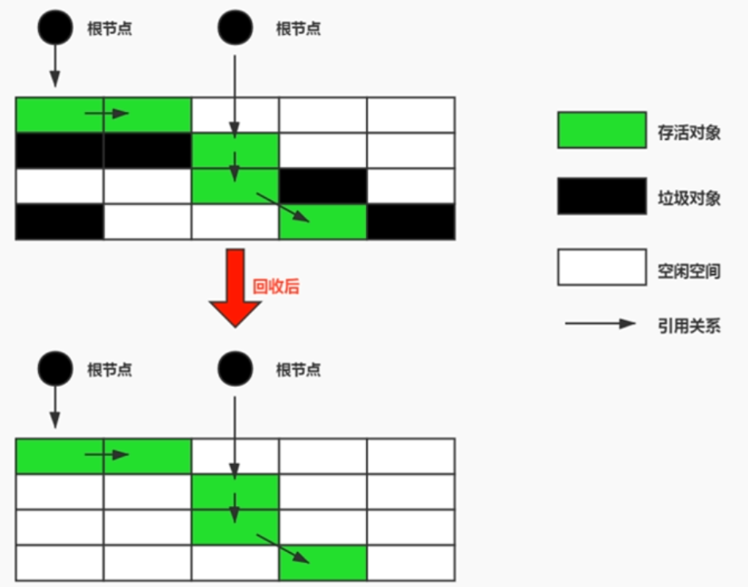
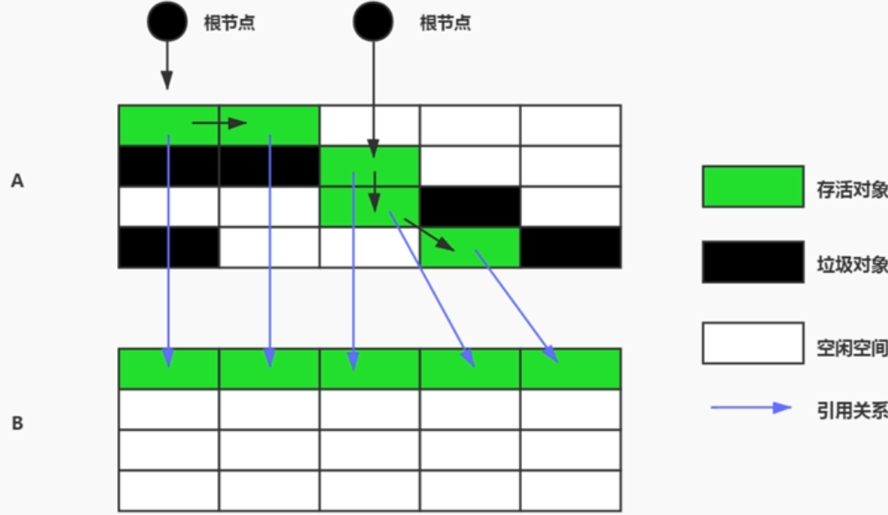
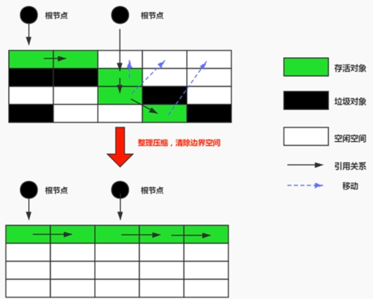
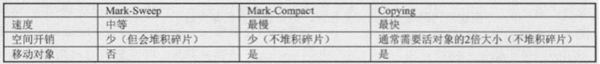
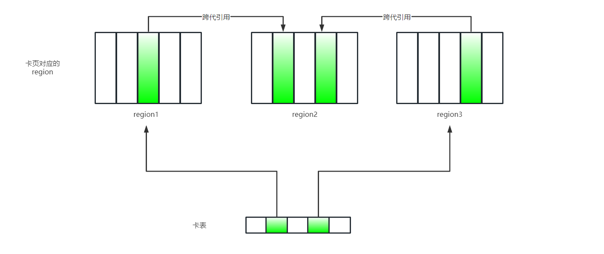
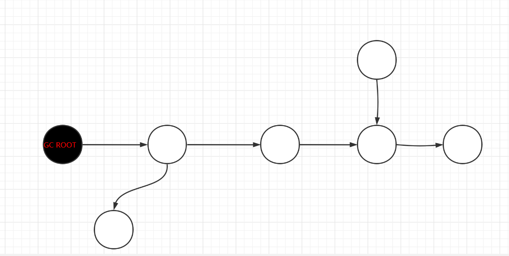
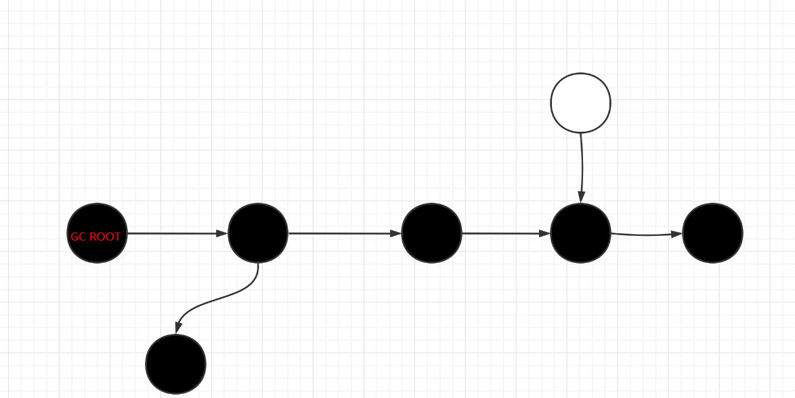
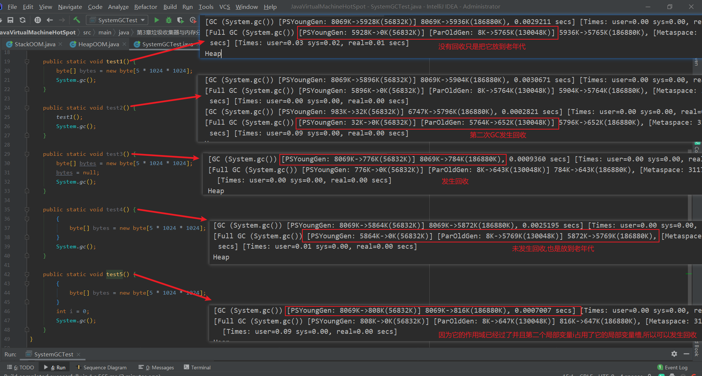
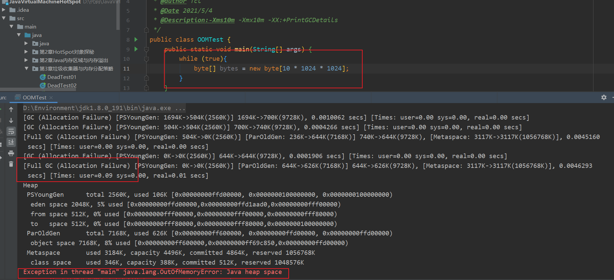
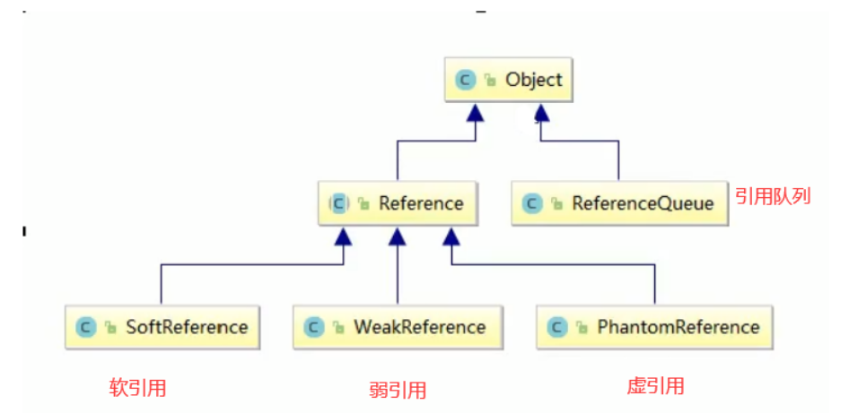

[toc]


## 垃圾回收算法与引用

### 判断对象已死(标记垃圾算法)

#### 引用计数算法

> 引用计数算法判断对象已死

**在对象添加一个引用计数器,有地方引用此对象,该引用计数器+1,引用失效时,该引用计数器-1,当引用计数器为0时,说明没有任何地方引用对象,对象已死**


但是该方法无法解决==循环引用==(比如对象A的字段引用了对象B,对象B的字段引用了字段A,此时都将null赋值给对象A,B它们的引用计数器上都不为0,也就是表示对象未死,但实际上为null已经死了)

- 优点 : **标记垃圾对象简单,高效**
- 缺点: **无法解决循环引用,存储引用计数器的空间开销,更新引用记数的时间开销**

因为**无法解决循环引用所以JVM不使用引用计数法**

> 证明Java未采用引用计数算法

```java
public class ReferenceCountTest {
    //占用内存
    private static final byte[] MEMORY = new byte[1024 * 1024 * 2];

    private ReferenceCountTest reference;

    public static void main(String[] args) {
        ReferenceCountTest a = new ReferenceCountTest();
        ReferenceCountTest b = new ReferenceCountTest();
        //循环引用
        a.reference = b;
        b.reference = a;

        a = null;
        b = null;
//        System.gc();
    }
}
```


#### 可达性分析算法

**Java使用可达性分析算法,可以解决循环引用**

> 可达性分析算法判断对象已死

- 从`GC Roots`对象开始,根据引用关系向下搜索,搜索的过程叫做==引用链==
	- 如果通过`GC Roots`可以通过引用链达到某个对象则该对象称为==引用可达对象==
	- 如果通过`GC Roots`到某个对象没有任何引用链可以达到,就把此对象称为==引用不可达对象==,将它放入==引用不可达对象集合==中(如果它是首个引用不可达对象节点,那它就是引用不可达对象根节点)


> 可以作为GC Roots对象的对象

1. 在栈帧中局部变量表中引用的对象==**参数,临时变量,局部变量**==

2. 本地方法引用的对象

3. 方法区的类变量引用的对象

4. 方法区的常量引用的对象(字符串常量池中的引用)

5. 被`sychronized`同步锁持有的对象

6. JVM内部引用(基础数据类型对应的Class对象,系统类加载器,常驻异常对象等)

7. 跨代引用

	

	

- 缺点:
	- **使用可达性分析算法必须在保持一致性的快照中进行(某时刻静止状态)**
	- **这样会导致STW(Stop the Word)从而让用户线程短暂停顿**


#### 真正的死亡

- 真正的死亡最少要经过2次标记
	- 通过GC Roots经过可达性分析算法,得到某对象不可达时,进行第一次标记该对象
	- 接着进行一次筛选(筛选条件: 此对象是否有必要执行`finalize()`)
		- 如果此对象没有重写`finalize()`或JVM已经执行过此对象的`finalize()`都将被认为此对象没有必要执行`finalize()`,这个对象真正的死亡了
		- 如果认为此对象有必要执行`finalize()`则会把该对象放入`F-Queue`队列中,JVM自动生成一条低优先级的Finalizer线程
			- ==Finalizer线程是守护线程,不需要等到该线程执行完才结束程序,也就是说不一定会执行该对象的finalize()方法==
			- ==设计成守护线程也是为了防止执行finalize()时会发生阻塞,导致程序时间很长,等待很久==
			- Finalize线程会扫描`F-Queue`队列,如果此对象的`finalize()`方法中让此对象重新与引用链上任一对象搭上关系,那该对象就完成自救==**finalize()方法是对象自救的最后机会**==

> 测试不重写finalize()方法,对象是否会自救

```java
/**
 * @author Tc.l
 * @Date 2020/11/20
 * @Description:
 * 测试不重写finalize方法是否会自救
 */
public class DeadTest01 {
    public  static DeadTest01 VALUE = null;
    public static void isAlive(){
        if(VALUE!=null){
            System.out.println("Alive in now!");
        }else{
            System.out.println("Dead in now!");
        }
    }
    public static void main(String[] args) {
        VALUE = new DeadTest01();

        VALUE=null;
        System.gc();
        try {
            //等Finalizer线程执行
            TimeUnit.SECONDS.sleep(1);
        } catch (InterruptedException e) {
            e.printStackTrace();
        }
        isAlive();
    }
}
/*
Dead in now!
*/
```

**对象并没有发生自救,对象以及死了**

> 测试重写finalize()方法,对象是否会自救

```java
/**
 * @author Tc.l
 * @Date 2020/11/20
 * @Description:
 * 测试重写finalize方法是否会自救
 */
public class DeadTest02 {
    public  static DeadTest02 VALUE = null;
    public static void isAlive(){
        if(VALUE!=null){
            System.out.println("Alive in now!");
        }else{
            System.out.println("Dead in now!");
        }
    }

    @Override
    protected void finalize() throws Throwable {
        super.finalize();
        System.out.println("搭上引用链的任一对象进行自救");
        VALUE=this;
    }

    public static void main(String[] args) {
        VALUE = new DeadTest02();
        System.out.println("开始第一次自救");
        VALUE=null;
        System.gc();
        try {
            //等Finalizer线程执行
            TimeUnit.SECONDS.sleep(1);
        } catch (InterruptedException e) {
            e.printStackTrace();
        }
        isAlive();

        System.out.println("开始第二次自救");
        VALUE=null;
        System.gc();
        try {
            //等Finalizer线程执行
            TimeUnit.SECONDS.sleep(1);
        } catch (InterruptedException e) {
            e.printStackTrace();
        }
        isAlive();
    }
}
/*
开始第一次自救
搭上引用链的任一对象进行自救
Alive in now!
开始第二次自救
Dead in now!
*/
```

**第一次自救成功,第二次自救失败,说明了finalize()执行过,JVM会认为它是没必要执行的了**

**重写finalize()代价高,不能确定各个对象执行顺序,不推荐使用**


### 垃圾回收算法

#### 垃圾回收分类

- 部分收集(Partial GC): 收集目标不是整个堆
	- **新生代收集(Minor GC/ Young GC):收集新生代**
		- Eden
		- Survive to
		- Survive from
	- **老年代收集(MajorGC/Old GC):收集老年代**
	- **混合收集(Mixed GC):收集整个新生代和部分老年代**
- **整堆收集(Full GC):  整个堆 +  元空间**


#### 标记-清除算法

**Mark-Sweep**

- **标记:从GCRoots开始遍历引用链,标记所有可达对象 (在对象头中标记)**
- **清除:从堆内存开始线性遍历,发现某个对象没被标记时对它进行回收**

> 大致流程




> 总结

- 优点
	- 简单
	- 不会改变引用的地址

- 缺点
	- 2次遍历扫描,**效率不高**
	- **会出现内存碎片,需要空闲列表记录**
	- **移动对象时必须全程暂停用户应用才可以进行(Stop The World)**


- **注意: 这里的清除,并不是真正意义上的回收内存,只是更新空闲列表**
	- **把要回收对象所在这块内存地址标记为空闲的**
	- 后续如果新对象需要就来覆盖
	- 类似删除文件后如果没有其他对象覆盖此空间时还可以恢复文件


#### 复制算法

**Copying**

Survive区分为两块容量一样的Survive to区和Survive from区

每次GC将Eden区和Survive from区存活的对象放入Survive to区,此时Survive to区改名为Survive from区,原来的Survive from区改名为Survive to区 ==**保证Survive to区总是空闲的**==

如果Survive from区的对象经过一定次数的GC后(默认15次),把它放入老年代

> 大致流程(图中的dean为Eden区写错了)


> 细节流程




> 总结

- 优点
	- **高效**
	- **无内存碎片**

- 缺点
	- **浪费半块Survive区的内存**
	- **移动对象时必须全程暂停用户应用才可以进行(Stop The World)**
	- **复制后会改变引用地址**
		- 因为hotspot中使用直接指针访问,还需要改变栈中`reference`指向改引用地址

**如果对象存活率高就会非常浪费资源,所以适用于新生代**


#### 标记-整理算法

**Mark-Compact**

- **标记**
	- **从GCRoots开始遍历引用链,标记所有可达对象 (在对象头中标记)**
	- 与标记-清除算法一致
- **整理**
	- **让所有存活对象往内存空间一端移动**
	- **然后直接清理掉边界以外的所有内存**

> 大致流程



- 优点
	- **没有内存碎片,不需要空闲列表 (解决标记-清除算法的问题)**
	- **没有浪费空间 (解决复制算法的问题)**
- 缺点
	- **移动对象时必须全程暂停用户应用才可以进行(Stop The World)**
	- **效率低** (比标记清除还低,多了整理步骤)
	- **需要移动对象** (需要改变栈中`reference`指向改引用地址)

如果不移动对象会产生内存碎片,内存碎片过多,将无法为大对象分配内存,移动对象则会Stop The World

还有种方法:多次标记-清除,等内存碎片多了再进行标记-整理


#### 分代收集算法



**需要移动对象 意味着 要改变改对象引用地址 也就是说要改变栈中`reference`指向改对象的引用地址**

**分代收集算法 : 对待不同生命周期的对象可以采用不同的回收算法**(没有最好的算法,只有最合适的算法)

- **年轻代: 对象生命周期短,存活率低,回收频繁**
	- **采用复制算法,高效**
- **老年代: 对象生命周期长,存活率高,回收没年轻代频繁**
	- **采用标记-清除 或混用 标记-整理** 
		- mark开销 和 compact 开销 与 存活对象数量 成正比
		- sweep 开销 与  堆空间大小 成正比 (遍历)


#### 增量收集算法

mark-sweep,copying,mark-compact算法都存在STW,如果垃圾回收时间很长,会严重影响用户线程的响应

**增量收集算法: 采用用户线程与垃圾收集线程交替执行**

- **优点**
	- **提高用户线程的响应时间**
- **缺点**
	- **存在线程上下文切换的开销,降低吞吐量,垃圾回收成本变大**


#### 分区算法

堆空间越大,GC时间就会越长,用户线程响应就越慢

**分区算法: 将堆空间划分为连续不同的区,根据要求的停顿时间合理回收n个区,而不是一下回收整个堆**

每个区独立使用,独立回收

- 优点
	- 根据能承受的停顿时间控制一次回收多少个区


### HotSpot垃圾回收算法细节


#### STW

**Stop The Word**

**STW: GC中为了分析垃圾过程确保一致性，会导致所有Java用户线程停顿**

**可达性分析算法枚举根节点导致STW**

（因为不停顿线程的话，在分析垃圾的过程中引用会变化，这样分析的结果会不准确）


#### 根节点枚举

枚举GC Roots的过程是耗时的，因为要找到栈上的Reference作为根节点，这就不得不对整个栈进行扫描

为了避免枚举根节点耗费太多时间，使用OopMap（Ordinary Object Pointer普通对象指针）数据结构来记录reference引用位置

**根节点枚举必须暂停用户线程，因为要保证一致性的快照（根节点枚举是用户线程停顿的重要原因）**

如果单纯遍历GC Roots和引用链过程会非常的耗时，**使用OopMap记录引用所在位置，扫描时不用去方法区全部扫描**

**使用OopMap快速，精准的让HotSpot完成根节点枚举**


#### 安全点与安全区域

> safe point

代码中引用的位置可能发生变动，每时每刻更新OopMap的开销是非常大的，因此规定在安全点位置才更新OopMap

那什么位置才是安全点呢？

**安全点所在的位置一般具有让程序长时间执行的特征**，比如方法调用、循环、异常跳转等

由于只有安全点位置的OopMap是有效的，因此在**进行GC时用户线程需要停留在安全点**

让用户线程到最近的安全点停下来的方式有两种，分别是抢先式中断、主动式中断

抢先式中断: 垃圾收集发生时，中断所有用户线程，如果有用户线程没在安全点上就恢复它再让它执行会到安全点上

**主动式中断: 设置一个标志位，当要发生垃圾回收时，就把这个标记位设置为真，用户线程执行时会主动轮询查看这个标志位，一旦发现它为真就去最近的安全点中断挂起**

hotspot选择主动式中断，使用内存保护陷阱方式将轮循标志位实现的只有一条汇编指令，高效

**安全点设立太多会影响性能，设立太少可能会导致GC等待时间太长**

**安全点保证程序线程执行时，在不长时间内就能够进入垃圾收集过程的安全点**


> safe region

安全点只能保证程序线程执行时，在不长时间内进入安全点，如果是Sleep或者Blocking的线程呢?

**安全区域：确保某一段代码中，引用关系不发生变化，这段区域中任意地方开始垃圾收集都是安全的**

sleep、blocking线程需要停留在安全区才能进行GC

用户线程执行到安全区，会标识自己进入安全区，垃圾回收时就不会去管这些标识进入安全区的线程

用户线程要离开安全区时，会去检查是否执行完根节点枚举，执行完了就可以离开，没执行完就等待，直到收到可以离开的信号（枚举完GC Roots）


#### 记忆集与卡表

前面说到过分代收集的概念，比如GC可能是只针对年轻代的，但年轻代对象可能引用老年代，对了可达性分析的正确性可能要将老年代也加入GC Roots的扫描范围中，这无疑又增加了一笔开销

上述问题叫做跨代引用问题，跨代引用问题不仅仅只存在与年轻代与老年大中，熟悉G1、低延迟ZGC、Shenandoah收集器的同学会知道它们分区region也会存在这种跨代引用

使用记忆集来记录存在跨代引用的情况，当发生跨代引用时只需要将一部分跨代引用的加入GC Roots的扫描范围，而不用全部扫描

可以把记忆集看成**记录从非收集区指向收集区的指针集合**

常用卡表实现记忆集的卡精度（每个记录精确到内存区，该区域有对象有跨代指针）

卡表简单形式是一个字节数组，数组中每个元素对应着其标识内存区域中一块特定大小的内存区（这块内存区叫:卡页）



如果卡页上有对象含有跨代指针，就把对应卡表数组值改为1(卡表变脏)，1说明卡表对应的内存块有跨代指针，把卡表数组上元素为1的内存块加入GC Roots中一起扫描（图中卡表绿色位置表示卡表变脏存在跨代引用）

**记忆集解决跨代引用问题，缩减GC Roots扫描范围**


#### 写屏障

维护卡表变脏应该放在跨代引用赋值之后，**使用写屏障来在跨代引用赋值操作后进行更新卡表**

这里的写屏障可以理解为AOP，在赋值完成后进行更新卡表的状态

更新卡表操作产生额外的开销，在高并发情况下还可能发生伪共享问题，降低性能

可以不采用无条件的写屏障，先检查卡表标记，只有未被标记过时才将其标记为变脏，来避免伪共享问题，但会增加额外判断的开销

-XX:+UseCondCardMark 是否开启卡表更新条件判断，开启增加额外判断的开销，可以避免伪共享问题

 

#### 并发可达性分析

> 如果GC线程和用户线程不同时执行

初始状态



扫描过程中


结束状态



**黑色: 当前对象已经被扫描过,并且它的所有引用也被扫描了**

**白色: 当前对象未被扫描过**

**灰色: 当前对象被扫描过,至少有一个引用未被扫描**

**如果扫描结束还是白色说明不可达**

>  如果GC线程和用户线程同时执行,用户线程标记时,并发修改引用

一种情况会把原本死亡的对象改成活的对象,成为浮动垃圾,下次再回收掉

另一种情况会把原本存活的对象改成死亡的对象,非常危险(如下图)


这个现象又叫:对象消失问题

对象消失需要满足的条件:

1. 赋值器插入一条或多条从黑色对象到白色对象的新引用
2. 赋值器删除全部从灰色对象到该白色对象的直接或间接引用

只需要破坏其中一条就可以避免对象消失

**增量更新和原始快照分别破坏1,2条件**

- 增量更新: 记录新增加的引用,并发扫描结束后,把记录的引用中以黑色对象为根节点再扫描一遍(==理解:黑色对象一旦添加新白色对象的引用,就变回灰色对象需要重新扫描==)

	增量更新+写后屏障 (需要记录新的引用对象)

- 原始快照: 记录删除的引用,并发扫描结束后,把记录的引用中以灰色对象为根节点再扫描一遍(==理解:无论删除与否,都从开始扫描那一刻的对象图快照来进行搜索,所以 可能产生浮动垃圾==)

	原始快照+写前屏障(不需要记录新的引用对象,需要记录旧引用对象)


### 相关概念

#### System.gc()

**提醒垃圾收集器进行Full GC，不一定会执行** 

与`Runtime.getRuntime().gc()`作用相同

可以使用`System.gc()` + `System.runFinalization()`强制执行finalize方法

> 代码测试GC不可达对象

```java
public class SystemGCTest {

    @Override
    protected void finalize() throws Throwable {
        super.finalize();
        System.out.println("执行了finalize");
    }

    public static void test1() {
        byte[] bytes = new byte[5 * 1024 * 1024];
        System.gc();
    }

    public static void test2() {
        test1();
        System.gc();
    }

    public static void test3() {
        byte[] bytes = new byte[5 * 1024 * 1024];
        bytes = null;
        System.gc();
    }

    public static void test4() {
        {
            byte[] bytes = new byte[5 * 1024 * 1024];
        }
        System.gc();
    }

    public static void test5() {
        {
            byte[] bytes = new byte[5 * 1024 * 1024];
        }
        int i = 0;
        System.gc();
    }
}
```




#### 内存溢出

**`OutOfMemoryError(OOM)`：没有空闲内存，并且垃圾收集器无法提供更多内存**

当应用程序占用内存速度大于垃圾回收内存速度时可能发生OOM

- 内存溢出的情况
	- 堆内存设置太小 (通过`-Xmx`来调整)
	- 创建大量大对象，且生命周期长，不能被回收

抛出OOM之前通常会进行Full GC，如果进行Full GC后依旧内存不足才抛出OOM

JVM参数`-Xms10m -Xmx10m -XX:+PrintGCDetails`




#### 内存泄漏

**内存泄漏Memory Leak: 对象不会被程序用到了，但是不能回收它们**


内存泄漏可能导致最终出现内存溢出OOM（因为不用这些对象了，但也不能回收，一直占用空间）

广义内存泄漏：不正确的操作导致对象生命周期变长也可能OOM

单例中引用外部对象，当这个外部对象不用了，但是因为单例还引用着它导致内存泄漏

一些需要close的资源未关闭导致内存泄漏


#### 并行与并发

**并发: 某时间段上有很多任务执行，但某时刻上只有一个任务在执行，这个时间段上任务是交替执行的**

**并行: 某时刻有多个任务在执行（前提条件: 多核处理器）**

> 垃圾回收的串行、并行、并发


**串行: 需要GC时，暂停用户线程，单条GC线程串行运行**

**并行: 需要GC时，暂停用户线程，多条GC线程并行运行**

**并发: 需要GC时，用户线程与GC线程并发执行（交替执行）**


### 引用

在栈上的`reference`类型存储的数据代表某块内存地址，称`reference`为某内存、某对象的引用

实际上引用分为很多种，从强到弱分为：强引用 > 弱引用 > 软引用 > 虚引用

平常我们使用的引用实际上是强引用，各种引用有自己的特点，下文将一一介绍

强引用就是Java中普通的对象，而弱引用、软引用、虚引用在JDK中定义的类分别是`SoftReference`、`WeakReference`、`PhantomReference`

下图是弱引用、软引用、虚引用、引用队列（搭配虚引用使用）之间的继承关系




#### 内存溢出与内存泄漏

为了更清除的描述引用之间的作用，首先需要介绍一下内存溢出和内存泄漏

当发生内存溢出时，表示**JVM没有空闲内存为新对象分配空间**，抛出**`OutOfMemoryError(OOM)`：**

当应用程序占用内存速度大于垃圾回收内存速度时就可能发生OOM

抛出OOM之前通常会进行Full GC，如果进行Full GC后依旧内存不足才抛出OOM

JVM参数`-Xms10m -Xmx10m -XX:+PrintGCDetails`


内存溢出可能发生的两种情况：

1. 必须的资源确实很大，**堆内存设置太小** （通过`-Xmx`来调整）

2. **发生内存泄漏**，创建大量对象，且生命周期长，不能被回收

**内存泄漏Memory Leak: 对象不会被程序用到了，但是不能回收它们**  

对象不再使用并且不能回收就会一直占用空间，大量对象发生内存泄漏可能发生内存溢出OOM

广义内存泄漏：不正确的操作导致对象生命周期变长

1. 单例中引用外部对象，当这个外部对象不用了，但是因为单例还引用着它导致内存泄漏
2. 一些需要关闭的资源未关闭导致内存泄漏


#### 强引用

强引用是程序代码中普遍存在的引用赋值，比如`List list = new ArrayList();`

**只要强引用的引用关系存在，垃圾收集器就不会回收该对象，因此不当的使用强引用是造成Java内存泄漏的主要原因**


#### 软引用

当内存充足时不会回收软引用

**只有当内存不足时，发生Full GC时才将软引用进行回收，如果回收后还没充足内存则抛出OOM异常**

JVM中针对不同的区域（年轻代、老年代、元空间）有不同的GC方式，**Full GC的回收区域为整个堆和元空间**

软引用使用`SoftReference`

> 内存充足情况下的软引用

```java
	public static void main(String[] args) {
        int[] list = new int[10];
        SoftReference listSoftReference = new SoftReference(list);
		//[I@61bbe9ba
        System.out.println(listSoftReference.get());
    }
```


> 内存不充足情况下的软引用(JVM参数:-Xms5m -Xmx5m -XX:+PrintGCDetails)

```java
//-Xms5m -Xmx5m -XX:+PrintGCDetails
public class SoftReferenceTest {
    public static void main(String[] args) {
        int[] list = new int[10];
        SoftReference listSoftReference = new SoftReference(list);
        list = null;

        //[I@61bbe9ba
        System.out.println(listSoftReference.get());

        //模拟空间资源不足
        try{
            byte[] bytes = new byte[1024 * 1024 * 4];
            System.gc();
        }catch (Exception e){
            e.printStackTrace();
        }finally {
            //null
            System.out.println(listSoftReference.get());
        }
    }
}
```


#### 弱引用

**无论内存是否足够，当发生GC时都会对弱引用进行回收**

弱引用使用`WeakReference`

> 内存充足情况下的弱引用

```java
	public static void test1() {
        WeakReference<int[]> weakReference = new WeakReference<>(new int[1]);
        //[I@511d50c0
        System.out.println(weakReference.get());

        System.gc();
        
        //null
        System.out.println(weakReference.get());
    }
```


> WeakHashMap

JDK中有一个WeakHashMap，使用与Map相同，只不过节点为弱引用


当key的引用不存在引用的情况下，发生GC时，WeakHashMap中该键值对就会被删除

```java
	public static void test2() {
        WeakHashMap<String, String> weakHashMap = new WeakHashMap<>();
        HashMap<String, String> hashMap = new HashMap<>();

        String s1 = new String("3.jpg");
        String s2 = new String("4.jpg");

        hashMap.put(s1, "图片1");
        hashMap.put(s2, "图片2");
        weakHashMap.put(s1, "图片1");
        weakHashMap.put(s2, "图片2");

        //只将s1赋值为空时,堆中的3.jpg字符串还会存在强引用,所以要remove
        hashMap.remove(s1);
        s1=null;
        s2=null;

        System.gc();

        //4.jpg=图片2
        test2Iteration(hashMap);

        //4.jpg=图片2
        test2Iteration(weakHashMap);
    }

    private static void test2Iteration(Map<String, String>  map){
        Iterator iterator = map.entrySet().iterator();
        while (iterator.hasNext()){
           Map.Entry entry = (Map.Entry) iterator.next();
            System.out.println(entry);
        }
    }
```

未显示删除weakHashMap中的该key，当这个key没有其他地方引用时就删除该键值对


> 软引用，弱引用适用的场景

数据量很大占用内存过多可能造成内存溢出的场景

比如需要加载大量数据，全部加载到内存中可能造成内存溢出，就可以使用软引用、弱引用来充当缓存，当内存不足时，JVM对这些数据进行回收

使用软引用时，可以自定义Map进行存储`Map<String,SoftReference<XXX>> cache`

使用弱引用时，则可以直接使用`WeakHashMap`

软引用与弱引用的区别则是GC回收的时机不同，软引用存活可能更久，Full GC下才回收；而弱引用存活可能更短，发生GC就会回收


#### 虚引用

**使用`PhantomReference`创建虚引用，需要搭配引用队列`ReferenceQueue`使用**

**无法通过虚引用得到该对象实例**（其他引用都可以得到实例）

**虚引用只是为了能在这个对象被收集器回收时收到一个通知**

> 引用队列搭配虚引用使用

```java
public class PhantomReferenceTest {
    private static PhantomReferenceTest reference;
    private static ReferenceQueue queue;

    @Override
    protected void finalize() throws Throwable {
        super.finalize();
        System.out.println("调用finalize方法");
        //搭上引用链
        reference = this;
    }

    public static void main(String[] args) {
        reference = new PhantomReferenceTest();
        //引用队列
        queue = new ReferenceQueue<>();
        //虚引用
        PhantomReference<PhantomReferenceTest> phantomReference = new PhantomReference<>(reference, queue);
		
        Thread thread = new Thread(() -> {
            PhantomReference<PhantomReferenceTest> r = null;
            while (true) {
                if (queue != null) {
                    r = (PhantomReference<PhantomReferenceTest>) queue.poll();
                    //说明被回收了,得到通知
                    if (r != null) {
                        System.out.println("实例被回收");
                    }
                }
            }
        });
        thread.setDaemon(true);
        thread.start();


        //null (获取不到虚引用)
        System.out.println(phantomReference.get());

        try {
            System.out.println("第一次gc 对象可以复活");
            reference = null;
            //第一次GC 引用不可达 守护线程执行finalize方法 重新变为可达对象
            System.gc();
            TimeUnit.SECONDS.sleep(1);
            if (reference == null) {
                System.out.println("object is dead");
            } else {
                System.out.println("object is alive");
            }
            reference = null;
            System.out.println("第二次gc 对象死了");
            //第二次GC 不会执行finalize方法 不能再变为可达对象
            System.gc();
            TimeUnit.SECONDS.sleep(1);
            if (reference == null) {
                System.out.println("object is dead");
            } else {
                System.out.println("object is alive");
            }
        } catch (InterruptedException e) {
            e.printStackTrace();
        }

    }
}
```

结果:

```java
/*
null
第一次gc 对象可以复活
调用finalize方法
object is alive
第二次gc 对象死了
实例被回收
object is dead
*/
```

第一次GC时，守护线程执行finalize方法让虚引用重新可达，所以没死

第二次GC时，不再执行finalize方法，虚引用已死

虚引用回收后，引用队列有数据，来通知告诉我们reference这个对象被回收了


> 使用场景

GC只能回收堆内内存，而直接内存GC是无法回收的，直接内存代表的对象创建一个虚引用，加入引用队列，当这个直接内存不使用，这个代表直接内存的对象为空时，这个虚内存就死了，然后引用队列会产生通知，就可以通知JVM去回收堆外内存（直接内存）