[toc]

## JVM监控及诊断工具-命令行篇

### jps 查看Java进程

**Java Virtual Machine Process Status Tool**

**Java进程和操作系统中的进程相同**

`jps`: 显示Java进程号和主类名称

`jps -q`:只显示Java进程号

`jps -l`:显示主类全类名

`jps -m`:显示主类main()的参数

`jps -v`:显示进程启动的JVM参数

### jstat查看JVM统计信息

**JVM Statistics Monitoring Tool**

**命令行中运行期间定位虚拟机性能问题首选工具,常用于检查垃圾回收以及内存泄漏问题**

- **格式: `jstat -<option> [-t] [-h] <vmid> [interval] [count]`**
	- option: 要查看什么统计信息
	- -t : 程序运行到现在耗时
	- -h : 输出多少行后输出一次表头信息
	- vmid: 要查看的进程号
	- interval: 间隔多少毫秒输出一次统计信息
	- count: 输出多少次终止

> option的种类

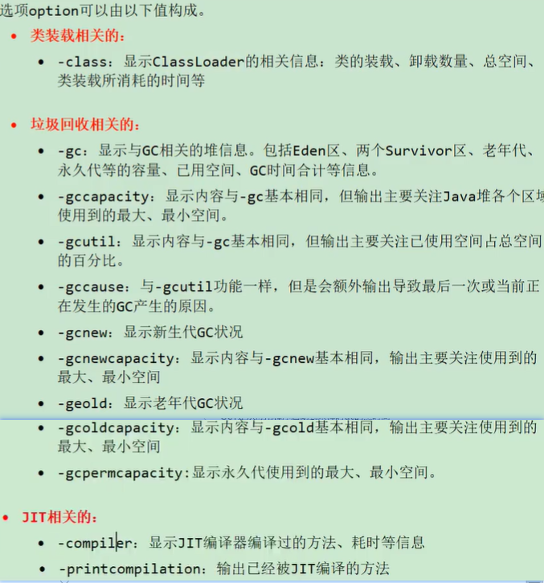

主要记住有关gc的即可

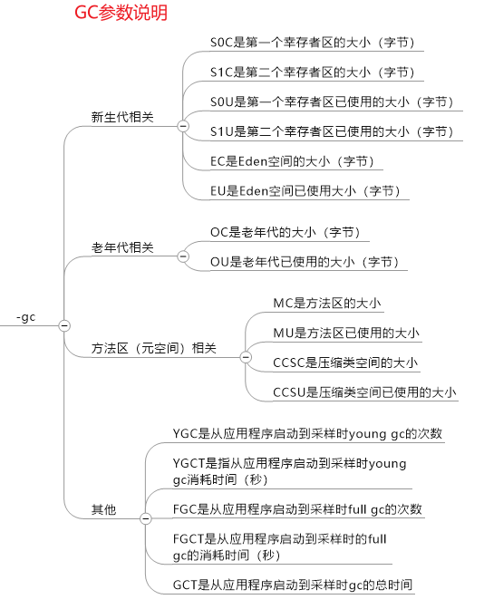

> 重点经验

- **当GC时间占总时间比率很大时,说明频繁GC,越大越可能OOM**

	- 计算GC占比公式 =  2次GC耗时时间相减 /  这2次程序持续时间相减

		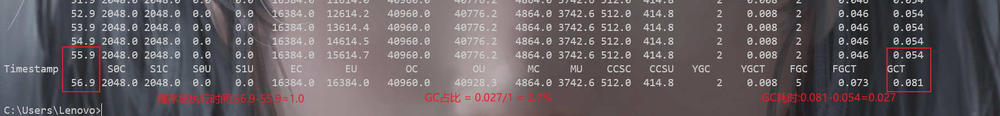

- **当老年代占用内存不断上涨,可能出现内存泄漏**

	

### jinfo实时查看,修改JVM参数

**Java Configuration Info:实时查看/修改JVM参数**

- 查看

	- `jinfo -sysprops pid`: 查看`System.getProperties()`取得的参数 (很多信息)

		

	- `jinfo -flags pid`: 查看曾经赋值的参数

		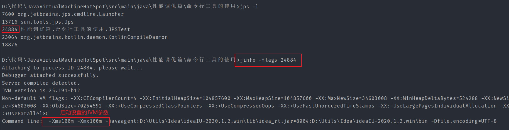

	- `jinfo -flag JVM参数名 pid`: 查看某个Java进程的具体某个参数信息

		

- 修改

	-  `jinfo -flag [+/-]JVM参数名 pid`修改布尔类型

		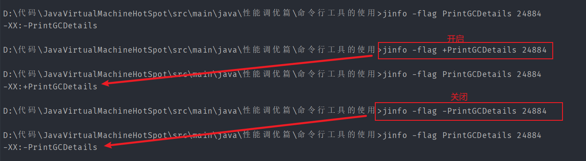

	- `jinfo -flag JVM参数名=参数值 pid`修改非布尔类型

		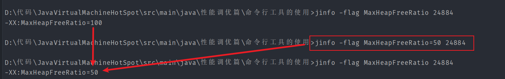

- 扩展
	- `java -XX:+PrintFlagsInitial`: 查看所有JVM参数启动初始值
	- `java -XX:+PrintFlagFinal`: 查看所有JVM参数最终值
	- `java -参数名:+PrintCommandLineFlags` 查看被修改过的某参数值

### jmap导出内存映像文件和内存使用情况

**JVM Memory Map:获取dump文件以及目标Java进程内存相关信息(堆使用情况,对象统计信息,类加载信息)**

**一般使用格式: `jmap [option] pid`**

> option参数说明

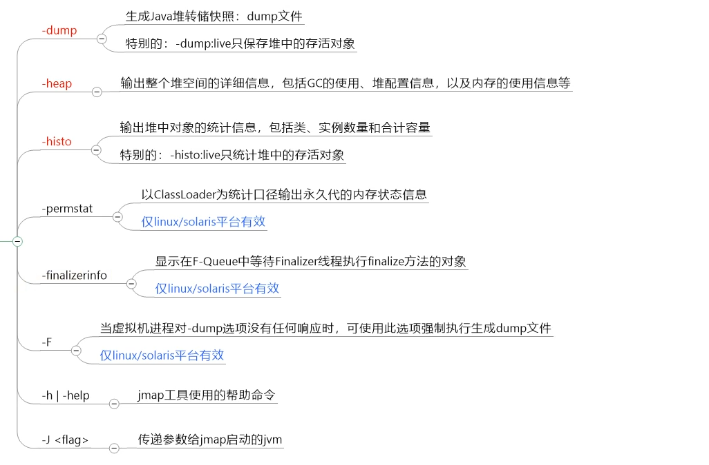

- 手动导出 : 手动直接立即导出

	- `jmap -dump:format=b,file=导出目录\文件名.hprof pid`

	- `jmap -dump:live,format=b,file=导出目录\文件名.hprof pid`

		- 只dump出存活对象的快照,节省dump时间,空间 (一般在手动时使用这种方式)

		

- 自动导出: 启动程序时需要带参数,发生OOM时自动导出

	- `-XX:+HeapDumpOnOutOfMemoryError`
	- `-XX:HeapDumpPath=导出目录\文件名.hprof`

	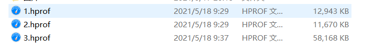

	OOM前Dump出的内存快照明显大一些

jmap会访问所有对象,为了不会用户线程干扰,jmap会借助安全点,在安全点中所有线程不会改变堆中对象状态,也就是说: **jmap导出的内存快照文件都是在安全点位置的** 

结果可能出现偏差(比如某对象声明周期在两个安全点,使用live时就无法探知到这些对象)

**如果某线程长时间无法到安全点或安全区域,jmap就会等待,而jstat只需要在安全点读取垃圾回收器保存的统计数据**

### jhat分析dump文件工具

**Java Heap Analysis Tool:内置微型服务器分析jmap生成的dump文件**

**格式: `jhat [option] [dumpfile目录]` **

jdk9后删除

使用的时候会占用CPU所以不会在生成环境中使用jhat来分析

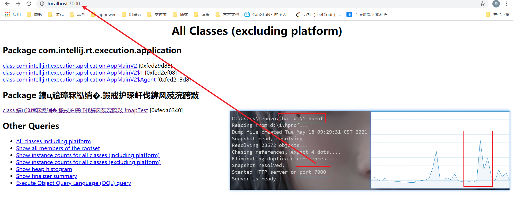

> option参数

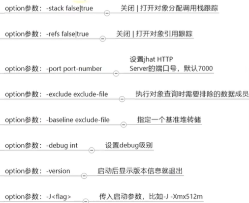

### jstack打印JVM线程快照

**JVM Stack Trace: 生成指定Java进程中当前时刻的线程快照,常用于定位线程出现长时间停顿的原因**

**格式: `jstack option pid`**

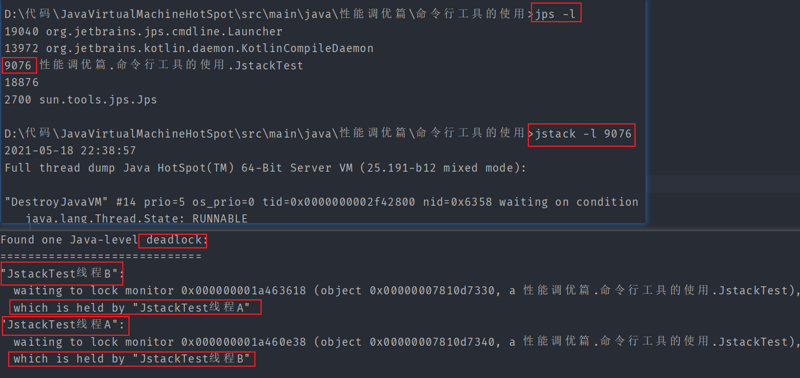

> option参数

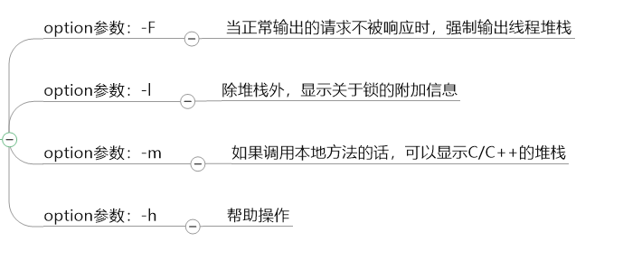

### jcmd多功能命令行

jcmd可以实现除了jstat外所有指令的功能

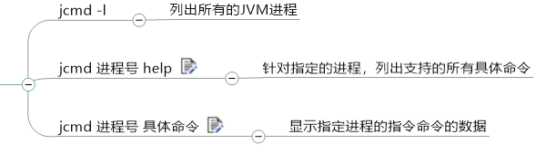

> jcmd -l 类似jps

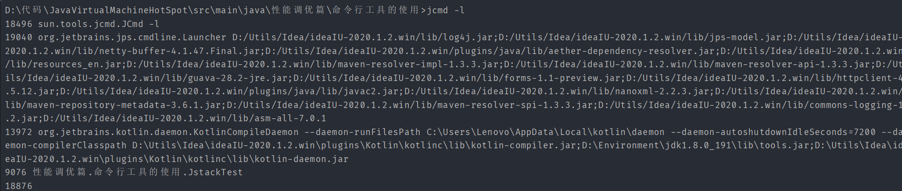

> jcmd pid help

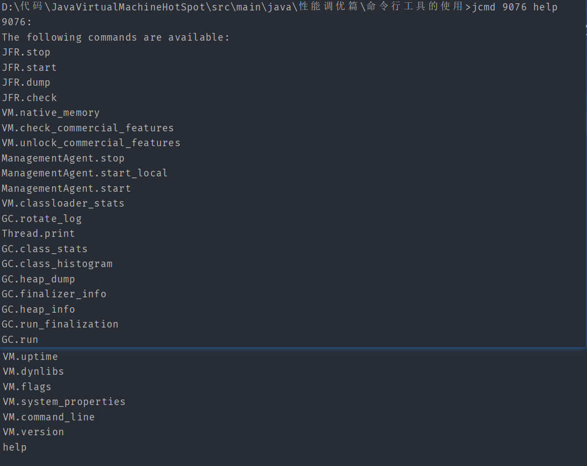

> jcmd pid 具体命令

### jstatd远程主机信息收集

以上的很多指令都可以连接远程主机查看信息需要搭配jstatd使用

