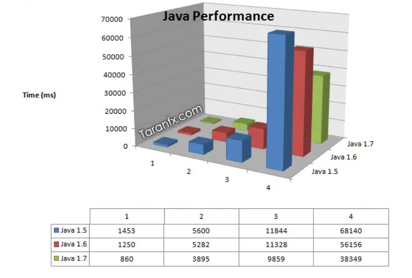
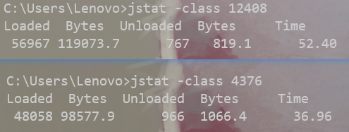
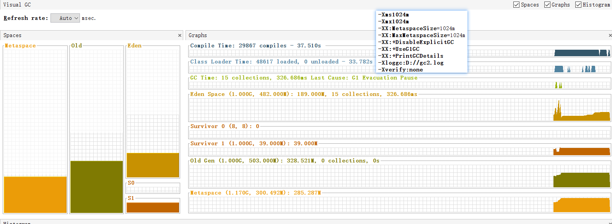

[toc]

## 调优案例分析与实战

### 案例分析

#### 大内存硬件上程序部署策略

> 前提

在线文档网站更换大内存硬件后,不定期长时间失去响应

> 分析

hotspot默认使用吞吐量优先的Paralleli收集器,访问文档会把文档从磁盘提取到内存,导致序列化产生很多大对象直接进入老年代

> 解决 (需要解决响应速度的问题)

- **使用逻辑集群部署充分利用硬件**
	- 逻辑集群带来的问题  (集群节点可以理解为服务器)
		1. 需要前端搭建负载均衡器并反向代理分配请求
		2. 集群节点竞争全局资源 (同时访问某磁盘文件,需要同步)
		3. 难以高效利用连接池 (一般在各个节点建立自己的连接池,可能有的连接池满了,有的连接池空的)
		4. 32位OS会限制单个进程所占最大内存
		5. 大量使用本地缓存 (考虑把本地缓存改为集中式缓存)

- **采用并发收集器CMS 或 低延迟分代收集器G1,加快响应速度**

#### 集群间同步导致内存溢出

集群间网络交互太频繁,**全局缓存可以接收频繁读,不能接收频繁写**(需要同步,导致传输超时失败,导致一直重发)

传输未成功之前要保存传输数据在内存

传输失败会重发,重发导致堆积数据产生内存溢出

#### 堆外内存导致溢出错误

这种场景一般是**堆内存很稳定但出现OOM**

**OS会对进程所占最大内存有所限制,不要忘记了堆外内存** (特别是32位的OS上)

> JVM进程中占用较多内存的地方

1. 堆内存
2. 方法区
3. 直接内存(堆外内存)
4. 线程栈内存
5. socket缓存区 (发送方,接收方的缓存区,连接多时也会占较多)
6. 调用JNI会占用本地方法栈,本地内存(直接内存)
7. JVM和垃圾收集器也会消耗一定内存

#### 外部命令导致系统缓慢

当出现**请求响应缓慢,处理器利用率高,用户应用程序的处理器利用率低**这种不正常的情况时,可能是外部命令导致系统缓慢

#### 服务器虚拟机进程奔溃

服务A异步调用服务B的Web服务,服务B处理速度过慢(调用和处理速度不一致),导致过多socket连接堆积,最终超时奔溃

**将异步调用改为生产者/消费者模式的消息队列**

#### 不恰当数据结构导致内存占用过大

**有效数据所占空间 / 数据结构所占空间  = 空间利用率**

使用空间利用率低的数据结构(比如空间换时间的散列表)时

**如果有大量的这种数据结构加载到内存,且它们生命周期比较长,会导致新生代使用复制算法的垃圾收集器暂停时间变长**

虽然可以通过减低survivor内存和降低进入老年代GC年龄,让这种数据结构早点进入老年代,但还是要考虑使用恰当数据结构

#### 由安全点导致长时间停顿

> 前提

real: 真正垃圾回收的时间 (现实时间中的时间)

user: 线程执行用户态代码时间 

sys: 线程执行核心态代码时间

单核: user+sys=real  

多核下,所有线程执行时间都会计算到user,sys中

**调优看real**

> 分析

某个项目 real 时间短,user时间长

user时间长,用户线程导致的

> 解决

可数循环: 循环次数类型是int类型及以下

不可数循环: 循环次数类型是long类型

hotspot默认不会在可数循环设立安全点,但循环时间 = 单次循环时间 * 循环次数

如果线程执行单次循环时间很长,且是一个可数循环,hotspot不为它设立安全点,那么这个线程到安全点会很慢,所有用户线程都要等它到达安全点后才可以进行垃圾回收

通过把循环类型改为long可以解决

### 实战

#### IDEA运行速度调优

启动IDEA实际上也是启动了一个Java进程,有时候启动IDEA会非常慢,通过分析IDEA的进程,调整参数对IDEA运行速度进行调优

##### 调优前的状态

有些参数为了此次实验故意修改过

初始化256堆内存,最大堆内存512,使用串行垃圾收集器Serial,打印日志

从图片中可以分析到 **编译时间,类加载时间,GC时间** 是我们要调优的主要内容

##### 升级JDK版本性能调优

可以通过升级虚拟机版本从而得到"免费"的调优

因为每次JDK版本发布,都会说明虚拟机运行速度比上一版本有提升 (1.5 < 1.6 < 1.7)

我使用的版本是1.8,为了稳定性,不升级JDK版本

##### 编译时间优化

**编译时间指的是虚拟机的即时编译器(后端编译器)编译热点代码的耗时**

默认使用的hotspot采用mixed混合方式: 解释器 + 后端编译器 

**程序刚启动时,主要由解释器将字节码指令解释为本地代码,随着程序的运行,越来越多的方法满足成为热点代码的条件,它们被即时编译器编译为本地代码,提高运行速度**

**运行时编译的缺点就是运行时会消耗计算机资源,影响运行时间,也就是增加编译时间**

在客户端模式使用的是C1轻量级编译器,在服务端模式使用C2相对重量级编译器可以提供更多优化措施,随着程序的运行,后端编译器所带来的优点(提升运行速度)会大大超过缺点(增加编译时间)

所以这部分,不需要调整

##### 类加载优化

因为使用的代码以及被证明是安全可靠的了,所以我们可以关闭类加载时的字节码验证来提升类加载速度

**`-Xverify:none`禁止类加载的字节码验证**

虽然后面加载的类少了很多,但经过计算,禁止类加载字节码验证还是可以优化类加载时间的

##### 垃圾回收优化

- 编译时间和类加载的影响会随着程序运行的时间增长而下降
	- 随着热点代码不断被编译,新的热点代码数量会下降
	- 不可能出现持续不断的类加载和卸载

而**垃圾回收随着程序运行时间是持续运作的,所以垃圾回收调优才是重点**

- 对于垃圾回收的优化一般需要查看GC日志信息

	- 如果日志**显示频繁minor gc 而不频繁full gc 可以尝试增加年轻代内存**

	- 各个运行时内存区域**初始化内存可以设置为相对于的最大内存,避免内存扩容的开销**

		- 比如 -Xmx512m 相应的 设置-Xms512m

	- 如果Old区稳定,但是发生Full GC,可能是程序中主动调用`System.gc()`,可以**通过`-XX:DisableExplictGC`禁止**

	- 我在我的GC日志信息中,看到很多**GC原因是元空间大小不够了,可以尝试增大元空间内存**

		

- 还可以**选择收集器降低延迟**
	- 之前采用的是串行收集器serial
	- 在使用Idea时应该考虑低延迟,所以可以采用老年代CMS,年轻代ParNew的收集器组合 又或者是 G1收集器

> 使用G1收集器

只发生了minor gc 未发生full gc 

从一开始的 2.8s -> 0.36s 

 因为使用的是G1最好不要设置年轻代与老年代占比这种参数(比如`-NewRatio`)

> 使用CMS+ParNew

与G1性能差不多

