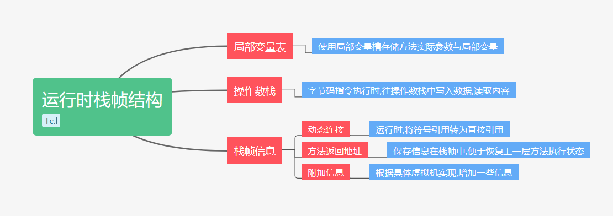
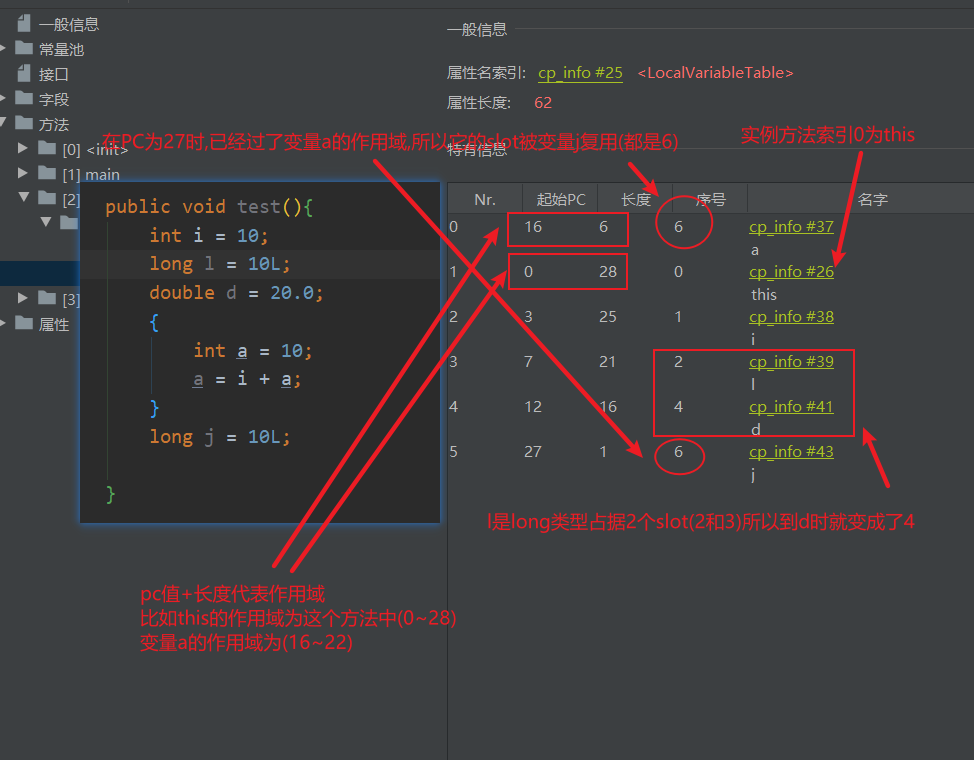
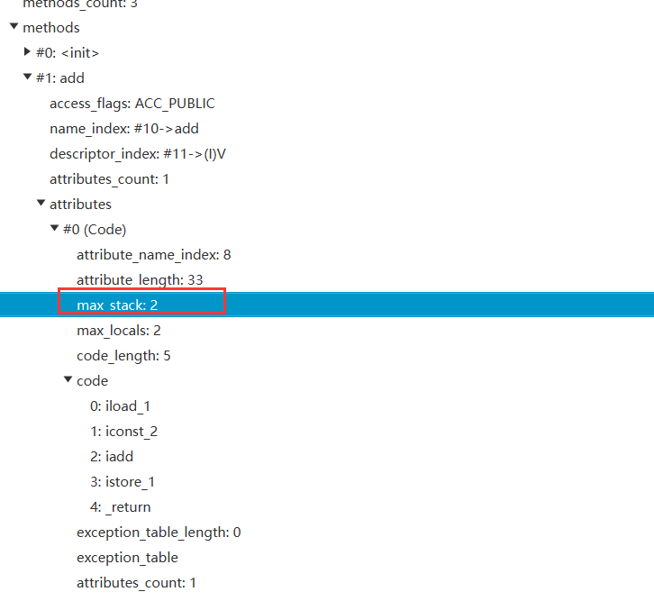

[toc]


## Java内存区域与内存溢出异常

==Java虚拟机在运行Java程序时,把所管理的内存分为多个区域, 这些区域就是运行时数据区==

**运行时数据区可以分为:程序计数器,Java虚拟机栈,本地方法栈,堆和方法区**


### 程序计数器 

Program Counter Register 程序记数寄存器

- 什么是程序计数器?
	
- 程序计数器是一块**很小的内存**,它可以当作**当前线程执行字节码的行号指示器**
	
- 程序计数器的作用是什么?

  1. **字节码解释器通过改变程序计数器中存储的下一条字节码指令地址以此来达到流程控制**
  2. Java多线程的线程会切换,为了保存线程切换前的正确执行位置,每个线程都应该有程序计数器,因此**程序计数器是线程私有的**

  线程**执行Java方法时,程序计数器记录的是正在执行的虚拟机字节码指令地址**

  线程**执行本地方法时,程序计数器记录的是空**

  

  pc寄存器保存下一条要执行的字节码指令地址

  执行引擎根据pc寄存器找到对应字节码指令来使用当前线程中的局部变量表(取某个值)或操作数栈(入栈,出栈..)又或是将字节码指令翻译成机器指令,然后由CPU进行运算

- 生命周期
	
	- 因为程序计数器是线程私有的,所以**生命周期是随着线程的创建而创建,随着线程的消亡而消亡**
	
- 内存溢出异常
	
	- **程序计数器是唯一一个没有OOM(OutOfMemoryError)异常的数据区**


### Java虚拟机栈

#### 简介

Java Virtual Mechine Stack

- Java虚拟机栈描述 **线程执行Java方法时的内存模型**
	
- Java虚拟机栈的作用
	- 方法被执行时,JVM会创建一个**栈帧(Stack Fr1ame):用来存储局部变量,动态链接,操作数栈,方法出口等信息**
	- **方法被调用到结束对应着栈帧在JVM栈中的入栈到出栈操作**
	
- 生命周期

	因为是**线程私有的,所以随着线程的创建而创建,随着线程的消亡而消亡**

**"栈"通常情况指的就是JVM栈**,更多情况下**"栈"指的是JVM栈中的局部变量表**

- 局部变量表内容
	1. 八大基本数据类型
	2. 对象引用
		- 可以是指向对象起始地址的指针
		- 也可以是指向对象的句柄
	3. returnAddress类型(指向字节码指令的地址)

局部变量表中的存储空间以==局部变量槽(Slot)==来表示, double和long 64位的用2个槽来表示,其他数据类型都是1个

内存空间是在编译期间就已经确定的,运行时不能更改

这里的局部变量槽真正的大小由JVM来决定


#### 运行时栈帧结构

> 结构图


栈帧是Java虚拟机栈中的数据结构

Java虚拟机栈又是属于线程私有的

调用方法和方法结束 可以看作是 栈帧入栈,出栈操作

**Java虚拟机以方法作为最基本的执行单位**

==每个栈帧中包括: 局部变量表,操作数栈,栈帧信息(返回地址,动态连接,附加信息)==



从Java程序来看:在调用堆栈的所有方法都同时处于执行状态(比如:main方法中调用其他方法)

从执行引擎来看:**当前线程只有处于栈顶的栈帧才是当前栈帧,此栈帧对应的方法为当前方法,执行引擎所运行的字节码指令只针对当前栈帧**==也就是执行引擎执行的字节码指令只针对栈顶栈帧(方法)==

```java
	public void add(int a){
        a=a+2;
    }
    public static void main(String[] args) {
        new Test().add(10);
    }
```


##### 局部变量表

**局部变量表用于存放方法中的`实际参数`和`方法内部定义的变量`(存储)**

**以局部变量槽为单位**(编译期间就确定了)

每个局部变量槽都可以存放**`byte,short,int,float,boolean,reference,returnAddress`**

byte,short,char,boolean在存储前转为int (boolean:0为false 非0为true)

而`double,long`由 两个局部变量槽存放

每个局部变量槽的真正大小应该是由JVM来决定的

> reference 和 returnAddress 类型是什么

- **reference : 直接或间接的查找到对象实例数据(堆中)和对象类型数据(方法区)** 也就是通常说的引用
- returnAddress: 曾经用来实现异常处理跳转,现在不用了,使用异常表代替


Java虚拟机通过`定位索引`的方式来使用局部变量表

局部变量表的范围: `0~max_locals-1`


比如: 我们上面代码中add()方法只有一个int参数,也没有局部变量,为什么最大变量槽数量为2呢?

实际上: **默认局部变量槽中索引0的是方法调用者的引用(通过"this"可以访问这个对象)**

其余参数则**按照申明顺序**在局部变量槽的索引中

**槽的复用**:如果PC指令申明局部变量(j)已经超过了某个局部变量(a)的作用域,那么j就会复用a的slot




##### 操作数栈

`max_stack`操作数栈的最大深度也是编译时就确定下来了的



**在方法执行的时候(字节码指令执行),会往操作数栈中写入和提取内容**(比如add方法中`a=a+2`,a入栈,常数2入栈,执行相加的字节码指令,它们都出栈,然后把和再入栈)

**操作数栈中的数据类型必须与字节码指令匹配**(比如 `a=a+2`都是Int类型的,字节码指令应该是`iadd`操作int类型相加,而不能出现不匹配的情况)

==这是在类加载时验证阶段的字节码验证过程需要保证的==


##### 动态连接

**动态连接:栈帧中指向运行时常量池所属方法的引用**

> 静态解析与动态连接

符号引用转换为直接引用有两种方式

- **静态解析:在类加载时解析阶段将符号引用解析为直接引用**
- **动态连接:每次运行期间把符号引用解析为直接引用**(因为只有在运行时才知道到底指向哪个方法)


##### 方法返回地址

执行方法后,有两种方式可以退出

> 正常调用完成与异常调用完成

- 正常调用完成: 遇到方法返回的字节码指令
	- 方法退出有时需要在栈帧中保存一些信息以恢复上一层方法的执行状态(程序计数器的值)
- 异常调用完成: 遇到异常未捕获(未搜索到匹配的异常处理器)
	- 以异常调用完成方式退出方法,不会在栈帧中保存信息,通过异常处理器来确定


##### 附加信息

增加一些《Java虚拟机规范》中没有描述的信息在栈帧中(取决于具体虚拟机实现)


#### 模拟栈溢出

- 内存溢出异常

1. 线程请求栈深度大于JVM允许深度,抛出StackOverflowError异常
2. 栈扩展无法申请到足够内存,抛出OOM异常
3. 创建线程无法申请到足够内存,抛出OOM异常

关于栈的两种异常

1. 线程请求**栈深度大于JVM允许深度**,抛出StackOverflowError异常
2. **栈扩展无法申请到足够内存** 或 **创建线程无法申请到足够的内存时**,抛出OOM异常

>  测试StackeOverflowError

另外在==hotSpot虚拟机中不区分虚拟机栈和本地方法栈==,所以`-Xoss`无效,只有`-Xss`设置单个线程栈的大小

```java
/**
 * @author Tc.l
 * @Date 2020/10/27
 * @Description: 测试栈溢出StackOverflowError
 * -Xss:128k 设置每个线程的栈内存为128k
 */
public class StackSOF {
    private int depth=1;

    public void recursion(){
        depth++;
        recursion();
    }

    public static void main(String[] args) throws Throwable {
        StackSOF sof = new StackSOF();
        try {
            sof.recursion();
        } catch (Throwable e) {
            System.out.println("depth:"+sof.depth);
            throw e;
        }
    }
}
/*
depth:1001
Exception in thread "main" java.lang.StackOverflowError
	at 第2章Java内存区域与内存溢出.StackSOF.recursion(StackSOF.java:12)
	at 第2章Java内存区域与内存溢出.StackSOF.recursion(StackSOF.java:13)
	...
	at 第2章Java内存区域与内存溢出.StackSOF.recursion(StackSOF.java:13)
	at 第2章Java内存区域与内存溢出.StackSOF.main(StackSOF.java:19)
*/
```

**减小了栈内存的空间,又递归调用频繁的创建栈帧,很快就会超过栈内存,从而导致StackOverflowError**

> 测试OOM

在我们经常使用的hotSpot虚拟机中是不支持栈扩展的

所以线程运行时不会因为扩展栈而导致OOM,只有可能是**创建线程无法申请到足够内存而导致OOM**

```java
/**
 * @author Tc.l
 * @Date 2020/10/27
 * @Description: 测试栈内存溢出OOM
 * -Xss2m 设置每个线程的栈内存为2m
 */
public class StackOOM {
    public void testStackOOM(){
        //无限创建线程
        while (true){
            Thread thread = new Thread(new Runnable() {
                @Override
                public void run() {
                    //让线程活着
                    while (true) {

                    }
                }
            });
            thread.start();
        }
    }

    public static void main(String[] args) {
        StackOOM stackOOM = new StackOOM();
        stackOOM.testStackOOM();
    }
}

/*
Exception in thread "main" java.lang.OutOfMemoryError: unable to create new native thread
	at java.lang.Thread.start0(Native Method)
	at java.lang.Thread.start(Thread.java:717)
	at 第2章Java内存区域与内存溢出.StackOOM.testStackOOM(StackOOM.java:19)
	at 第2章Java内存区域与内存溢出.StackOOM.main(StackOOM.java:25)
*/
```

操作系统为(JVM)进程分配的内存大小是有效的,这个内存再减去堆内存,方法区内存,程序计数器内存,直接内存,虚拟机消耗内存等,剩下的就是虚拟机栈内存和本地方法栈内存

**此时增加了线程分配到的栈内存大小,又在无限建立线程,就很容易把剩下的内存耗尽,最终抛出OOM**

如果是因为这个原因出现的OOM,创建线程又是必要的,解决办法可以是==减小堆内存和减小线程占用栈内存大小==


### 本地方法栈

Native Method Stacks

与JVM栈作用类似

**JVM栈为Java方法服务**

**本地方法栈为本地方法服务**

**内存溢出异常也与JVM栈相同**

**hotspot将本地方法栈和Java虚拟机栈合并**


### Java 堆

#### 简介

- 什么是堆?
	
	- 堆是JVM内存管理中最大的一块区域
- 堆的作用是什么?
	
- 堆的目的就是**为了存放对象实例数据**
	
- 生命周期
	
	- 因为大部分对象实例都是存放在堆中,所以JVM启动时,堆就创建了 (注意这里的大部分,不是所有对象都存储在堆中)
	- 又因为线程都要去用对象,因此**堆是线程共享的**
	
- 堆内存
	- **堆的内存在物理上是可以不连续的,在逻辑上是连续的**
	- 堆内存可以是固定的,也是扩展(-Xmx ,  -Xms)


#### 堆的内存结构


- 年轻代

	- 伊甸园区(eden)
		- 大部分对象都是伊甸园区被new出来的
	- 幸存to区( Survive  to)
	- 幸存from区( Survive from)

- 老年代

- 永久代(JDK8后变为元空间)

	- 常驻内存，用来存放JDK自身携带的Class对象，存储的是Java运行时的一些环境

	- JDK 6之前：永久代，静态常量池在方法区

	- JDK 7 ： 永久代，慢慢退化，`去永久代`，将静态常量池移到堆中（字符串常量池也是）

	- JDK 8后 ：**无永久代，方法，静态常量池在元空间，元空间仍与堆不相连，但与堆共享物理内存，逻辑上可认为在堆中**

	- 不存在垃圾回收，关闭JVM就会释放这个区域的内存

	- 什么情况下永久代会崩：

		- 一个启动类加载大量第三方jar包
		- tomcat部署太多应用
		- 大量动态生成反射类，不断被加载直到内存满，就出现OOM

		**因为这些原因容易OOM所以将永久代换成元空间，使用本地内存**


**元空间：逻辑上存在堆，物理上不存在堆**（使用本地内存）

GC垃圾回收主要在**伊甸园区，老年区**


#### 内存调优

##### 堆内存常用参数

| 指令                     | 作用                                                         |
| ------------------------ | ------------------------------------------------------------ |
| -Xms                     | 设置初始化内存大小 默认1/64                                  |
| -Xmx                     | 设置最大分配内存 默认1/4                                     |
| -XX:+PrintGCDetails      | 输出详细的GC处理日志                                         |
| -XX:NewRatio = 2         | 设置老年代占堆内存比例  **默认新生代:老年代=1:2**(新生代永远为1,设置的值是多少老年代就占多少) |
| -XX:SurvivorRatio  = 8   | 设置eden与survivor内存比例 **文档上默认8:1:1实际上6:1:1**(设置的值是多少eden区就占多少) |
| -Xmn                     | 设置新生代内存大小                                           |
| -XX:MaxTenuringThreshold | 设置新生代去老年代的阈值                                     |
| -XX:+PrintFlagsInitial   | 查看所有参数默认值                                           |
| -XX:+PrintFlagsFinal     | 查看所有参数最终值                                           |


##### 查看堆内存

```java
public class HeapTotal {
    public static void main(String[] args) {
        //JVM试图使用最大内存
        long maxMemory = Runtime.getRuntime().maxMemory();
        //JVM初始化总内存
        long totalMemory = Runtime.getRuntime().totalMemory();

        System.out.println("JVM试图使用最大内存-->"+maxMemory+"KB 或"+(maxMemory/1024/1024)+"MB");
        System.out.println("JVM初始化总内存-->"+totalMemory+"KB 或"+(totalMemory/1024/1024)+"MB");
        /*
        JVM试图使用最大内存-->2820669440KB 或2690MB
		JVM初始化总内存-->191365120KB 或182MB
        */
    }
}
```

**默认情况下  JVM试图使用最大内存是电脑内存的1/4  JVM初始化总内存是电脑内存的1/64 （电脑内存：12 G）**


##### 修改堆内存

> 使用-Xms1024m -Xmx1024m -XX:+PrintGCDetails 执行HeapTotal

```java
JVM试图使用最大内存-->1029177344B 或981MB
JVM初始化总内存-->1029177344B 或981MB
Heap
 PSYoungGen      total 305664K, used 15729K [0x00000000eab00000, 0x0000000100000000, 0x0000000100000000)
  eden space 262144K, 6% used [0x00000000eab00000,0x00000000eba5c420,0x00000000fab00000)
  from space 43520K, 0% used [0x00000000fd580000,0x00000000fd580000,0x0000000100000000)
  to   space 43520K, 0% used [0x00000000fab00000,0x00000000fab00000,0x00000000fd580000)
 ParOldGen       total 699392K, used 0K [0x00000000c0000000, 0x00000000eab00000, 0x00000000eab00000)
  object space 699392K, 0% used [0x00000000c0000000,0x00000000c0000000,0x00000000eab00000)
 Metaspace       used 3180K, capacity 4496K, committed 4864K, reserved 1056768K
  class space    used 343K, capacity 388K, committed 512K, reserved 1048576K
```

**最好-Xms初始化分配内存与-Xmx最大分配内存一致,因为扩容需要开销**

为什么明明设置的是1024m 它显示使用的是981m?

**因为幸存from,to区采用复制算法,总有一个幸存区的内存会被浪费**

**年轻代内存大小 = eden + 1个幸存区  (305664 = 262144 + 43520)**

**堆内存大小 = 年轻代内存大小 + 老年代内存大小 (305664 + 699392 = 1005056KB/1024 = 981MB)**

所以说: **元空间逻辑上存在堆内存，但是物理上不存在堆内存**


#### 模拟堆OOM异常

因为堆是存放对象实例的地方,所以只需要不断的创建对象

并且让`GC Roots`到各个对象间有可达路径来避免清除这些对象(因为用可达性分析算法来确定垃圾)

最终就可以导致堆内存没有内存再为新创建的对象分配内存,从而导致OOM

```java
/**
 * @author Tc.l
 * @Date 2020/10/27
 * @Description: 测试堆内存溢出
 */
public class HeapOOM {
    /**
     * -Xms20m 初始化堆内存
     * -Xmx20m 最大堆内存
     * -XX:+HeapDumpOnOutOfMemoryError Dump出OOM的内存快照
     */
    public static void main(String[] args) {
        ArrayList<HeapOOM> list = new ArrayList<>();
        while (true){
            list.add(new HeapOOM());
        }
    }
}

/*
java.lang.OutOfMemoryError: Java heap space
Dumping heap to java_pid17060.hprof ...
Heap dump file created [28270137 bytes in 0.121 secs]
Exception in thread "main" java.lang.OutOfMemoryError: Java heap space
	at java.util.Arrays.copyOf(Arrays.java:3210)
	at java.util.Arrays.copyOf(Arrays.java:3181)
	at java.util.ArrayList.grow(ArrayList.java:265)
	at java.util.ArrayList.ensureExplicitCapacity(ArrayList.java:239)
	at java.util.ArrayList.ensureCapacityInternal(ArrayList.java:231)
	at java.util.ArrayList.add(ArrayList.java:462)
	at 第2章Java内存区域与内存溢出.HeapOOM.main(HeapOOM.java:20)
*/
```

解决这个内存区域的异常的常用思路:

- 确定内存中导致出现OOM的对象是否必要(==确定是内存泄漏还是内存溢出==)
	- **内存泄漏: 使用内存快照工具找到泄漏对象到GC Roots的引用类,找出泄漏原因**
	- **内存溢出: 根据物理内存试试能不能再把堆内存调大些,减少生命周期过长等设计不合理的对象,降低内存消耗**


### 方法区

#### 简介

> Method Area

- 什么是方法区?

	- 方法区在逻辑上是堆的一个部分,但在物理上不是,又名"非堆"(Non Heap)就是为了区分堆

- 方法区的作用是什么?

	- 方法区用来存储**类型信息,常量,静态变量,即时编译器编译后的代码缓存**等数据

	也和堆一样可以固定内存也可以扩展

- 生命周期
	
	- 因为存储了类型信息,常量,静态变量等信息,很多信息线程都会使用到,因此**方法区也是一个线程共享的区域**
- 历史
	- JDK 6 前 HotSpot设计团队使用"永久代"来实现方法区 
	- Oracle收购BEA后,想把JRockit的优秀功能移植到HotSpot,但是发现JRockit与HotSpot内部实现不同,没有永久代(并且发现永久代更容易遇到内存溢出问题)
	- JDK 6 计划放弃永久代,逐步改为采用==本地内存==(Native Memory)来实现方法区
	- JDK 7 把永久代中的**==字符串常量池,静态变量等== 移出到堆中**
		- 为什么要把字符串常量池放到堆中?
			- **字符串常量池在永久代只有FULL GC才可以被回收,开发中会有大量字符串被创建,方法区回收频率低,放在堆中回收频率高**
	- JDK 8 完全废弃永久代,改用与JRockit , J9 一样的方式**采用本地内存中实现的元空间来代替**,把原本永久代中剩下的信息(类型信息)全放在元空间中
- 内存溢出异常
	
	- 方法区无法满足新的内存分配时,抛出OOM异常


#### 模拟方法区OOM异常

因为方法区的主要责任是用于存放相关类信息,只需要运行时产生大量的类让方法区存放,直到方法区内存不够抛出OOM

使用CGlib操作字节码运行时生成大量动态类

导入CGlib依赖

```xml
		<dependency>
            <groupId>cglib</groupId>
            <artifactId>cglib-nodep</artifactId>
            <version>3.3.0</version>
        </dependency>
```

```java
/*
 * -XX:MaxMetaspaceSize=20m 设置元空间最大内存20m
 * -XX:MetaspaceSize=20m	设置元空间初始内存20m
 */
public class JavaMethodOOM {
    public static void main(String[] args) {
        while (true){
            Enhancer enhancer = new Enhancer();
            enhancer.setSuperclass(JavaMethodOOM.class);
            enhancer.setUseCache(false);
            enhancer.setCallback(new MethodInterceptor() {
                @Override
                public Object intercept(Object obj, Method method, Object[] args, MethodProxy proxy) throws Throwable {
                    return proxy.invokeSuper(obj, args);
                }
            });
            enhancer.create();
        }
    }
}

/*
Caused by: java.lang.OutOfMemoryError: Metaspace
	at java.lang.ClassLoader.defineClass1(Native Method)
	at java.lang.ClassLoader.defineClass(ClassLoader.java:763)
	... 11 more
*/
```

很多主流框架(Spring)对类增强时都会用到这类字节码技术

所以增强的类越多,存放在方法区就越容易溢出


#### 运行时常量池

>  Runtime Constant Pool

- 什么是运行时常量池?

	- 运行时常量池是方法区中的一部分

- 运行时常量池的作用是什么?

  - 类加载后,将Class文件中常量池表(Constant Pool Table)中的**字面量和符号引用**保存到运行时常量池中

  

  符号引用:#xx 会指向常量池中的一个直接引用(比如类引用Object)

  - 并且会把**符号引用翻译成直接引用保存在运行时常量池**中
  - **运行时也可以将常量放在运行时常量池(String的intern方法)**

  运行时常量池中,**绝大部分是随着JVM运行,从常量池中转化过来的,还有部分可能是通过动态放进来的(String的intern)**

- 生命周期和内存溢出异常

	- 因为是方法区的一部分所以与方法区相同


### 直接内存

#### 简介

> Direct Memory

直接内存不是运行时数据区的一部分,因为这部分内存被频繁使用,有可能导致抛出OOM

Java1.4加入了NIO类,引入了以==通道传输,缓冲区存储==的IO方式

它可以让本地方法库直接分配物理内存,通过一个在Java堆中`DirectByteBuffer`的对象作为这块物理内存的引用进行IO操作 **避免在Java堆中和本地物理内存堆中来回copy数据**

直接内存分配不受Java堆大小的影响,如果忽略掉直接内存,使得各个内存区域大小总和大于物理内存限制,扩展时就会抛出OOM


#### 测试分配直接内存

```java
public class LocalMemoryTest {
    private static final int BUFFER = 1024 * 1024 * 1024 ;//1GB

    public static void main(String[] args) {
        ByteBuffer buffer = ByteBuffer.allocateDirect(BUFFER);
        System.out.println("申请了1GB内存");

        System.out.println("输入任意字符释放内存");

        Scanner scanner = new Scanner(System.in);
        scanner.next();
        System.out.println("释放内存成功");
        buffer=null;
        System.gc();
        while (!scanner.next().equalsIgnoreCase("exit")){

        }
        System.out.println("退出程序");
    }
}
```


#### 模拟直接内存溢出

默认直接内存与最大堆内存一致

`-XX:MaxDirectMemorySize`可以修改直接内存

使用NIO中的`DirectByteBuffer`分配直接内存也会抛出内存溢出异常,但是它抛出异常并没有真正向操作系统申请空间,只是通过计算内存不足,自己手动抛出的异常

**真正申请分配直接内存的方法是Unsafe::allocateMemory()**


```java
/* 测试直接内存OOM
 * -XX:MaxDirectMemorySize=10m
 * -Xmx20m
 */
public class DirectMemoryOOM {
    static final int _1MB = 1024*1024;
    public static void main(String[] args) throws IllegalAccessException {
        Field declaredField = Unsafe.class.getDeclaredFields()[0];
        declaredField.setAccessible(true);
        Unsafe unsafe  =(Unsafe) declaredField.get(null);
        while (true){
            unsafe.allocateMemory(_1MB);
        }
    }
}
```

由直接内存出现的OOM的明显特征就是:Dump 堆快照中,没有什么明显的异常

如果是这种情况,且使用了NIO的直接内存可以考虑这方面的原因


### 本地方法接口与本地方法库

**本地方法: 关键字`native`修饰的方法,Java调用非Java代码的接口**

**注意: `native`不能和`abstract`一起修饰方法**

> 为什么需要本地方法

1. Java需要调用其他语言 (C,C++等)
2. Java要与操作系统交互 (JVM部分也是由C实现)

**本地方法很少了,部分都是与硬件有关**(比如启动线程`start0()`)

只是部分虚拟机支持本地方法


> 本地方法接口

**本地方法通过本地方法接口来访问虚拟机中的运行时数据区**

某线程调用本地方法时,它就不受虚拟机的限制,在OS眼里它和JVM有同样权限

可以直接使用本地处理器中的寄存器,直接从本地内存分配任意内存


> 本地方法库

本地方法栈中登记`native`修饰的方法,由执行引擎来加载本地方法库


### 总结


