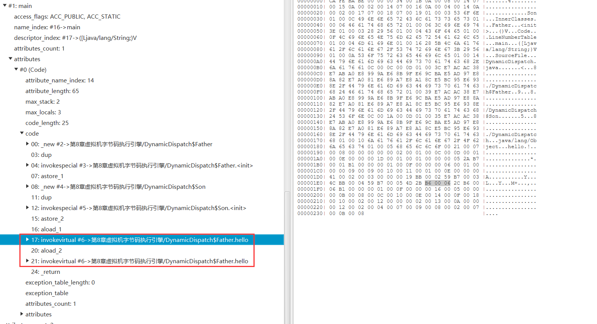

[toc]


本篇文章将围绕Java中方法的调用，深入浅出的说明方法调用的指令、解析调用以及分派调用等


### 方法调用

要知道Java中方法调用唯一目的就是确定要调用哪一个方法

方法调用可以分为**解析调用和分派调用**，接下来会详细介绍


#### 非虚方法与虚方法

**非虚方法: 静态方法，私有方法，父类中的方法，被final修饰的方法，实例构造器**

其他不是非虚方法的方法就是虚方法

非虚方法的特点就是没有重写方法，适合**在类加载阶段就进行解析(符号引用->直接引用)**【编译时就能够确定】


#### 调用指令

- 普通调用指令

	- **`invokestatic`:调用静态方法**
	- **`invokespecial`:调用私有方法,父类中的方法,实例构造器<init>方法,final方法**
	- **`invokeinterface`:调用接口方法**
	- **`invokevirtual`: 调用虚方法**

	**使用`invokestatic`和`invokespecial`指令的一定是非虚方法**

	使用`invokeinterface`指令一定是虚方法(因为接口方法需要具体的实现类去实现)

	使用`invokevirtual`指令的是虚方法

- 动态调用指令

	- `invokedynamic`: 动态解析出需要调用的方法再执行

	jdk 7 出现`invokedynamic`，支持动态语言


> 测试虚方法代码

- 父类

```java
public class Father {
    public static void staticMethod(){
        System.out.println("father static method");
    }

    public final void finalMethod(){
        System.out.println("father final method");
    }

    public Father() {
        System.out.println("father init method");
    }

    public void overrideMethod(){
        System.out.println("father override method");
    }
}
```

- 接口

```java
public interface TestInterfaceMethod {
    void testInterfaceMethod();
}
```

- 子类

```java
public class Son extends Father{

    public Son() {
        //invokespecial 调用父类init 非虚方法
        super();
        //invokestatic 调用父类静态方法 非虚方法
        staticMethod();
        //invokespecial 调用子类私有方法 特殊的非虚方法
        privateMethod();
        //invokevirtual 调用子类的重写方法 虚方法
        overrideMethod();
        //invokespecial 调用父类方法 非虚方法
        super.overrideMethod();
        //invokespecial 调用父类final方法 非虚方法
        super.finalMethod();
        //invokedynamic 动态生成接口的实现类 动态调用
        TestInterfaceMethod test = ()->{
            System.out.println("testInterfaceMethod");
        };
        //invokeinterface 调用接口方法 虚方法
        test.testInterfaceMethod();
    }

    @Override
    public void overrideMethod(){
        System.out.println("son override method");
    }

    private void privateMethod(){
        System.out.println("son private method");
    }

    public static void main(String[] args) {
        new Son();
    }
}
```


**注意: 接口中的默认方法也是`invokeinterface`,接口中的静态方法是`invokestatic`**


#### 解析调用

解析调用就是在调用非虚方法

在编译期间就能够确定，运行时也不会改变

 


#### 分派调用

分派调用又分为静态分派与动态分配

**早期绑定:解析调用和静态分派这种编译期间可以确定调用哪个方法**

**晚期绑定: 动态分派这种编译期无法确定,要到运行时才能确定调用哪个方法**


##### 静态分派

```java
//  静态类型      	 实际类型
	List list = new ArrayList();
```

**静态分派: 根据静态类型决定方法执行的版本的分派**

**发生在编译期，特殊的解析调用**

典型的表现就是方法的重载	

```java
public class StaticDispatch {
    public void test(List list){
        System.out.println("list");
    }

    public void test(ArrayList arrayList){
        System.out.println("arrayList");
    }

    public static void main(String[] args) {
        ArrayList arrayList = new ArrayList();
        List list = new ArrayList();
        StaticDispatch staticDispatch = new StaticDispatch();
        staticDispatch.test(list);
        staticDispatch.test(arrayList);
    }
}
/*
list
arrayList
*/
```

方法的版本并不是唯一的,往往只能确定一个最适合的版本


##### 动态分派

**动态分派:动态期根据实际类型确定方法执行版本的分派**

动态分派与重写有着紧密的联系

```java
public class DynamicDispatch {
    public static void main(String[] args) {
        Father father = new Father();
        Father son = new Son();

        father.hello();
        son.hello();
    }
    static class Father{
        public void hello(){
            System.out.println("Father hello");
        }
    }

    static class Son extends Father{
        @Override
        public void hello() {
            System.out.println("Son hello");
        }
    }
}
/*
Father hello
Son hello
*/
```



虽然常量池中的符号引用相同,`invokevirtual`指令最终指向的方法却不一样

> 分析invokevirtual指令搞懂它是如何确定调用的方法

1. invokevirtual找到栈顶元素的==实际类型==
2. 如果在这个实际类型中找到与常量池中描述符与简单名称相符的方法，并通过访问权限的验证就返回这个方法的引用(未通过权限验证返回`IllegalAccessException`非法访问异常)
3. 如果在实际类型中未找到，就去实际类型的父类中寻找(没找到抛出`AbstractMethodError`异常)

因此，子类重写父类方法时，**根据invokevirtual指令规则，先在实际类型（子类）中寻找，找不到才去父类**，所以存在重写的多态

**频繁的动态分派会重新查找栈顶元素实际类型，会影响执行效率**

**为提高性能，JVM在该类方法区建立虚方法表使用索引表来代替查找**


> 字段不存在多态

当子类出现与父类相同的字段,子类会覆盖父类的字段

```java
public class DynamicDispatch {
    public static void main(String[] args) {
        Father son = new Son();
    }
    static class Father{
        int num = 1;

        public Father() {
            hello();
        }

        public void hello(){
            System.out.println("Father hello " + num);
        }
    }

    static class Son extends Father{
        int num = 2;

        public Son() {
            hello();
        }

        @Override
        public void hello() {
            System.out.println("Son hello "+ num);
        }
    }
}
/*
Son hello 0
Son hello 2
*/
```

先对父类进行初始化，所以会先执行父类中的构造方法，而构造方法去执行了`hello()`方法，此时的实际类型是Son于是会去执行Son的hello方法，此时子类还未初始化成员变量，只是有个默认值，所以输出`Son hello 0`


##### 单分派与多分派

**方法参数或方法调用者被称为宗量**

分派还可以分为单、多分派

**根据一个宗量（方法参数或方法调用者）选择方法被称为单分派**

**根据多个宗量（方法参数和方法调用者）选择方法被称为多分派**

```java
public class DynamicDispatch {
    public static void main(String[] args) {
        Father son = new Son();
        Father father = new Father();

        son.hello(new Nod());
        father.hello(new Wave());
    }
    static class Father{


        public void hello(Nod nod){
            System.out.println("Father nod hello " );
        }

        public void hello(Wave wave){
            System.out.println("Father wave hello " );
        }
    }

    static class Son extends Father{

        @Override
        public void hello(Nod nod) {
            System.out.println("Son nod hello");
        }

        @Override
        public void hello(Wave wave) {
            System.out.println("Son wave hello");
        }
    }

    //招手
    static class Wave{}
    //点头
    static class Nod{}
}
/*
Son nod hello
Father wave hello 
*/
```

在编译时，不仅要关心静态类型是Father还是Son，还要关心参数是Nod还是Wave，所以**静态分派是多分派(根据两个宗量对方法进行选择)**

在执行`son.hello(new Nod())`时只需要关心实际类型是Son还是Father，所以**动态分派是单分派(根据一个宗量对方法进行选择)**


### 总结

本篇文章围绕Java方法的调用，深入浅出的解析非虚方法与虚方法、调用的字节码指令、解析调用和分派调用、单分派以及多分派

**不能重写的方法（静态、私有、父类、final修饰、实例构造）被称为非虚方法，其他方法为虚方法**

**非虚方法是编译时就能够确定的，解析调用就是调用非虚方法**

**分派调用中的静态分派也是编译时确定的，是特殊的解析调用，根据静态类型选择方法，典型例子就是方法重载**

**分派调用中的动态分派是根据实际类型选择方法，在运行时才能够确定实际类型，典型例子就是方法重写**

**静态分派需要考虑方法调用者和方法参数是多分派，动态分派只需要考虑方法调用者是单分派**