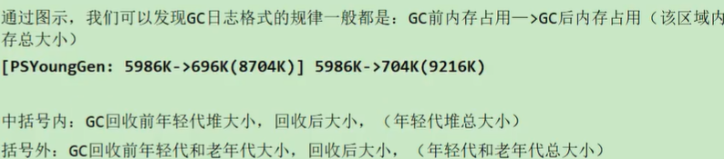

[toc]

## GC日志的分析

### GC日志相关参数

- `-XX:+PrintGC` 或 `-verbose:gc` 输出简单GC日志信息

- ` -XX:+PrintGCDeatils` 输出详细GC日志信息 **常用**

- `-XX:+PrintGCTimeStamps`  需要搭配输出GC信息使用,输出程序运行时间  **常用**

- `-XX:+PrintGCDateStamps` 需要搭配输出GC信息使用,输出时间戳 

- ` -Xloggc:d:\gc.log` 将GC信息输出到d:\gc.log文件中 **常用**

- `-XX:PrintHeapAtGC` 每次GC前后打印堆信息

### GC分类

- Minor GC 
	- 收集年轻代

- Major GC 
	- 收集老年代
	- Major GC前会Minor GC

- Mixed GC
	- 混合收集 (分代收集器)

- Full GC 

	- 整堆收集 (堆+方法区)
	- 逻辑上把方法区作为堆的一部分,物理空间上不是一部分
	- 什么情况会进行Full GC
		- OOM前
		- 方法区空间不足
		- 老年代空间不足
			- minor gc 后满足条件的对象要进入老年代所需空间 大于 老年代可用空间
			- 大对象要进入老年代所需空间 大于 老年代可用空间
		- 显示调用`System.gc()`

	

### GC日志解析

### GCeasy分析GC日志

在线分析: https://gceasy.io/

